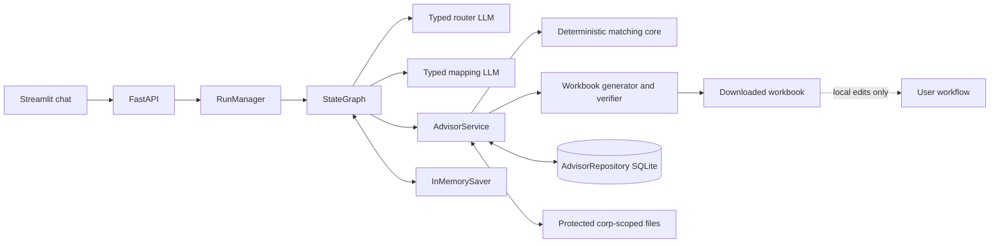
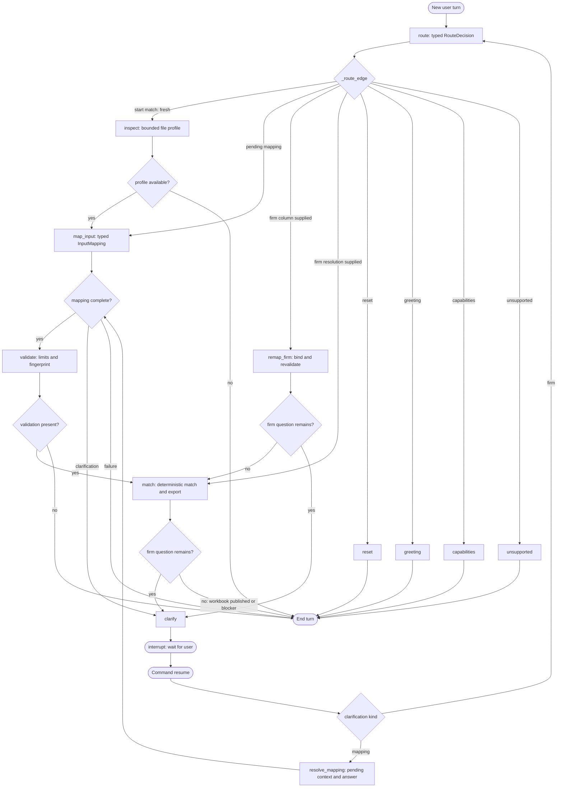

# Advisor Match Architecture

## Decision

The application uses a single explicit LangGraph workflow, not Deep Agents.
The matching problem has a fixed sequence and code-owned identity policy, so a
planner, dynamic tool selection, filesystem skills, subagents, and an autonomous
tool loop would add uncertainty without adding required capability.

The graph ends after deterministic matching and verified workbook publication.
Post-match row review is intentionally outside the application: the user reviews
and may edit the downloaded workbook locally.

## Component boundaries

`RunManager` streams application events (`node_completed`,
`clarification_required`, `artifact_published`, and run status). Model calls are
non-streaming. The UI polls the existing run endpoint and therefore does not
depend on token streaming.

## Graph nodes

1. `route` — strict structured intent and same-turn firm extraction.
2. `inspect` — bounded sheet/row/column profile.
3. `map_input` — strict structured `InputMapping`; ambiguous interpretations
   branch to `clarify`.
4. `resolve_mapping` — resumes a mapping clarification with the pending
   question, current answer, optional proposed mapping, and bounded profile. A
   clear affirmative accepts a stored proposal deterministically.
5. `validate` — deterministic load, row limits, transformation checks, and
   mapping fingerprint.
6. `remap_firm` — binds an exact user-selected firm column and revalidates.
7. `match` — firm resolution, authoritative snapshot, deterministic matching,
   durable session creation, workbook generation, verification, and publication.
8. `clarify` — `interrupt()` for mapping or firm ambiguity; the next text-only
   message resumes with `Command(resume=...)`.
9. `reset`, `greeting`, `capabilities`, and `unsupported` — small terminal
   branches with deterministic user-facing copy.

There are no graph nodes for review pages, row mutations, manual CRD proposals,
approval, or post-match status. Requests for those operations are routed to
capability guidance that explains the workbook-only review boundary.

## Exact node and edge map

The graph does not send full chat history through these edges. `route` receives
the current message plus phase/attachment/session flags. `resolve_mapping`
receives the exact pending question, current answer, optional proposed mapping,
and bounded file profile.

A new attachment deletes the conversation's in-memory checkpoint and starts a
fresh graph. Text such as “apply firm ABC to all advisors” resumes the pending
thread and does not reset it. One run may be active per `(corp_id,
conversation_id)`; different conversations may run concurrently under the same
corporation.

## State and persistence

Graph state contains corporation, conversation, and run IDs; current message;
attachment ID; phase; router decision; bounded upload profile; mapping;
validation summary; match result summary; pending clarification payload;
response; and error. It never contains the complete advisor reference, full
input table, workbook bytes, a review page, or a pending manual override.

`InMemorySaver` is intentional. API restart loses conversations, checkpoints,
pending interrupts, and progress. SQLite retains only durable matching evidence:
attachment metadata, reference snapshots, match sessions, and artifact metadata.

## Authority and failure behavior

The model can route and interpret columns. It cannot select arbitrary tools or
decide advisor identities. Each structured LLM operation has three total
attempts; exhaustion fails the current run without mutating deterministic
decisions. Blocking file/reference work runs off the event loop. File, row,
preview, timeout, corporation-scope, integrity, duplicate-CRD, identity-policy,
and workbook-validation rules remain enforced in code.

The workbook has four sheets: `Matched`, `Review Required`, `Original Input`,
and `Run Summary`. Editable review columns in `Review Required` are deliberately
blank. Changes to a downloaded copy are user-owned and are not sent back to or
validated by the application.

The interactive version of this workflow is
[`advisor_match_workflow.html`](advisor_match_workflow.html).
