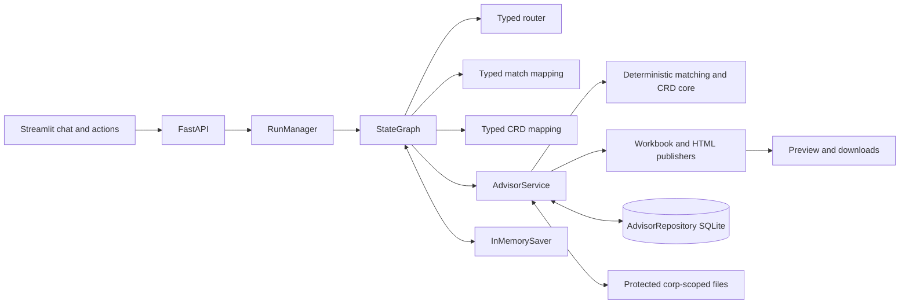
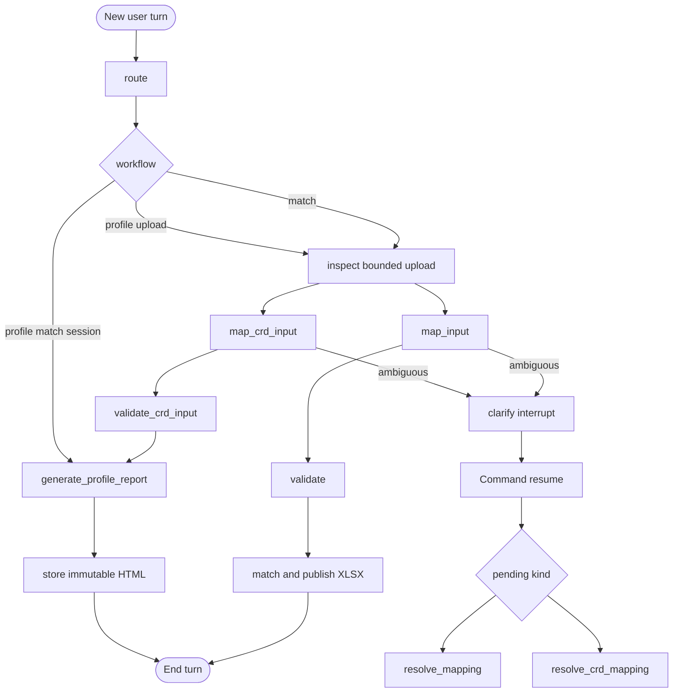

# Advisor Match and Profile Report Architecture

## Decision

The application uses one explicit LangGraph `StateGraph`, not Deep Agents. Its
two bounded workflows share routing, checkpoints, cancellation, clarification,
event streaming, protected storage, and artifact download behavior.

Explicit Streamlit actions set `requested_workflow` and bypass intent
classification. Conversational requests use the typed router. Structured model
output may interpret a bounded upload profile, but deterministic code owns file
validation, matching, CRD extraction, report generation, storage, and
publication.

## Component boundaries

`RunManager` emits node, clarification, artifact, and run-status events. Model
calls are non-streaming. The UI polls the existing run endpoint.

## Graph branches

Matching-specific firm clarification and remapping remain unchanged. Greeting,
capabilities, reset, unsupported, and missing-profile-source paths are small
terminal branches.

## State and handoff

Graph state contains scoped IDs, the current request, workflow hint/selection,
bounded profile, exact mapping and validation metadata, result summaries,
pending clarification, response, and error. It never contains a full input or
master table, workbook/HTML bytes, or a CRD list.

Post-match report generation passes `match_session_id`, not workbook contents or
copied CRDs. The service reloads the corporation- and conversation-scoped
session, selects only automated `Matched` decisions, and deduplicates their CRDs.
For direct uploads, the service reopens the immutable attachment and validates
its hash, worksheet, header row, physical column index, exact header, row limit,
and mapping fingerprint immediately before extraction.

`InMemorySaver` and conversations/runs/events remain process-local. SQLite
durably stores attachments, reference snapshots, match sessions, workbook
artifacts, and additive `advisor_profile_reports` records. API restart therefore
loses pending conversations and interrupts but not published audit evidence.

## Authority and outputs

The model may route and interpret bounded columns. It cannot select arbitrary
tools, decide advisor identities, extract CRDs, or create artifacts. CRDs are
opaque trimmed strings; blanks are ignored and duplicates retain first-seen
order. Post-match reports exclude ambiguous, unmatched, and candidate-only CRDs.

Matching publishes the verified four-sheet `advisor_matches.xlsx`. Profile
report version 1 publishes a verified, deterministic
`advisor_profile_report.html` with a valid shell and empty body. It performs no
network access and does not simulate profile data. Both artifact types are
immutable, hashed, corporation scoped, and downloaded through the existing API.

The interactive workflow is
[`advisor_match_workflow.html`](advisor_match_workflow.html).
