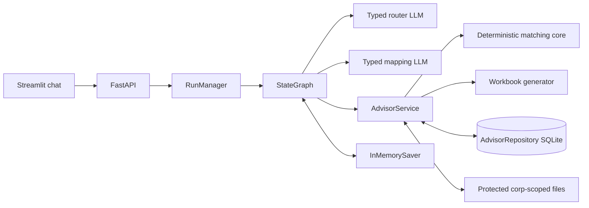
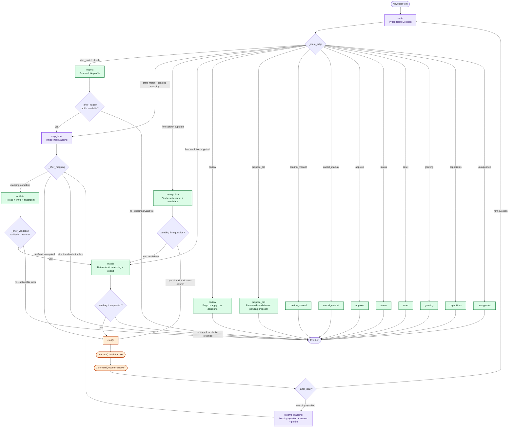

# Advisor Match Architecture

## Decision

The application uses a single explicit LangGraph workflow, not Deep Agents.
The matching problem has a fixed sequence and code-owned identity policy, so a
planner, dynamic tool selection, filesystem skills, subagents, and an autonomous
tool loop added uncertainty without adding required capability.

## Component boundaries

`RunManager` streams application events (`node_completed`,
`clarification_required`, `artifact_published`, and run status). Model calls are
non-streaming. The UI keeps polling the existing run endpoint and therefore
does not depend on token streaming.

## Graph

The graph is one `StateGraph`:

1. `route` — strict structured intent and same-turn firm extraction.
2. `inspect` — bounded sheet/row/column profile.
3. `map_input` — strict structured `InputMapping`; ambiguous interpretations
   branch to `clarify`. A yes/no question must carry the concrete proposed
   mapping that an affirmative answer would approve.
4. `resolve_mapping` — resumes mapping clarification with the exact pending
   question, the current answer, any proposed mapping, and the bounded upload
   profile. It bypasses the general request router. A clear affirmative accepts
   a stored proposal deterministically; other answers return only to the typed
   mapping interpreter.
5. `validate` — deterministic load, row limits, transformation checks, and
   mapping fingerprint.
6. `match` — firm resolution, authoritative snapshot, deterministic matching,
   durable session creation, and verified workbook publication.
7. `remap_firm` — binds an exact user-selected source column and revalidates the
   immutable upload.
8. `clarify` — `interrupt()` for mapping or firm ambiguity; the next text-only
   message resumes with `Command(resume=...)`.
9. `review` and `propose_crd` — resolve user-facing source row numbers to
   internal review IDs. Presented candidates can be selected directly; an
   unlisted CRD creates a pending later-turn confirmation.
10. `confirm_manual`, `cancel_manual`, `approve`, `status`, `reset`,
   `capabilities`, `unsupported` — explicit terminal branches.

## Exact node and edge map

This diagram mirrors the compiled `StateGraph`. Diamonds are conditional-edge
functions rather than executable nodes. Purple nodes are the only LLM decision
points; green nodes are deterministic application code.

The graph does not send full chat history through these edges. `route` receives
the current message plus phase/attachment/session flags. `resolve_mapping`
receives the exact pending question, current answer, optional proposed mapping,
and bounded file profile. A clear affirmative accepts a stored proposed mapping
deterministically before another model call is considered.

A new attachment deletes the conversation's in-memory checkpoint and starts a
fresh graph. Text such as “apply firm ABC to all advisors” resumes the pending
thread and does not reset it. One run may be active per `(corp_id,
conversation_id)`; different conversations may run concurrently under the same
corporation.

## State

Graph state contains IDs and bounded structured values: corporation,
conversation, run, current message, attachment ID, phase, router decision,
bounded upload profile, mapping, validation fingerprint/summary, result summary,
pending interrupt/proposal payload, bounded current review page, response, and
error. Mapping interrupts retain only the pending question, clarification type,
and optional proposed mapping; full chat history is not sent to the model on
resume. Internal session, review, proposal, and artifact IDs remain in state and
audit data instead of normal user-facing copy. State never contains the complete
advisor reference, full input table, or workbook bytes.

`InMemorySaver` is intentional. API restart loses conversations, checkpoints,
pending interrupts, and progress. Durable business evidence stays in
`.data/advisor_repository.sqlite3`; legacy databases are neither migrated nor
deleted.

## Authority and failure behavior

The model can route and interpret columns. It cannot select arbitrary tools or
decide advisor identities. Each structured LLM operation has three total
attempts; exhaustion fails the current run without mutating deterministic
decisions. Blocking file/reference work runs off the event loop. Existing file,
row, preview, timeout, corp-scope, integrity, duplicate-CRD, review, and workbook
validation rules remain enforced in code.

User-facing operational copy is deterministic and centralized in
`general_agent/user_messages.py`. Known user-fixable validation errors become
actionable graph responses. Unexpected provider or system failures still fail
the run and expose technical details only when UI debug mode is enabled.

LangSmith tracing remains off by default. Operational logs contain IDs, event
names, counts, durations, and exception types—not raw advisor rows or prompts.

The interactive version of this workflow is
[`advisor_match_workflow.html`](advisor_match_workflow.html).
