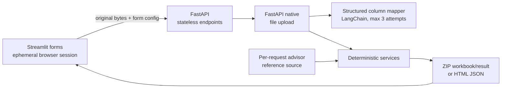

# Advisor Match architecture

Advisor Match is a synchronous, stateless REST application. An API pod does not
own a workflow: every operation receives the complete file bytes and confirmed
configuration, performs its work, and returns the complete result.

## Request boundaries

`/advisor-match/mapping` and `/advisor-profile/mapping` inspect bounded source
profiles and call the configured model for typed proposals. The service never
sends full files or reference rows to the model. A proposal is deterministically
validated before it is returned where possible; the form remains editable.

`/advisor-match/match` resends the original bytes with their analysis SHA-256,
confirmed mapping, and firm resolution. Hash and mapping validation happen
before the reference source is called. The request obtains a fresh source,
validates and indexes its streamed canonical rows, applies policy version 5,
builds and verifies a four-sheet workbook, and returns an in-memory ZIP.

`/advisor-profile/generate` similarly revalidates resent bytes and an exact CRD
mapping, then trims blanks and deduplicates opaque CRDs in first-seen order. It
returns one deterministic placeholder HTML document; it performs no profile
lookup.

## Multi-pod behavior

There is no affinity requirement. Mapping can run on pod A and matching on pod
B because the second request includes the same file bytes and all confirmed
configuration. Profile mapping and generation can likewise use different pods.
No application database, persistent local file, conversation, checkpoint,
cache, or in-memory workflow session is consulted between requests. Native
uploads may use request-scoped pod-local temporary storage.

The Streamlit UI uses `st.session_state` only for browser convenience. Refresh,
UI restart, or pod loss clears work in progress by design.

## Reference source seam

The FastAPI app factory accepts a `ReferenceSourceFactory`. Development and
tests use the packaged synthetic source. Production may inject the existing
Snowflake client through this seam. Each match asks the factory for a new source;
records are streamed through schema and row-limit validation into the existing
advisor index. A SHA-256 is computed from stable serialization of the eight
ordered canonical fields. No rows are cached or persisted.

## Failure model

User-correctable mappings and firm choices are `422`; changed bytes are `409`;
oversized uploads are `413`; unsupported file types are `415`; mapping provider
failures after three attempts are `502`; reference failures are `503`. Failed
synchronous operations return no partial output and are restarted from the
beginning when retried.
