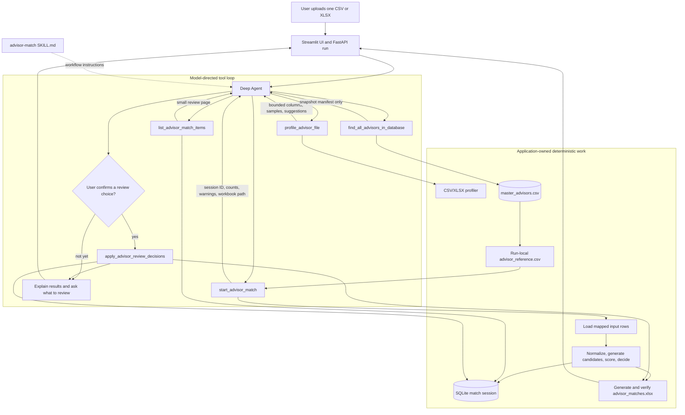
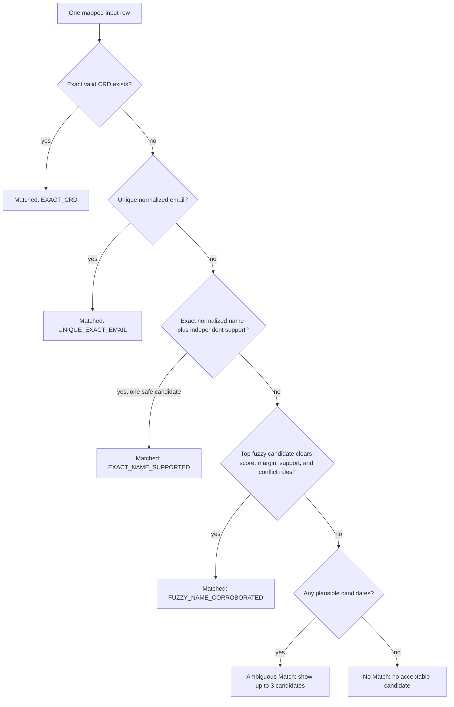

# Advisor Match Workflow Walkthrough

## The central idea

The agent orchestrates the conversation, but ordinary Python code decides every
row-level identity match. The model profiles the upload, chooses a typed column
mapping, calls the workflow tools, and presents bounded review pages. It does
not receive the complete master table and does not calculate or select matches
itself.

## Agent and application workflow

## What happens in one matching run

1. **Upload and context** — the UI stores the original file in the current
   corporation and conversation. The run manager gives the agent a virtual
   upload path such as `/uploads/advisors.csv`.
2. **Skill loading** — the agent reads `skills/advisor-match/SKILL.md`. The
   skill gives the model the required tool order, review behavior, and
   explanation rules.
3. **Profiling** — `profile_advisor_file` reads a bounded portion of the CSV or
   XLSX. It returns sheet names, headers, basic patterns, three sample rows, and
   mapping suggestions. The model uses this summary to create an
   `InputMapping`.
4. **Reference snapshot** — `find_all_advisors_in_database` reads the current
   reference source. In this PoC the source is the checked-in 40-row synthetic
   `master_advisors.csv`. The tool creates a run-local
   `/tmp/advisor_reference.csv` and returns only its manifest to the model.
5. **Deterministic matching** — `start_advisor_match` loads the mapped input and
   reference rows inside the application process, calls `run_matching`, stores
   the structured decisions in SQLite, and generates the workbook.
6. **Summary to the model** — the model receives the session ID, policy version,
   warnings, workbook path, and counts for `Matched`, `Ambiguous Match`, and
   `No Match`—not the full decision table.
7. **Conversational review** — `list_advisor_match_items` reads a small page from
   the persisted session. The model explains the source row, candidate CRDs,
   evidence, conflicts, and reason.
8. **User-directed changes** — only an explicit user choice triggers
   `apply_advisor_review_decisions`. The tool updates the session, writes an
   audit entry, recomputes counts, and regenerates the workbook.
9. **Recovery** — if a turn fails after matching,
   `get_current_advisor_match_session` recovers the latest session in the same
   conversation so the agent can continue rather than rerun the match.

## Deterministic decision ladder

### Normalization

The matcher compares normalized copies while preserving original values for the
workbook. It normalizes CRD, email, person name, firm, street, city, state, and
ZIP independently. Blank values do not match other blanks.

### Candidate scoring

For rows not resolved by exact CRD or unique email, every advisor in the current
PoC reference is scored using the fields present on the input row:

| Evidence | Weight |
| --- | ---: |
| Name | 0.50 |
| Firm | 0.20 |
| Street | 0.12 |
| City | 0.06 |
| State | 0.06 |
| ZIP | 0.06 |

The weighted score is normalized over only the fields present in the input.
Important thresholds in policy version 1 are:

- acceptance score: `0.92`;
- plausible candidate score: `0.78`;
- minimum winner-to-runner-up margin: `0.10`;
- minimum name similarity: `0.92`;
- maximum candidates shown for review: `3`.

A fuzzy candidate is automatically matched only when it also has independent
firm/location evidence and no strong conflict. A nickname alias may generate a
candidate but is not automatically confirmed.

## Responsibility boundary

| Component | Owns |
| --- | --- |
| Deep Agent | Reads the skill, chooses the next tool, constructs the column mapping, summarizes counts, and conducts the conversation. |
| Typed advisor tools | Validate workflow inputs, invoke deterministic modules, page review data, persist decisions, and regenerate exports. |
| Matching engine | Normalization, candidate scoring, rule ordering, match status, duplicate groups, and deterministic explanations. |
| SQLite store | Match sessions, decisions, review audit records, run events, and corporation/conversation scoping. |
| Workbook generator | The fixed four-sheet export and structural/formula verification. |

## What the model sees

The model sees:

- bounded upload profiles and sample rows;
- the advisor reference manifest;
- match counts and warnings;
- bounded review pages with at most three candidates per item;
- results from explicit review operations.

The model does not see:

- the complete advisor master table;
- the complete persisted match session;
- every workbook row;
- internal candidate scores in the workbook or review response.

## Workbook result

`advisor_matches.xlsx` is regenerated from persisted structured decisions and
contains four sheets:

1. `Matched` — confirmed deterministic or user-confirmed matches.
2. `Review Required` — ambiguous candidates and true no-match rows.
3. `Original Input` — preserved source values and row numbers.
4. `Run Summary` — counts, mapping, hashes, policy version, and session state.

## Current PoC limitations

- The master is a synthetic 40-row CSV, not Snowflake.
- Fuzzy matching currently scores an unresolved row against every advisor; it
  is suitable for this PoC dataset but not the configured million-row ceiling.
- Advisor profile building is intentionally not implemented yet.
