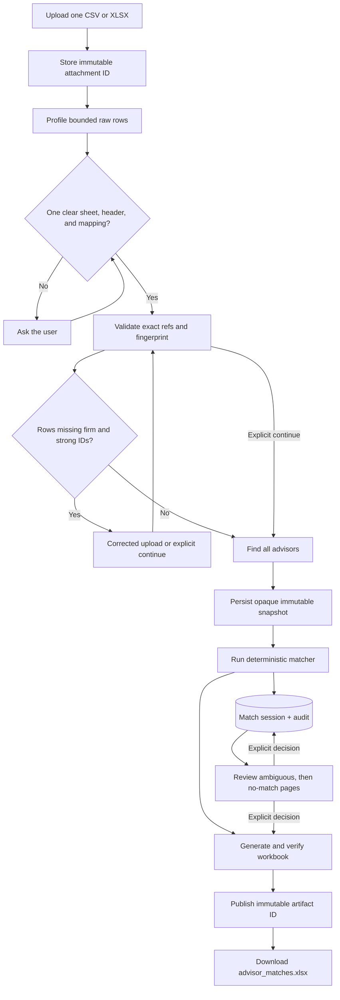
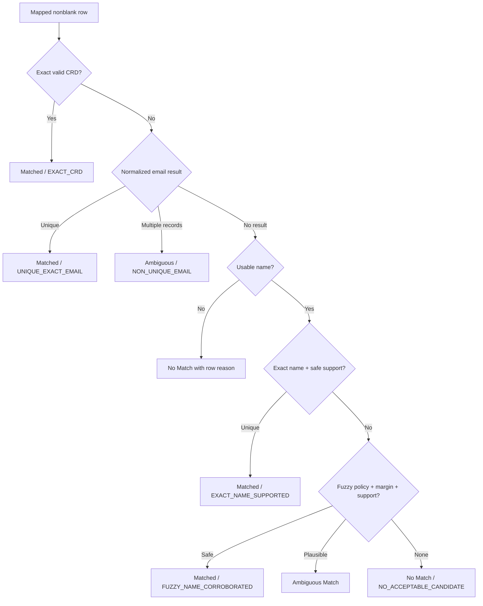

# Advisor Match workflow walkthrough

## Central idea

The Deep Agent adapts to inconsistent uploads and asks clarification questions. Ordinary Python code validates table structure, resolves identities, persists review state, and creates the workbook. The model never receives the full authoritative advisor table and never chooses a match row by row.

## One new matching run

1. **Upload**—FastAPI stores exactly one CSV or XLSX in protected corporation-scoped storage. SQLite binds its opaque attachment ID to the active run and conversation. No second live workspace copy is created.
2. **Load the skill**—the agent reads `skills/advisor-match/SKILL.md`, which defines tool order and clarification boundaries.
3. **Inspect raw rows**—`inspect_advisor_upload` resolves the attachment ID, verifies its protected path and hash, and returns bounded physical rows, plausible header interpretations, a headerless view, patterns, and samples.
4. **Interpret**—the agent selects one worksheet and maps CRD, name, firm, email, city, state, and optional ZIP. It asks the user when the meaning is not clear.
5. **Validate**—`validate_advisor_input` confirms exact indexes and headers before data loading, skips blank/preamble rows, reports the missing-firm checkpoint, and returns a source-and-mapping fingerprint.
6. **Clarify if needed**—firm information is added only through a corrected upload. The user may explicitly continue with weaker evidence.
7. **Retrieve the source**—`find_all_advisors` creates a fresh protected snapshot and returns only its opaque manifest.
8. **Match**—`create_advisor_match` revalidates the attachment and fingerprint, verifies the reference snapshot, runs policy version 2, persists a session, creates and verifies the workbook, and publishes revision 1 under an artifact ID.
9. **Report**—the agent shows the interpreted mapping, header mode, selected sheet, warnings, session ID, workbook artifact ID, and three status counts.
10. **Review**—the agent pages ambiguous items first, then no-match items by reason. Candidate explanations use qualitative evidence only.
11. **Apply explicit choices**—the application records before/after audit data, recalculates counts, increments the revision, regenerates and verifies the workbook, and publishes a new immutable artifact ID.
12. **Recover**—a later turn calls `get_current_advisor_match`; it does not rerun matching merely to recover state.

## Input interpretations

A headed mapping contains a one-based physical `header_row`. Each bound column contains its exact zero-based index and observed header. Indexes make duplicate headers safe.

A headerless mapping uses `header_row=null` and `header=null` on each column reference. Generated labels such as `Column A` are for previews and Original Input only.

Rows above a selected header are preamble. Entirely blank data rows are skipped. Physical row numbers remain stable so conversation and workbook always point to the source file correctly.

Structural errors stop the run: unreadable input, missing worksheet, invalid mapping, missing mapped column, changed fingerprint, empty data table, or configured row-limit overflow. Malformed row values do not stop other records.

## Decision ladder

Exact/close firm and exact city/state are independent support. Strong firm or state conflicts block name-based automation. Same-state city differences are weaker conflicts. Legal firm suffixes normalize away. Nicknames generate candidates only. ZIP is displayed as context and never changes status.

## What the model sees

The model sees bounded raw previews, the validated mapping summary, reference manifest, match counts/warnings, and bounded review pages with at most three candidates per item.

It does not see the complete upload, authoritative table, persisted decision collection, internal similarity scores, protected attachment/reference/artifact paths, or workbook contents.

## Output

`advisor_matches.xlsx` contains `Matched`, `Review Required`, `Original Input`, and `Run Summary`. The first two sheets use a compact human-facing layout; technical audit fields are hidden by default. Every revision is generated from structured state, styled, reopened, checked for formulas, reconciled, and explicitly registered as an immutable artifact before return.

Current limitations are the synthetic reference, in-memory fuzzy candidate scan, and intentionally unimplemented profile builder.
