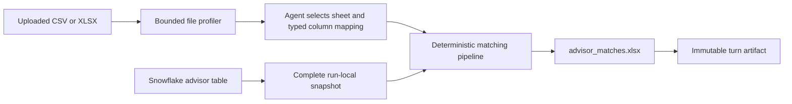

# Specializing General Agent

This guide explains how to convert this repository's general-purpose Deep
Agent into a domain-specific application. It is grounded in the current
architecture and uses a Financial Advisor Matching Agent as the primary
example.

The example accepts one `.csv` or `.xlsx` webinar-attendee file, retrieves a
complete authoritative advisor snapshot from Snowflake, matches every input
row, and creates `/advisor_matches.xlsx`. The design deliberately separates
adaptive agent reasoning from deterministic record linkage:

- The agent inspects the file, identifies its schema, selects a worksheet, and
  produces a typed column mapping.
- Versioned application code normalizes values, generates candidates, applies
  matching rules, resolves ambiguity, and creates the workbook.
- The model never chooses an advisor row by row.

That boundary preserves the flexibility needed for inconsistent source files
without making the final decisions irreproducible.

> [!IMPORTANT]
> General Agent is a trusted-local application. Preserve loopback-only service
> checks, corporation isolation, `virtual_mode=True`, path and symlink defenses,
> `inherit_env=False`, cancellation, output bounds, and immutable artifact
> snapshots. Prompt instructions do not replace those code-enforced controls.

## 1. Understand the existing extension points

The relevant repository components are:

| Concern | Existing implementation | Specialization change |
| --- | --- | --- |
| Agent construction | `general_agent/agent.py` | Replace `SYSTEM_PROMPT`, register domain tools, restrict filesystem tools, and disable the default sub-agent. |
| Environment settings | `general_agent/config.py` and `.env.example` | Add validated Snowflake table identifiers, policy location, and a developer-execute flag. Keep credentials in the existing connector configuration. |
| Skills | Source under `skills/`; installed copy under `workspace/.app/skills/` | Add `skills/advisor-matching/`. Never edit the installed copy. |
| Uploads | `general_agent/api.py`, `RunManager.add_upload`, and `Workspace.upload` | Restrict matching-run attachments to one `.csv` or `.xlsx` file. Reuse the existing collision-safe, corporation-scoped upload path. |
| File preview | `general_agent/file_inspector.py` | Reuse its bounded CSV/XLSX inspection ideas; add a domain profiler that returns headers, types, and limited samples rather than full files. |
| Virtual paths | `general_agent/workspace.py` and `general_agent/execution.py` | Accept agent-visible paths such as `/uploads/attendees.xlsx`; resolve ordinary inputs/outputs through `Workspace.resolve_agent`. Resolve `/tmp` snapshot tokens to the active run directory using injected runtime context. |
| Run lifecycle | `general_agent/run_manager.py` | Reuse timeouts, cancellation, event projection, cleanup, and artifact snapshots. A created `/advisor_matches.xlsx` automatically becomes a downloadable immutable artifact. |
| API/persistence schemas | `general_agent/schemas.py` | Keep advisor-internal schemas in a new domain module unless they become public API response models. |
| Spreadsheet support | `pandas`, `openpyxl`, `markitdown`, and `skills/xlsx/` | Reuse `pandas`/`openpyxl` and the XLSX verification workflow. No new spreadsheet package is required. |
| Tests | `tests/test_agent.py`, `tests/test_skills.py`, API/workspace/run tests | Add focused matching, workbook, tool, and optional Snowflake integration tests. |

Deep Agents adds its filesystem and sub-agent tools separately from the
`tools=` argument. In the pinned `deepagents>=0.7,<0.8` API, `tools=[]` means
"no additional tools"; it does **not** disable built-ins. Tool restriction is
covered in [Section 9](#9-restrict-the-agent-tool-set).

## 2. Use the right component for each responsibility

Use a combination of a skill, custom tools, and deterministic application
code. A sub-agent is not needed for this workflow.

| Component | Responsibility | Do not put here |
| --- | --- | --- |
| Advisor-matching skill | Triggering, workflow order, questions to ask, required validations, and references to scripts/policy | Credentials, database sessions, or record-by-record decisions |
| Custom tools | Typed boundaries for profiling, Snowflake snapshot export, matching, and workbook creation | Open-ended model-authored code in production |
| Domain library | Normalization, indexes, candidate generation, scoring, ambiguity policy, audit evidence, and workbook generation | User conversation or prompt routing |
| Snowflake connector | Read-only access to the complete authoritative advisor table | Fuzzy matching policy |
| System prompt | Stable purpose, authority boundaries, and mandatory workflow invariants | Detailed thresholds or a hard-coded skill catalog |
| Sub-agent | Nothing in the baseline design | Row matching, schema mapping, or workbook generation |

The skill is the playbook. Tools are controlled entry points. The domain
library is the testable implementation.



## 3. Add the advisor-matching skill

Create the source skill here:

```text
skills/advisor-matching/
├── SKILL.md
├── references/
│   ├── advisor-schema.md
│   ├── matching-policy.md
│   ├── matching-policy.yaml
│   └── workbook-contract.md
└── scripts/
    ├── profile_input.py
    ├── run_match.py
    └── verify_workbook.py
```

`Settings.prepare_directories()` replaces the installed skill tree with a
copy of `skills/` at application startup. Edit only the source folder. The
agent discovers it generically through `skills=["/skills/"]`; do not add the
skill name to a catalog in `SYSTEM_PROMPT`.

### 3.1 Keep `SKILL.md` procedural and short

Use frontmatter with only `name` and `description`. The description is the
trigger, so include the file types, operation, and expected deliverable.

```markdown
---
name: advisor-matching
description: "Match uploaded webinar-attendee CSV or XLSX rows to the authoritative Snowflake financial-advisor reference table and produce advisor_matches.xlsx. Use for attendee-to-advisor identity resolution, CRD lookup, fuzzy advisor matching, ambiguous candidate review, and regenerating or validating an advisor match workbook."
---

# Advisor matching

1. Confirm there is exactly one `.csv` or `.xlsx` input.
2. Call `profile_attendee_file`; do not read the entire file into model context.
3. Select a worksheet only when one is clearly an attendee table. Ask the user
   when more than one worksheet is plausible.
4. Construct the validated `InputMapping`. If a field mapping is uncertain,
   ask the user instead of guessing.
5. Call `export_advisor_reference_snapshot` exactly once for the run.
6. Call `match_advisors` with the input mapping and returned snapshot path.
7. Require the output path to be `/advisor_matches.xlsx` and verify the exact
   sheet names and status counts.
8. Report the path, selected input sheet, `Matched`, `Ambiguous Match`, and
   `No Match` counts, plus warnings.

Never select a candidate row yourself. CRD matches are absolute. For other
methods, use the versioned matching policy and return similarly plausible
candidates as `Ambiguous Match`.

Read these only when needed:

- `references/advisor-schema.md` for Snowflake and normalized field definitions.
- `references/matching-policy.md` for rule order, evidence, and edge cases.
- `references/workbook-contract.md` before generating or validating output.
- `/skills/xlsx/SKILL.md` with `limit=1000` for spreadsheet verification rules.
```

Deep Agents' default `read_file` limit is 100 lines. This repository's custom
description tells the model to use `limit=1000` for a complete skill, but a
concise `SKILL.md` plus direct references is still more reliable and cheaper in
context.

### 3.2 Put detail in references

Recommended contents:

- `advisor-schema.md`: exact Snowflake table columns, types, nullability,
  authoritative meanings, and approved query columns. Do not put credentials
  here.
- `matching-policy.md`: plain-language decision rules, normalization behavior,
  ambiguity rules, examples, and calibration procedure.
- `matching-policy.yaml`: machine-readable policy version, internal weights,
  thresholds, margin, tie-breakers, and maximum review candidates.
- `workbook-contract.md`: exact worksheet names, column order, confidence/status
  vocabulary, and formatting rules.

Keep the policy versioned with the source skill. Load it from
`settings.installed_skills_root / "advisor-matching/references/matching-policy.yaml"`
at runtime so production code uses the read-only installed version that the
agent sees.

An illustrative policy file is:

```yaml
version: 1
review_candidate_limit: 3

exact_rules:
  crd_is_absolute: true
  unique_email_is_match: true
  unique_full_name_is_match: true
  unique_firm_street_zip_is_match: true
  unique_firm_city_state_is_match: true

fuzzy:
  acceptance_score: 0.88
  plausible_score: 0.75
  minimum_margin: 0.08
  minimum_name_similarity: 0.92
  require_independent_corroboration: true
  weights:
    name: 0.45
    firm: 0.20
    street: 0.15
    city: 0.08
    state: 0.07
    zip: 0.05

tie_breakers:
  - descending_internal_score
  - ascending_crd_number
```

These are starting values, not universal truth. Calibrate them against labeled
historical matches before production. The internal score ranks and separates
candidates; it is not a probability and is not written to the final workbook.

### 3.3 Make skill scripts thin and reusable

Avoid maintaining one matching implementation inside the skill and another
inside the application. Put canonical logic under
`general_agent/advisor_matching/` and make skill scripts small command-line
drivers that import it. This gives developers reproducible offline examples
while production tools call the same functions directly.

For example, `scripts/run_match.py` can accept an attendee path, a local advisor
fixture, a JSON mapping, and an output path. It must not open its own Snowflake
connection. This keeps credentials and runtime tenant context in the
application layer.

Validate the eventual skill with:

```bash
uv run python skills/skill-creator/scripts/quick_validate.py \
  skills/advisor-matching
```

Also add `advisor-matching` to `EXPECTED_SKILLS` in `tests/test_skills.py`. The
existing tests validate frontmatter and direct relative links.

## 4. Add a deterministic advisor-matching package

Create an importable package rather than placing business logic in
`general_agent/agent.py`:

```text
general_agent/advisor_matching/
├── __init__.py
├── schemas.py
├── input_loader.py
├── normalization.py
├── candidates.py
├── matcher.py
├── policy.py
└── workbook.py
general_agent/advisor_tools.py
```

- `schemas.py` defines tool and pipeline contracts.
- `input_loader.py` safely reads CSV/XLSX values and preserves source order.
- `normalization.py` produces comparison-only values without altering original
  values.
- `candidates.py` builds exact indexes and bounded fuzzy candidate sets.
- `matcher.py` applies ordered rules and emits evidence.
- `policy.py` loads and validates the versioned YAML policy.
- `workbook.py` creates and verifies the four-sheet workbook.
- `advisor_tools.py` exposes narrow LangChain tools around these modules and the
  existing Snowflake connection.

Keep these internal models out of `general_agent/schemas.py` unless the FastAPI
API itself begins returning them. That module currently holds stable API and
persistence contracts.

### 4.1 Define typed input and output contracts

The upload is schema-flexible; the mapping passed to deterministic code is not.
Reference columns by both zero-based position and observed header so duplicate
or similar headers cannot silently bind to the wrong column.

```python
from __future__ import annotations

from typing import Literal

from pydantic import BaseModel, Field, model_validator


TransformName = Literal[
    "trim",
    "casefold",
    "digits_only",
    "normalize_email",
    "normalize_person_name",
    "normalize_firm",
    "normalize_street",
    "normalize_city",
    "normalize_state",
    "normalize_zip",
]


class ColumnRef(BaseModel):
    index: int = Field(ge=0)
    header: str = Field(min_length=1)


class FieldBinding(BaseModel):
    columns: list[ColumnRef] = Field(min_length=1)
    combine: Literal["first", "join_space"] = "first"
    transforms: list[TransformName] = Field(default_factory=list)


class InputMapping(BaseModel):
    sheet_name: str | None = None       # None for CSV
    header_row: int = Field(default=1, ge=1)
    crd_number: FieldBinding | None = None
    first_name: FieldBinding | None = None
    last_name: FieldBinding | None = None
    full_name: FieldBinding | None = None
    email: FieldBinding | None = None
    firm: FieldBinding | None = None
    street_address: FieldBinding | None = None
    city: FieldBinding | None = None
    state: FieldBinding | None = None
    zip_code: FieldBinding | None = None

    @model_validator(mode="after")
    def require_evidence(self) -> "InputMapping":
        evidence = (
            self.crd_number,
            self.first_name,
            self.last_name,
            self.full_name,
            self.email,
            self.firm,
            self.street_address,
            self.city,
            self.state,
            self.zip_code,
        )
        if not any(evidence):
            raise ValueError("At least one advisor evidence field is required.")
        return self


class ProfileRequest(BaseModel):
    input_virtual_path: str


class MatchRequest(BaseModel):
    input_virtual_path: str
    snapshot_virtual_path: str
    mapping: InputMapping


class MatchCounts(BaseModel):
    matched: int = Field(ge=0)
    ambiguous_match: int = Field(ge=0)
    no_match: int = Field(ge=0)


class MatchRunResult(BaseModel):
    output_virtual_path: Literal["/advisor_matches.xlsx"]
    selected_sheet: str | None
    counts: MatchCounts
    warnings: list[str] = Field(default_factory=list)
```

Use Pydantic validation at every model-to-code boundary. Do not accept arbitrary
Python expressions or transform names from the model. Add a transform to the
enum and cover it with tests when a recurring source format requires it.

### 4.2 Return summaries to the model, not full datasets

Tool responses enter model context. A profiler may return headers, non-null
counts, inferred patterns, and a small representative sample; it must not
return every attendee or advisor row. A matching tool should return only the
`MatchRunResult` summary. The full data stays in scoped files and the workbook.

The application already snapshots changed files after the run. A custom tool
does not need to put workbook bytes in a `ToolMessage`. Create the fixed output
in the current chat and return its virtual path.

## 5. Reuse the Snowflake connection correctly

This repository does not currently contain a Snowflake implementation, so the
exact connector method names below are integration placeholders. The design
assumes the application already has a built-in Snowflake connector or tool, as
specified for this use case.

### 5.1 Retrieve one complete snapshot per run

The snapshot tool should:

1. Use the existing application-side Snowflake client/session and credentials.
2. Execute one read-only query selecting the approved advisor columns.
3. Retrieve the complete advisor reference population, not a model-selected
   candidate subset. If the connector paginates, exhaust and verify every page.
4. Preserve CRD and ZIP as strings.
5. Write the rows to a run-local virtual path such as
   `/tmp/advisor_reference.csv`.
6. Return only path, row count, retrieval timestamp, policy/schema version, and
   Snowflake query ID when available.

Validate the expected columns before matching, reject an unexpectedly empty
snapshot, and write to a temporary sibling before an atomic rename so a
cancelled or failed export cannot be consumed as complete. Calculate the hash
after the final rename.

Use explicit columns rather than `SELECT *`:

```sql
SELECT
    CRD_NUMBER,
    FIRST_NAME,
    LAST_NAME,
    EMAIL_ADDRESS,
    FIRM,
    STREET_ADDRESS,
    CITY,
    STATE,
    ZIP_CODE
FROM IDENTIFIER(?)
ORDER BY CRD_NUMBER
```

Use the connector's supported identifier-binding mechanism. Ordinary value
parameters do not necessarily bind object identifiers, so never interpolate a
model-provided table name into SQL. Read the database/schema/table identifier
from validated settings or use a connector API that safely quotes identifiers.

### 5.2 Adapt the existing connector instead of exposing secrets

The trusted-host shell uses `inherit_env=False`; provider and database secrets
are intentionally absent from agent-run commands. Do not weaken that boundary
or copy Snowflake credentials into `GENERAL_AGENT_*` variables.

Run Snowflake access inside the API process through a custom tool that closes
over the existing connector/client. If the built-in Snowflake tool already
supports exporting query results directly to a scoped file without placing all
rows in its model-facing result, it may be exposed directly. Otherwise add a
thin adapter such as:

```python
from collections.abc import Iterable, Mapping
from datetime import UTC, datetime
from typing import Any, Protocol

from langchain.tools import ToolRuntime
from langchain_core.tools import tool

from general_agent.workspace import current_corp_id


ADVISOR_COLUMNS = (
    "CRD_NUMBER",
    "FIRST_NAME",
    "LAST_NAME",
    "EMAIL_ADDRESS",
    "FIRM",
    "STREET_ADDRESS",
    "CITY",
    "STATE",
    "ZIP_CODE",
)


class AdvisorReferenceSource(Protocol):
    """Adapter implemented with the application's existing Snowflake session."""

    def fetch_complete_advisor_snapshot(
        self, *, table_identifier: str, columns: tuple[str, ...]
    ) -> tuple[Iterable[Mapping[str, Any]], str | None]: ...


def _run_temp_path(workspace, runtime: ToolRuntime, name: str):
    """Resolve a fixed file under the active run's existing temp directory."""
    corp_id = current_corp_id()
    thread_id = str(
        runtime.config.get("configurable", {}).get("thread_id", "")
    )
    prefix = f"{corp_id}:"
    if not corp_id or not thread_id.startswith(prefix):
        raise RuntimeError("The active corporation/run context is unavailable.")
    run_id = thread_id.removeprefix(prefix)
    if not run_id or any(character not in "0123456789abcdef" for character in run_id):
        raise RuntimeError("The active run identifier is invalid.")
    root = workspace.temp_root(corp_id) / run_id
    root.mkdir(parents=True, exist_ok=True)
    return root / name


def build_export_snapshot_tool(settings, workspace, source: AdvisorReferenceSource):
    @tool
    def export_advisor_reference_snapshot(runtime: ToolRuntime) -> dict[str, object]:
        """Export the complete authoritative advisor reference for this run."""
        rows, query_id = source.fetch_complete_advisor_snapshot(
            table_identifier=settings.advisor_reference_table,
            columns=ADVISOR_COLUMNS,
        )
        target = _run_temp_path(
            workspace, runtime, "advisor_reference.csv"
        )
        row_count = write_reference_csv_atomic(
            target, rows, columns=ADVISOR_COLUMNS
        )
        retrieved_at = datetime.now(UTC).isoformat()
        return {
            "snapshot_virtual_path": "/tmp/advisor_reference.csv",
            "row_count": row_count,
            "retrieved_at": retrieved_at,
            "query_id": query_id,
        }

    return export_advisor_reference_snapshot
```

`ToolRuntime` is injected by LangChain and is not part of the model-facing tool
schema. `RunManager` configures its thread ID as `<corp_id>:<run_id>`, while
`CancellableLocalShellBackend.run_scope` sets the active corporation context.
The helper validates both before writing under
`Workspace.temp_root(corp_id) / run_id`. Do not accept a physical host path,
run ID, or corporation identifier from the model. If the project adds a public
run-temp resolver later, use that helper instead of duplicating this validation.

### 5.3 Record provenance without retaining the raw snapshot

The run manager cleans scoped temporary files after each run. Put the snapshot
under `/tmp`, not `/shared` or the chat output directory. Record in `Run Summary`:

- retrieval timestamp;
- reference row count;
- Snowflake query ID or snapshot/version identifier;
- hash of the snapshot;
- reference schema version;
- matching-policy version.

This provides a useful audit trail without turning the full advisor snapshot
into a downloadable artifact. If regulation requires exact replay after
Snowflake Time Travel or query history expires, add an approved encrypted
reference-snapshot retention design; do not silently retain it in `/shared`.

## 6. Profile and load flexible CSV/XLSX inputs

The agent should reason over a bounded profile, not the complete file.

### 6.1 Validate the matching-run upload

For matching runs, accept one file only:

- `.csv`
- `.xlsx`

Reject `.xls`, `.xlsm`, password-protected workbooks, and macro-enabled files
with a clear message. The general workspace upload API may remain broader for
operator use, but `POST /conversations/{id}/messages` should reject more than
one attachment and unsupported matching formats when the specialized workflow
starts.

Do not rely solely on filename extensions. Attempt safe parser initialization
and return a bounded validation error when the content is malformed or
encrypted.

### 6.2 Reuse existing inspection limits

`general_agent/file_inspector.py` already bounds worksheet, row, column, and
character previews with `Settings.max_inspect_*`. A domain profiler can reuse
those settings while returning matching-oriented metadata:

```json
{
  "input_virtual_path": "/uploads/webinar.xlsx",
  "format": "xlsx",
  "sheets": [
    {
      "name": "Registrations",
      "row_count": 412,
      "column_count": 9,
      "candidate_header_rows": [1],
      "columns": [
        {"index": 0, "header": "Registrant First", "non_null": 407, "pattern": "text"},
        {"index": 1, "header": "Registrant Last", "non_null": 409, "pattern": "text"},
        {"index": 4, "header": "Email", "non_null": 398, "pattern": "email"}
      ]
    }
  ],
  "mapping_suggestions": {
    "first_name": [{"index": 0, "header": "Registrant First"}],
    "last_name": [{"index": 1, "header": "Registrant Last"}],
    "email": [{"index": 4, "header": "Email"}]
  },
  "warnings": []
}
```

Pattern summaries and a few representative values are enough for mapping.
Keep complete rows out of tool responses and model context.

### 6.3 Select worksheets conservatively

For `.xlsx`:

1. Inspect sheet names, dimensions, likely header rows, headers, and limited
   samples.
2. Select automatically only if one worksheet clearly contains attendee rows.
3. Ask the user when multiple worksheets are plausible.
4. Store the selected sheet name in `InputMapping` and `Run Summary`.

For `.csv`, set `sheet_name=None`. Detect encoding and delimiter using the same
bounded approach as `file_inspector.py`.

### 6.4 Preserve originals and compare normalized copies

Load matching fields as strings so identifiers and ZIP codes do not lose
leading zeros. Maintain two representations:

- `source_values`: the typed/displayed values and original column/row order for
  `Original Input` and attendee columns in the result.
- `normalized_values`: deterministic comparison-only fields.

Never overwrite source fields with normalized values. Assign a stable
`source_row_number` based on the source table row. Every downstream candidate
and match record must carry it.

If formulas are present, consume cached/displayed values only and issue a
warning when no cached value exists. Do not evaluate or copy formulas into the
output workbook.

## 7. Implement deterministic, auditable matching

### 7.1 Normalize by field type

Normalization must be pure, versioned, and independently tested.

| Field | Recommended comparison normalization |
| --- | --- |
| CRD | Convert numeric-looking values such as `12345.0` safely, retain digits, reject malformed mixed text, and compare the canonical string. |
| Email | Unicode normalize, trim, and case-fold the whole address. Treat blank values as absent. |
| Person name | Unicode normalize, case-fold, remove honorifics/suffixes under an explicit list, normalize punctuation/whitespace, and retain first/last components where known. |
| Firm | Unicode normalize, case-fold, normalize `&`/`and`, punctuation, whitespace, and explicitly configured legal suffixes. |
| Street | Normalize case, whitespace, unit markers, directionals, and common street suffixes. Do not discard apartment/suite evidence without recording it. |
| City | Unicode normalize, case-fold, punctuation, and whitespace. |
| State | Map full US state names and accepted variants to a canonical abbreviation. |
| ZIP | Retain five digits for locality comparison and preserve the original ZIP+4 as additional evidence. |

Blank values never match other blanks. Do not invent missing values. Make every
normalization change inspectable through unit tests and policy versioning.

### 7.2 Build exact indexes before fuzzy candidates

Build dictionaries from the complete advisor snapshot:

```text
CRD -> advisor
normalized email -> [advisors]
normalized full name -> [advisors]
(firm, street, ZIP) -> [advisors]
(firm, city, state) -> [advisors]
(last name, state) -> [advisors]       # fuzzy candidate block
(firm, state) -> [advisors]            # fuzzy candidate block
```

This avoids comparing every attendee with every advisor. Fuzzy candidate
generation should use deterministic blocks such as same normalized last name,
same state, same ZIP prefix, or strong firm similarity. Use stable CRD ordering
for ties; never rely on set or hash iteration order.

### 7.3 Apply rules in an explicit order

Use rule identifiers in code and in the workbook:

| Order | Example rule ID | Decision |
| ---: | --- | --- |
| 1 | `EXACT_CRD` | A supplied CRD that exists in the reference snapshot is an absolute `Matched`, regardless of conflicts in other fields. Record conflicts as warnings only. |
| 2 | `UNIQUE_EXACT_EMAIL` | A nonblank exact normalized email belonging to one advisor is `Matched`. A shared email is evidence only. |
| 3 | `UNIQUE_EXACT_FULL_NAME` | A normalized exact first/last or full-name value belonging to one advisor is `Matched`. |
| 4 | `EXACT_NAME_DISAMBIGUATED` | When a name has multiple advisors, exact firm/location/address evidence may reduce the set to one. |
| 5 | `UNIQUE_EXACT_FIRM_ADDRESS` | Exact firm plus street/ZIP, or an approved firm/city/state composite, is `Matched` only when it uniquely identifies one advisor in the complete snapshot. |
| 6 | `FUZZY_NAME_CORROBORATED` | A strong fuzzy name candidate may be `Matched` only with independent firm, city/state, address, or email-domain evidence, and only when it clears both acceptance and margin thresholds. |
| 7 | `AMBIGUOUS_CANDIDATES` | Multiple plausible candidates with insufficient separation produce `Ambiguous Match`; choose none. |
| 8 | `NO_ACCEPTABLE_CANDIDATE` | No candidate clears the policy requirements. Produce `No Match` with blank candidate fields and a clear explanation. |

If a supplied CRD is not present, record that fact and continue using other
available evidence. CRD absoluteness applies when the authoritative record is
found.

### 7.4 Keep fuzzy matching deterministic

The repository already includes `scikit-learn`; character n-gram cosine
similarity or a small explicitly implemented string-similarity function can be
used without runtime installation. Whatever method is selected:

- pin all preprocessing and weights in the policy;
- use no random sampling, or fix and record any random seed;
- require independent corroboration for automatic fuzzy matches;
- require an acceptance threshold and a runner-up margin;
- sort ties by a stable field such as CRD;
- expose rule ID, evidence, conflicts, and explanation;
- keep the internal score out of the workbook because it is not a calibrated
  probability.

Illustrative resolution logic:

```python
def resolve(attendee, indexes, policy):
    if attendee.crd_number:
        advisor = indexes.by_crd.get(attendee.crd_number)
        if advisor is not None:
            return matched("EXACT_CRD", advisor, conflicts=identity_conflicts(attendee, advisor))

    unique_email = unique(indexes.by_email.get(attendee.email, []))
    if attendee.email and unique_email:
        return matched("UNIQUE_EXACT_EMAIL", unique_email)

    unique_name = unique(indexes.by_full_name.get(attendee.full_name, []))
    if attendee.full_name and unique_name:
        return matched("UNIQUE_EXACT_FULL_NAME", unique_name)

    exact_candidates = exact_composite_candidates(attendee, indexes, policy)
    if len(exact_candidates) == 1:
        return matched(exact_candidates.rule_id, exact_candidates[0])

    ranked = rank_fuzzy_candidates(attendee, indexes, policy)
    plausible = [candidate for candidate in ranked if candidate.is_plausible]
    if fuzzy_winner_is_acceptable(plausible, attendee, policy):
        return matched("FUZZY_NAME_CORROBORATED", plausible[0])
    if plausible:
        return ambiguous(plausible[: policy.review_candidate_limit])
    return no_match()
```

### 7.5 Status and confidence are closed vocabularies

The final result supports exactly:

| `match_status` | `match_confidence` | Meaning |
| --- | --- | --- |
| `Matched` | `High` | Exactly one advisor satisfied an accepted deterministic rule. |
| `Ambiguous Match` | `Uncertain` | Multiple plausible advisors could not be safely separated. |
| `No Match` | `None` | No advisor satisfied the acceptance rules. |

Do not add ad hoc variants such as `Possible Match`, `Low Match`, or `Review`.
Use `match_rule_id` and `match_explanation` for nuance.

### 7.6 Write explanations from evidence, not model prose

Generate explanations deterministically from templates, for example:

```text
Exact CRD 123456 matched the authoritative advisor record. Input email differed.

Exact normalized name matched 3 advisors. Firm and state evidence did not
separate the top 2 candidates; manual review is required.

No acceptable candidate. The closest name candidate lacked independent firm,
email, or location corroboration.
```

This prevents wording drift and makes tests straightforward.

## 8. Generate `advisor_matches.xlsx`

Always create the workbook at `/advisor_matches.xlsx`. The existing run manager
detects the new file, creates an immutable artifact snapshot, emits an
`artifact_changed` event, and makes it downloadable through the UI/API.

### 8.1 Use a fixed four-sheet contract

| Worksheet | Contents |
| --- | --- |
| `Matched` | One row per input attendee with a high-confidence match. Include `source_row_number`, all original attendee fields, authoritative advisor CRD/name/email/firm/address fields, `match_status`, `match_confidence`, `match_rule_id`, and `match_explanation`. Repeat an advisor when multiple attendees match the same CRD. |
| `Review Required` | One row per attendee-candidate pair, grouped by `source_row_number`, with `candidate_rank` and candidate advisor fields. Include up to three candidates by default. A true no-match has one row with blank candidate fields and its explanation. |
| `Original Input` | The selected source table's values, source column order, and source row order, plus `source_row_number`. Do not copy formulas, macros, charts, or source formatting. |
| `Run Summary` | Counts, selected source sheet, source file/hash, inferred mapping, warnings, policy version, reference retrieval time/row count/hash/query ID, and generation timestamp. |

Prefix authoritative output columns with `advisor_` and review candidates with
`candidate_advisor_` to avoid collisions with arbitrary input headers.

### 8.2 Prevent workbook formula injection

User-controlled strings beginning with formula-like characters must remain text.
When writing with `openpyxl`, explicitly mark strings as string cells:

```python
from openpyxl.cell.cell import Cell


def set_safe_value(cell: Cell, value: object) -> None:
    cell.value = value
    if isinstance(value, str):
        # Prevent strings such as '=HYPERLINK(...)' from becoming formulas.
        cell.data_type = "s"
```

Apply this to original attendee values and text copied from Snowflake. Do not
create formulas in this workbook. Formula recalculation is therefore not
needed, but structural and value verification still is.

### 8.3 Make review practical

Recommended formatting:

- freeze the header row;
- enable filters;
- use stable column widths with wrapping for explanations;
- keep IDs and ZIP codes formatted as text;
- use restrained fills for `Matched`, `Ambiguous Match`, and `No Match`;
- do not use color as the only status signal;
- keep candidate rows sorted by `source_row_number`, then `candidate_rank`;
- keep matched rows in source order.

### 8.4 Verify before returning

Reopen the output with `openpyxl` and assert:

- the exact four worksheet names and order;
- output row accounting equals input row count;
- matched rows have CRD and authoritative name values;
- status, confidence, and rule IDs are from their closed vocabularies;
- candidate ranks are contiguous and no greater than three per attendee;
- every source row appears in exactly one decision group;
- no user-controlled cell has formula type;
- the workbook is readable after close/reopen.

`skills/advisor-matching/scripts/verify_workbook.py` should call the same
verification function used by the production tool.

## 9. Restrict the agent tool set

### 9.1 Recommended production tools

Retain:

- Deep Agents skill discovery (`skills=["/skills/"]`);
- `read_file` so the agent can load skills and text references;
- `ls` and `glob` for scoped upload discovery;
- `TodoListMiddleware` for visible multi-step progress;
- `profile_attendee_file`;
- `export_advisor_reference_snapshot` or the existing connector's safe export
  tool;
- `match_advisors`, which also creates and verifies the workbook.

Disable in the normal advisor workflow:

- `execute`;
- `write_file`, `edit_file`, and `delete`;
- `grep` unless a demonstrated workflow needs it;
- `task` and the default `general-purpose` sub-agent;
- unrelated network, web, email, calendar, or office-service tools.

The custom matcher owns the one allowed output path, so generic write/edit tools
are unnecessary in production.

### 9.2 Use a filesystem-tool allowlist

This repository already replaces Deep Agents' default
`FilesystemMiddleware` with a custom instance of the same middleware name. Add
the `tools=` allowlist there:

```python
def _filesystem_middleware(
    backend: CancellableLocalShellBackend,
    *,
    trusted_execute: bool,
) -> FilesystemMiddleware:
    tools = "all" if trusted_execute else ["ls", "read_file", "glob"]
    return FilesystemMiddleware(
        backend=backend,
        tools=tools,
        custom_tool_descriptions={
            "execute": EXECUTE_TOOL_DESCRIPTION,
            "read_file": READ_FILE_TOOL_DESCRIPTION,
        },
    )
```

Then pass `settings.advisor_enable_trusted_execute` from `build_agent`.

Do not try to remove `FilesystemMiddleware` through
`HarnessProfile.excluded_middleware`; Deep Agents treats it as required
scaffolding. A static `HarnessProfile.excluded_tools` is another valid way to
hide named tools, but exclusions merge additively and are awkward when the
developer fallback must re-enable `execute`. The middleware allowlist expresses
the two modes cleanly.

### 9.3 Disable the default sub-agent correctly

The `task` tool exists because Deep Agents automatically creates a
`general-purpose` sub-agent. Disable it through the additive harness profile:

```python
register_harness_profile(
    profile_key,
    HarnessProfile(
        general_purpose_subagent=GeneralPurposeSubagentProfile(enabled=False),
    ),
)
```

Pass no synchronous `subagents=` to `create_deep_agent`. Remove the
`ToolCallLimitMiddleware(tool_name="task", ...)` entry because no task tool
remains. Keep the model and total tool-call limits.

Do not remove `SubAgentMiddleware` via `excluded_middleware`; the pinned Deep
Agents version rejects that configuration.

### 9.4 Keep an explicit developer fallback

Flexible inputs do not require arbitrary execution. The agent expresses
unfamiliar headers through `InputMapping`, and deterministic code implements a
controlled transform vocabulary.

During development, however, trusted operators may need the existing
`execute` tool to diagnose a new format. Add a boolean setting that defaults to
false:

```python
def _boolean(name: str, default: bool = False) -> bool:
    raw = os.getenv(name, str(default)).strip().lower()
    if raw in {"1", "true", "yes", "on"}:
        return True
    if raw in {"0", "false", "no", "off"}:
        return False
    raise ValueError(f"{name} must be a boolean, got {raw!r}.")


@dataclass(frozen=True, slots=True)
class Settings:
    # Existing fields omitted.
    advisor_enable_trusted_execute: bool = field(
        default_factory=lambda: _boolean("ADVISOR_ENABLE_TRUSTED_EXECUTE")
    )
    advisor_reference_table: str = field(
        default_factory=lambda: os.getenv("ADVISOR_REFERENCE_TABLE", "").strip()
    )
```

Add readiness validation for the table identifier and document in
`.env.example`:

```dotenv
ADVISOR_REFERENCE_TABLE=DATABASE.SCHEMA.FINANCIAL_ADVISORS
ADVISOR_ENABLE_TRUSTED_EXECUTE=false
```

The fallback remains trusted-host execution with the current user's
permissions; it is not a sandbox. Keep both services loopback-only.

## 10. Register custom tools and specialize instructions

### 10.1 Build tools with application dependencies

Use a factory so tools close over `Settings`, `Workspace`, and the existing
Snowflake adapter. Do not ask the model for physical paths, credentials, or a
corporation ID.

```python
from langchain.tools import ToolRuntime
from langchain_core.tools import BaseTool, tool

from general_agent.advisor_matching.schemas import (
    MatchRequest,
    MatchRunResult,
    ProfileRequest,
)
from general_agent.workspace import current_conversation_id, current_corp_id


def resolve_current_attendee_upload(workspace, virtual_path: str):
    corp_id = current_corp_id()
    conversation_id = current_conversation_id()
    if not corp_id or not conversation_id:
        raise RuntimeError("The active chat context is unavailable.")
    source = workspace.resolve_agent(virtual_path, must_exist=True)
    upload_root = (
        workspace.chat_root(corp_id, conversation_id) / "uploads"
    ).resolve()
    if (
        source.is_symlink()
        or not source.is_file()
        or not source.resolve().is_relative_to(upload_root)
    ):
        raise ValueError("The attendee input must be an upload in the current chat.")
    if source.suffix.lower() not in {".csv", ".xlsx"}:
        raise ValueError("The attendee input must be a CSV or XLSX file.")
    return source


def build_advisor_tools(settings, workspace, advisor_source) -> list[BaseTool]:
    export_snapshot = build_export_snapshot_tool(
        settings, workspace, advisor_source
    )

    @tool(args_schema=ProfileRequest)
    def profile_attendee_file(input_virtual_path: str) -> dict[str, object]:
        """Profile one attendee CSV/XLSX for worksheet and column mapping."""
        source = resolve_current_attendee_upload(
            workspace, input_virtual_path
        )
        return profile_input(source, settings).model_dump(mode="json")

    @tool(args_schema=MatchRequest)
    def match_advisors(
        input_virtual_path: str,
        snapshot_virtual_path: str,
        mapping: InputMapping,
        runtime: ToolRuntime,
    ) -> dict[str, object]:
        """Deterministically match attendees and create advisor_matches.xlsx."""
        source = resolve_current_attendee_upload(
            workspace, input_virtual_path
        )
        if snapshot_virtual_path != "/tmp/advisor_reference.csv":
            raise ValueError("Use the snapshot returned for the active run.")
        snapshot = _run_temp_path(
            workspace, runtime, "advisor_reference.csv"
        )
        if not snapshot.is_file():
            raise FileNotFoundError("The active run's advisor snapshot is missing.")
        output = workspace.resolve_agent("/advisor_matches.xlsx")
        result: MatchRunResult = run_matching_pipeline(
            source=source,
            reference_snapshot=snapshot,
            mapping=InputMapping.model_validate(mapping),
            policy_path=(
                settings.installed_skills_root
                / "advisor-matching/references/matching-policy.yaml"
            ),
            output=output,
        )
        return result.model_dump(mode="json")

    return [profile_attendee_file, export_snapshot, match_advisors]
```

Adapt the wrapper signature to LangChain's generated schema in a focused test;
some teams prefer accepting a single `MatchRequest` object in internal code
while exposing its fields as tool arguments.

### 10.2 Add tools to `build_agent`

The current `tools=[]` line is the exact registration seam:

```python
advisor_tools = build_advisor_tools(
    settings=settings,
    workspace=workspace,
    advisor_source=advisor_source,
)

return create_deep_agent(
    name="advisor-matching-agent",
    model=chat_model,
    tools=advisor_tools,
    system_prompt=SYSTEM_PROMPT,
    skills=["/skills/"],
    backend=backend,
    middleware=[
        _filesystem_middleware(
            backend,
            trusted_execute=settings.advisor_enable_trusted_execute,
        ),
        TodoListMiddleware(system_prompt=""),
        ModelCallLimitMiddleware(
            run_limit=settings.max_model_calls,
            exit_behavior="error",
        ),
        ToolCallLimitMiddleware(
            run_limit=settings.max_tool_calls,
            exit_behavior="error",
        ),
    ],
    checkpointer=checkpointer,
)
```

Add `advisor_source` to `build_agent`'s dependencies and construct or retrieve
it in the FastAPI lifespan in `general_agent/api.py`, next to the backend and
checkpointer. Reuse the existing connector/session lifecycle and close it on
application shutdown when the connector requires that.

### 10.3 Replace the canonical prompt without duplicating the skill

Preserve `SHARED_RUNTIME_GUIDANCE`, then replace the general-purpose preamble
and delegation text with stable advisor-specific invariants:

```python
SYSTEM_PROMPT = f"""
You are Financial Advisor Matching Agent. Convert one uploaded attendee CSV or
XLSX file into a deterministic, auditable advisor match workbook using the
authoritative Snowflake advisor reference.

Use the discovered advisor-matching skill for every matching request. Inspect
only bounded file profiles in model context. Express file-specific decisions as
a validated InputMapping and let deterministic tools decide every row. Never
choose an advisor directly, invent missing identity data, or force a match when
multiple candidates are similarly plausible. A CRD found in the authoritative
reference is absolute.

Create the final workbook only at `/advisor_matches.xlsx`. Report the selected
input sheet, status counts, output path, and warnings.

{SHARED_RUNTIME_GUIDANCE}
""".strip()
```

Do not copy thresholds, the Snowflake schema, workbook columns, or the current
skill list into this prompt. Those details belong in versioned skill references
and typed code.

## 11. Define the conversational and workbook outputs

The workbook is the authoritative detailed output. The final assistant message
should be predictable and compact:

```text
Created `/advisor_matches.xlsx` from worksheet `Registrations`.

- Matched: 387
- Ambiguous Match: 14
- No Match: 11

Warnings: 3 supplied CRDs were absent from the reference snapshot and were
evaluated using other available fields.
```

The UI will surface the file through its artifact event after the run finishes.
The agent cannot know the immutable `artifact_id` before `RunManager` snapshots
changes, so it should report the virtual output path rather than invent an API
download URL.

Typed tool inputs and results are the primary structured contract. Do not rely
on graph-level `response_format` alone for this workflow: the current
`RunManager._final_text` extracts the last `AIMessage` text, while artifacts are
tracked separately. If a future external API needs structured match summaries,
add an explicit response model and persistence/event projection instead of
parsing prose.

## 12. Test the specialized agent

Start with pure deterministic tests, then tool/construction tests, then API and
optional live integrations.

### 12.1 Unit-test normalization and rules

Create `tests/test_advisor_matching.py` with table-driven cases for:

- CRD strings, numeric Excel CRDs, blanks, malformed CRDs, and an exact CRD
  with conflicting name/email that still matches;
- unique and shared exact emails;
- unique and duplicate exact full names;
- name reversal, punctuation, suffixes, accents, whitespace, and common
  abbreviations;
- exact firm/address and firm/city/state composites;
- fuzzy name plus corroborating firm/location evidence;
- fuzzy name-only evidence that must not auto-match;
- candidates above acceptance but inside the ambiguity margin;
- no usable fields and no acceptable candidates;
- stable candidate ordering and deterministic explanations;
- blank values never matching other blanks.

Run the same logical case more than once and compare decisions, evidence,
ordering, and explanations. Do not compare raw XLSX bytes because ZIP metadata
may differ even when workbook contents are identical.

### 12.2 Test input profiling and mapping

Create fixtures for:

- CSV with alternate headers and leading-zero identifiers;
- XLSX with one clear attendee sheet;
- XLSX with two plausible sheets that requires user clarification;
- preamble rows before the real header;
- duplicate or confusing headers referenced by position;
- empty sheet, encrypted/malformed workbook, `.xls`, and `.xlsm` rejection;
- formulas without cached values;
- one input row with only CRD, another with email, another with name, and another
  with firm/location only.

Assert the profiler remains bounded by existing `max_inspect_*` settings and
does not return the full dataset.

### 12.3 Test the workbook contract

Create `tests/test_advisor_workbook.py` and assert:

- exact worksheet names and order;
- one matched row per matched input record, including repeated advisor CRDs;
- one review row per candidate and at most three candidates per attendee;
- one blank-candidate review row for a no-match attendee;
- original column and row order;
- closed status/confidence vocabularies;
- expected rule IDs and deterministic explanations;
- formula-like input strings remain text cells;
- CRD/ZIP cells remain text;
- input-row accounting reconciles with summary counts;
- workbook reopens successfully.

### 12.4 Test tools and agent construction

Update `tests/test_agent.py` to assert:

- the three advisor tools are passed through `tools=`;
- production `FilesystemMiddleware.tools` exposes only the allowlist;
- developer mode exposes `execute`;
- the registered `GeneralPurposeSubagentProfile.enabled` is `False`;
- no `task`-specific limit middleware remains;
- `SYSTEM_PROMPT` contains advisor invariants and still embeds
  `SHARED_RUNTIME_GUIDANCE`;
- the prompt does not hard-code the skill catalog or matching thresholds.

Test custom tools with a fake `AdvisorReferenceSource`. Assert it is called once
per matching run, receives only the configured table/column list, writes under
the current run's `/tmp`, and returns summary metadata rather than rows. Run the
same test under two corporation IDs and assert no path or result leakage.

### 12.5 Test the API flow

Extend `tests/test_api.py` with a fake graph or deterministic tool harness:

- one CSV/XLSX attachment is accepted;
- multiple matching attachments and unsupported formats are rejected;
- the output is recorded as an immutable artifact;
- artifact download is corporation-scoped;
- a stopped run cancels matching work and does not report success;
- the final response contains path, counts, selected sheet, and warnings.

### 12.6 Keep real Snowflake tests opt-in

The deterministic suite must not require credentials or a live warehouse. Add
an opt-in integration test, for example `tests/test_live_snowflake_advisors.py`,
that verifies:

- read-only connectivity through the existing connector;
- exact reference schema and expected types;
- a complete export can be written to a run-local file;
- query metadata is returned;
- no mutation statement is executed.

Mark it `live` or with a more specific marker and require an explicit environment
flag. Never run it as part of the normal suite.

### 12.7 Use reviewer decisions for calibration

Do not automatically write match outcomes or manual corrections to Snowflake.
Reviewers may add a decision column to a copy of `Review Required`, or maintain
a separate labeled fixture. Use confirmed outcomes to calculate automatic-match
precision, ambiguous coverage, and false-positive rates, then adjust the
versioned policy and regression tests.

Favor precision over match rate: an additional `Ambiguous Match` is cheaper
than an incorrect advisor assignment.

### 12.8 Run repository checks

Use the repository's normal progression:

```bash
uv run pytest tests/test_advisor_matching.py
uv run pytest tests/test_advisor_workbook.py tests/test_advisor_tools.py
uv run pytest tests/test_agent.py tests/test_skills.py tests/test_api.py
uv run pytest
git diff --check
```

Run the existing provider-backed smoke test only when a billable model call is
intended. Run the Snowflake integration test only when its explicit live flag
and credentials are configured.

## 13. Recommended implementation order

1. Add the domain package and typed schemas.
2. Implement and unit-test normalization, indexes, exact rules, fuzzy evidence,
   ambiguity, and explanations against local fixtures.
3. Implement and test workbook generation and verification.
4. Add the skill, references, policy YAML, and thin scripts; validate the skill.
5. Adapt the existing Snowflake connection into the complete snapshot tool.
6. Add profile and match tools using virtual paths and application dependencies.
7. Replace the canonical system prompt and register the advisor tools.
8. Disable the general-purpose sub-agent and apply the production filesystem
   tool allowlist; retain the explicit developer fallback.
9. Tighten matching-run attachment validation to one CSV/XLSX.
10. Update construction, skill, API, isolation, artifact, and end-to-end tests.
11. Calibrate thresholds on labeled historical data and version the accepted
    policy.
12. Run focused tests, the full deterministic suite, and `git diff --check`.

## 14. Reuse the pattern for other specializations

The same architecture works for customer/entity matching, claims triage,
compliance review, product classification, document intake, and other domains:

1. Replace the canonical purpose and stable invariants in `SYSTEM_PROMPT`.
2. Add one concise domain skill with direct references and thin scripts.
3. Put deterministic business rules in an importable domain package.
4. Wrap external systems with typed, corporation-safe tools that return
   summaries instead of raw datasets.
5. Let the model produce a validated plan or mapping; let code execute repeated
   or consequential decisions.
6. Restrict built-in tools to the minimum needed by the workflow.
7. Create a fixed, validated artifact or structured result contract.
8. Preserve the repository's workspace, cancellation, artifact, usage, and
   isolation mechanisms.
9. Test pure logic with fixtures and keep external-system tests opt-in.
10. Feed reviewed outcomes back into versioned policy and regression tests, not
    directly into unattended production decisions.

The reusable principle is simple: use the agent where inputs and workflow
choices vary; use typed deterministic code where outcomes must be consistent,
auditable, and safe to repeat.
