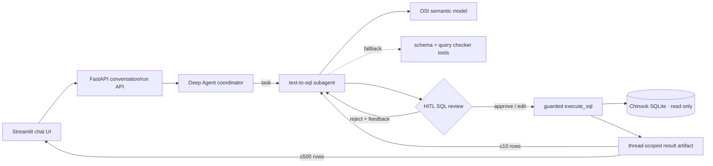

# Chinook Deep-Agent Text-to-SQL POC

A localhost proof of concept for conversational analytics with a FastAPI
backend and Streamlit UI. A Deep Agent coordinator delegates database work to
one isolated `text-to-sql` subagent. Every generated query pauses at LangChain's
built-in human-in-the-loop middleware, where the user can approve it, edit it,
or reject it with feedback.

The POC uses OpenAI `gpt-5.4-mini`, Chinook SQLite, in-memory LangGraph
checkpoints, provider-native structured output, and an Apache Ossie/OSI `0.1.1`
semantic model.

## What is implemented

- OSI-first grounding for all 11 Chinook tables, fields, keys, relationships,
  synonyms, AI instructions, and six canonical metrics
- Deep Agent coordinator plus one synchronous `text-to-sql` subagent invoked
  through the built-in `task` tool
- explicit query-writing and schema-exploration skills on the custom subagent
- provider-native strict `SQLAnalysisResult` and `FinalAnswer` schemas
- built-in LangChain approve/edit/reject HITL with `InMemorySaver`
- exact edited-SQL validation before LangGraph resume
- SQLGlot SQLite parsing and one-query/read-only enforcement
- SQLite URI read-only mode, authorizer protection, execution deadline, and
  a 500-row result cap
- full capped results in a thread-scoped artifact store, with at most ten rows
  shown to either model
- non-token-streaming background runs with cursor-based activity polling
- Streamlit conversation rehydration, collapsed run activity, editable SQL,
  complete result tables, and repeated approval cycles

## Learn the agent step by step

[`agent_internals_tutorial.ipynb`](agent_internals_tutorial.ipynb) is an
executable student lab covering the architecture, OSI grounding, prompts,
memory, skills, structured schemas, SQL safety, result artifacts, agent
construction, HITL pause/resume, sanitized events, and API lifecycle.

Install the notebook dependencies and launch JupyterLab:

```bash
uv sync --group dev
uv run --group dev jupyter lab agent_internals_tutorial.ipynb
```

The notebook builds the real application agent without making a model request.
Its OpenAI/HITL exercise is controlled by an explicit `RUN_LIVE_AGENT` switch
and is off by default.

## Architecture



## Quick start

Prerequisites: Python 3.11+, [uv](https://docs.astral.sh/uv/), and an OpenAI
API key.

From this directory:

```bash
curl -L -o chinook.db \
  https://github.com/lerocha/chinook-database/raw/master/ChinookDatabase/DataSources/Chinook_Sqlite.sqlite

uv sync
cp .env.example .env
```

Edit `.env` and set `OPENAI_API_KEY`. `chinook.db` and `.env` are gitignored.
The API returns an actionable `not_ready` health response if either is missing.

Start both services with the foreground launcher:

```bash
./scripts/start.sh
```

The launcher checks the environment and database, starts FastAPI, waits for its
health endpoint, starts Streamlit, and stops both services when you press
Ctrl+C. Open `http://127.0.0.1:8501`.

To run the processes separately for debugging, start the API in terminal one:

```bash
uv run uvicorn text2sql_agent.api:app \
  --host 127.0.0.1 --port 8000
```

Then start Streamlit in terminal two:

```bash
uv run streamlit run streamlit_app.py
```

The UI calls `API_BASE_URL=http://127.0.0.1:8000`. Its local copyable
conversation links use `APP_BASE_URL=http://127.0.0.1:8501`.

## Example workflow

1. Ask: “Which five artists generated the most line-item revenue?”
2. Watch the sanitized status panel show context loading, semantic-model
   inspection, SQL checking, and subagent lifecycle.
3. Inspect the generated SQL.
4. Approve it, change it and select **Execute edited SQL**, or reject it with
   feedback.
5. Inspect the answer, exact executed SQL, result table, assumptions, and
   interpretation, or download the complete capped result as CSV.
6. Refresh the browser: the `thread_id` URL parameter restores completed turns.
7. Ask a follow-up that refers to the prior result.

Other useful prompts:

- “How many customers are in each country?”
- “Show monthly invoice revenue and explain any assumptions.”
- “Which support representatives manage the highest-revenue customers?”
- “What is the relationship between playlists, tracks, and sales?”

Simple ranked/list questions default to five rows. SQL execution stores at most
500 rows and reports whether the original result was truncated.

## API lifecycle

| Endpoint | Purpose |
| --- | --- |
| `GET /health` | Model/database readiness without exposing secrets |
| `POST /api/conversations` | Create an in-memory conversation |
| `GET /api/conversations/{thread_id}` | Rehydrate completed turns and active run |
| `POST /api/conversations/{thread_id}/messages` | Queue one run; concurrent same-thread runs return `409` |
| `GET /api/runs/{run_id}?after_event_id=N` | Poll state and only newer activity events |
| `POST /api/runs/{run_id}/decisions` | Approve, edit, or reject interrupted SQL |
| `GET /api/results/{result_id}?offset=0&limit=100` | Page through the saved result |

Run states are `queued`, `running`, `approval_required`, `completed`, and
`failed`. A decision resumes the same checkpointed thread using LangGraph's
`Command(resume={"decisions": [...]})` contract.

## Deep Agent practices demonstrated

### Context engineering

Keep stable identity and operating rules in `AGENTS.md`, put specialized
workflows in progressively disclosed skills, and keep the database contract in
a machine-readable semantic artifact. This gives each context item one clear
job and avoids repeatedly rediscovering schema through SQL.

### OSI-first grounding

`semantic/chinook.osi.yaml` is read before SQL is written. It contains logical
dataset names, exact physical names, join paths, revenue definitions, synonyms,
and ambiguity warnings. Live table/schema tools remain available only as drift
or missing-detail fallbacks.

### Subagent isolation

The coordinator owns conversation continuity and final communication. The
custom SQL subagent owns schema interpretation, planning, SQL construction,
review, and result interpretation. Custom Deep Agent subagents do not inherit
coordinator skills automatically, so both skills are assigned explicitly. The
auto-added general-purpose subagent is disabled.

### HITL and checkpointing

Only `execute_sql` is interrupted. The approval surface shows the action that
would occur, and edits replace the action arguments through LangChain
middleware instead of bypassing the agent. `InMemorySaver` and a stable
`thread_id` let rejection/replanning and repeated interrupts resume correctly.

### Structured output and result artifacts

Provider-native schemas make both the SQL analyst and coordinator return
validated fields. Full rows do not enter the conversation checkpoint: they are
stored under an opaque `result_id`; models receive only ten sample rows. The
artifact can still be paged by the UI or safely revisited in a follow-up.

### SQL defense in depth

Safety does not depend on the prompt. SQLGlot must parse exactly one SQLite
query expression; the connection uses `mode=ro`; an SQLite authorizer denies
mutation and administrative opcodes; a progress handler enforces a deadline;
and retrieval stops after 501 rows to return 500 with an accurate truncation
flag. The reviewed SQL is executed exactly—no hidden `LIMIT` rewrite.

### Sanitized observability

Deep Agents `astream_events(version="v3")` is consumed internally, but the API
publishes only stable activity labels. Prompts, hidden reasoning, tool inputs,
and raw query results are never emitted as activity events. LangSmith can be
enabled separately for developer traces.

## Project structure

```text
data-analyst-agent/
├── AGENTS.md
├── semantic/chinook.osi.yaml
├── skills/
│   ├── query-writing/SKILL.md
│   └── schema-exploration/SKILL.md
├── text2sql_agent/
│   ├── agent.py
│   ├── api.py
│   ├── config.py
│   ├── run_manager.py
│   ├── schemas.py
│   ├── sql_tools.py
│   ├── stores.py
│   └── ui/
│       ├── api_client.py
│       └── components.py
├── streamlit_app.py
├── .streamlit/config.toml
├── scripts/start.sh
├── agent_internals_tutorial.ipynb
├── tests/
├── pyproject.toml
└── uv.lock
```

## Tests

```bash
uv run pytest
```

The default suite covers OSI references, SQL parsing and guards, read-only
execution, timeout/cap behavior, result isolation and pagination, HITL resume
shapes, repeated interrupts, API states, concurrent-run rejection, and
conversation rehydration.

The opt-in live build smoke test requires the normal `.env` and database:

```bash
RUN_LIVE_SMOKE=1 uv run pytest -m live
```

## Limitations

This is deliberately a local, single-user POC. There is no authentication,
multi-user authorization, production persistence, deployment configuration, or
chart builder. Restarting FastAPI clears conversations, checkpoints, run
events, and saved results. Result IDs are opaque but the result HTTP endpoint is
not an authorization boundary. CLI compatibility is not an acceptance goal.

## References

- [Deep Agents overview](https://docs.langchain.com/oss/python/deepagents/overview)
- [Deep Agents subagents](https://docs.langchain.com/oss/python/deepagents/subagents)
- [Deep Agents event streaming](https://docs.langchain.com/oss/python/deepagents/event-streaming)
- [LangChain human-in-the-loop middleware](https://docs.langchain.com/oss/python/langchain/human-in-the-loop)
- [LangChain structured output](https://docs.langchain.com/oss/python/langchain/structured-output)
- [Datawhale Deep Agents in Action: task planning](https://datawhalechina.github.io/deepagents-in-action/chapters/ch04-task-planning/)
- [Datawhale Deep Agents in Action: skills](https://datawhalechina.github.io/deepagents-in-action/chapters/ch07-skills/)
- [Datawhale Deep Agents in Action: human in the loop](https://datawhalechina.github.io/deepagents-in-action/chapters/ch09-human-in-the-loop/)
- [Apache Ossie core semantic-model specification](https://github.com/apache/ossie/blob/main/core-spec/spec.md)
- [OpenAI GPT-5.4 mini model](https://developers.openai.com/api/docs/models/gpt-5.4-mini)
- [Chinook database](https://github.com/lerocha/chinook-database)
