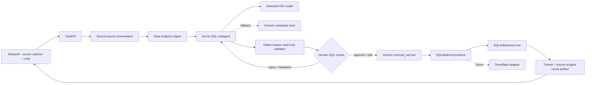

# Data Analytics Agent

A local proof of concept for source-aware conversational analytics with a
FastAPI backend and Streamlit UI. A Deep Agent coordinator delegates database
work to one isolated text-to-SQL subagent. Every generated query pauses for
human approval before a source-bound backend executes the exact reviewed SQL.

The included registry exposes two local SQLite sources:

- **Chinook music store** — catalog, customers, invoices, and playlists
- **Financial services** — accounts, clients, transactions, cards, and loans

Each conversation is permanently bound to one registered data source and its
required Apache Ossie/OSI `0.1.1` semantic model.

## Architecture



The coordinator, API, result store, HITL workflow, and UI do not import
SQLite. Backend-specific connection, introspection, validation, timeout, and
safety behavior live behind `SQLBackend`.

## Data-source registry

[`data_sources.yaml`](data_sources.yaml) is the trusted catalog that pairs each
semantic model with an execution backend and target:

```yaml
version: 1
default_source: chinook

backends:
  local_sqlite:
    type: sqlite

sources:
  chinook:
    name: Chinook music store
    backend: local_sqlite
    semantic_model: semantic/chinook.osi.yaml
    dialect: sqlite
    target:
      path: db/chinook/chinook.db
```

A source can also define its description, starter questions, and optional
execution-limit overrides. Registry changes require an API restart. A source is
not selectable unless:

- its backend type and execution target are usable;
- its OSI file exists and is structurally valid; and
- simple OSI table and column references match the live database.

Errors and warnings are returned by `GET /api/data-sources` and shown in the
Streamlit sidebar. One broken source does not disable healthy sources.

## Quick start

Prerequisites: Python 3.11+, [uv](https://docs.astral.sh/uv/), and an OpenAI
API key.

```bash
uv sync
cp .env.example .env
```

Set `OPENAI_API_KEY` in `.env`. Database locations are configured in
`data_sources.yaml`, not environment variables.

If the Chinook database is missing:

```bash
mkdir -p db/chinook
curl -L -o db/chinook/chinook.db \
  https://github.com/lerocha/chinook-database/raw/master/ChinookDatabase/DataSources/Chinook_Sqlite.sqlite
```

The supplied Financial source expects:

```text
db/financial/financial.sqlite
```

Start FastAPI and Streamlit together:

```bash
./scripts/start.sh
```

Open `http://127.0.0.1:8501`. Select a ready source in the sidebar, ask a
business question, review the generated SQL, and approve, edit, or reject it.
Changing the source starts a new conversation. The previous conversation
remains available through its existing URL.

To run each process separately:

```bash
uv run uvicorn text2sql_agent.api:app --host 127.0.0.1 --port 8000
uv run streamlit run streamlit_app.py
```

## Adding another SQLite source

1. Place the database wherever the API process can read it.
2. Create a curated OSI file under `semantic/`.
3. Add a source entry using `backend: local_sqlite`, `dialect: sqlite`, the OSI
   path, and `target.path`.
4. Restart the API and inspect source readiness in the sidebar.

No Python change is required for additional SQLite databases.

## Backend contract

[`text2sql_agent/backends/base.py`](text2sql_agent/backends/base.py) defines the
dependency-injected `SQLBackend` protocol:

- `readiness_errors()`
- `validate_sql(query)`
- `execute(query, timeout_seconds, max_rows)`
- `list_tables()`
- `get_table_schema(table_names)`

Execution returns normalized columns, row dictionaries, elapsed time, and
truncation state. An adapter may internally consume a cursor, DataFrame, or
provider-native result, but the rest of the application receives the same
contract.

### Future Snowflake integration

Snowflake is intentionally not a dependency of this POC. A future adapter can
wrap an existing injected client:

```python
class SnowflakeBackend:
    backend_type = "snowflake"
    dialect = "snowflake"

    def __init__(self, client):
        self.client = client

    def validate_sql(self, query: str) -> None:
        validate_readonly_sql(query, dialect=self.dialect)

    def execute(self, query: str, *, timeout_seconds: float, max_rows: int):
        native_result = self.client.execute(query)
        return normalize_snowflake_result(native_result, max_rows=max_rows)
```

The complete adapter also implements readiness and metadata methods. Register
its constructor in `backends/factory.py`, define a Snowflake backend/profile in
`data_sources.yaml`, and keep credentials in environment variables or secrets.
Multiple Snowflake sources can reuse one connection profile while selecting
different OSI models and database/schema contexts.

## SQL safety

Safety is layered:

- SQLGlot parses the selected dialect and permits exactly one
  `SELECT`/CTE/set-operation query.
- DML, DDL, procedures, administrative/session commands, metadata commands,
  and multiple statements are rejected.
- Validation does not submit the proposed query to the database.
- Every query requires approve/edit/reject human review.
- Edited SQL is validated again.
- The backend executes the exact reviewed SQL.
- SQLite additionally uses a read-only URI, authorizer, progress deadline, and
  capped fetch.
- Results are scoped to both conversation and source; only a small configured
  sample enters model context.

Global defaults are controlled by:

```text
SQL_TIMEOUT_SECONDS=10
SQL_MAX_RESULT_ROWS=500
MODEL_SAMPLE_ROWS=10
```

Per-source overrides belong in `data_sources.yaml`.

## API lifecycle

| Endpoint | Purpose |
| --- | --- |
| `GET /health` | Global model/registry readiness |
| `GET /api/data-sources` | Source metadata, examples, limits, errors, and warnings |
| `POST /api/conversations` | Create a conversation for `source_id` |
| `GET /api/conversations/{thread_id}` | Rehydrate turns, active run, and bound source |
| `POST /api/conversations/{thread_id}/messages` | Queue one source-bound run |
| `GET /api/runs/{run_id}` | Poll status and incremental activity |
| `POST /api/runs/{run_id}/decisions` | Approve, edit, or reject interrupted SQL |
| `GET /api/results/{result_id}` | Page through a saved normalized result |

Run states are `queued`, `running`, `approval_required`, `completed`, and
`failed`.

## Project structure

```text
data-analyst-agent/
├── AGENTS.md
├── data_sources.yaml
├── db/
│   ├── chinook/chinook.db
│   └── financial/
│       ├── financial.sqlite
│       └── database_description/*.csv
├── semantic/
│   ├── chinook.osi.yaml
│   └── financial.osi.yaml
├── skills/
├── text2sql_agent/
│   ├── backends/
│   │   ├── base.py
│   │   ├── factory.py
│   │   ├── sqlite.py
│   │   └── validation.py
│   ├── agent.py
│   ├── api.py
│   ├── config.py
│   ├── data_sources.py
│   ├── semantic.py
│   ├── sql_tools.py
│   └── ...
├── streamlit_app.py
└── tests/
```

## Learn the agent

[`agent_internals_tutorial.ipynb`](agent_internals_tutorial.ipynb) is an
executable lab covering the registry, source binding, OSI grounding, generic
backend contract, HITL flow, result provenance, API lifecycle, and Streamlit
selection behavior.

## Tests

```bash
uv run pytest
```

The suite covers both OSI models, registry/readiness behavior, backend contract
injection, SQLite safeguards, source isolation, exact edited-SQL validation,
repeated HITL interrupts, API rehydration, and UI helpers.

## Limitations

This remains a local, single-user POC. Conversations, checkpoints, events, and
results are process-local. There is no authentication, persistent store,
automatic OSI generation, production authorization boundary, chart builder, or
included Snowflake/PostgreSQL adapter.
