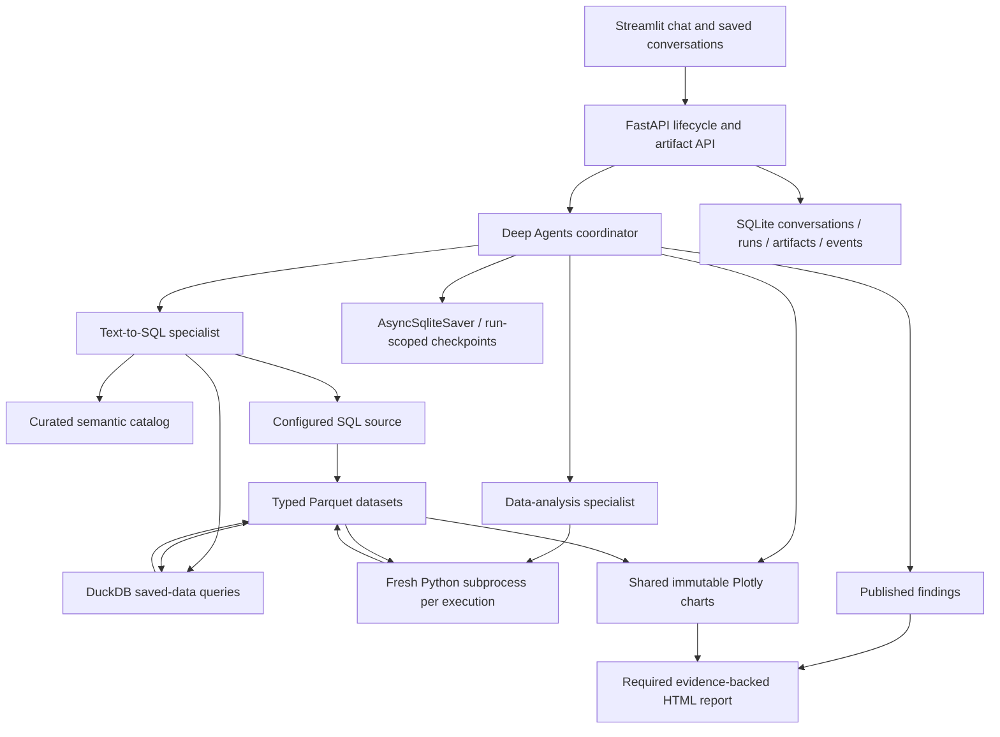

# Architecture

The coordinator routes by required work, not surface keywords. It handles
metadata-only discussion directly. SQL owns warehouse access and descriptive
transformations; Python owns analysis over explicit saved artifacts. Python can
request more data through the coordinator, which makes a sequential SQL
assignment and resumes the analysis. There are no fixed one-delegation rules.

`datasets.py` handles bounded extraction, typed Parquet and full-artifact
summaries. `stores.py` handles conversation/run/analysis/report state using
`persistence.py`. Durable metadata uses typed JSON, with large content in files.
`execution.py` and the Python runner manage local cancellation. `run_manager.py`
owns execution/resume/stop/report retry; `approvals.py` translates exact edits;
`diagnostics.py` aggregates provider usage and bounded tool events.

The graph is constructed per configured source and uses one run ID as its
checkpoint identity. FastAPI opens/closes the maintained SQLite checkpoint saver.
On startup, unfinished computations become paused and pending reviews remain
reviewable. Each tool registers artifacts directly and journals its committed
output under run/tool-call identity. Final assembly resolves explicit references;
it does not scan backward through messages or guess embedded JSON schemas.

`presentation.py` resolves all material evidence and transitive dataset lineage.
Chart versions are immutable. Chat and report consume the same chart spec and
presentation dataset. Report metric values reference exact stored rows/columns.
A published answer remains visible if rendering fails; successful completion
requires its report. Retry report only uses saved evidence and specification.

Streamlit refreshes active content using a timed fragment, preserving stable
widget keys. Immutable previews/reports are cached by ID with bounded caches.
Full downloads stream separately from preview pages. Conversation changes cause
an app rerun; ordinary active-run refresh does not rebuild the conversation.

Constraints: one process, one local user, one source per conversation, sequential
source queries. No persistent arbitrary Python object state, cross-conversation
learning, or obsolete in-memory-state migration.
