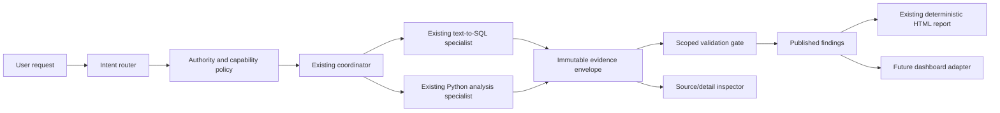

# Data plugin comparative architecture review

**Reviewed:** 2026-09-14  
**Scope:** the installed Data plugin at `/Users/charlie/.codex/plugins/cache/openai-curated-remote/data-analytics/1.0.8` and the current `data-analytics-agent` repository.  
**Method:** static source and contract review; repository test run; plugin package test attempt. This is an architectural and product-capability review, not an assessment of production data quality or connected-source access.

## Executive assessment

The two systems solve complementary parts of an analytics product.

The official **Data plugin** is a broad, host-integrated analytics product layer. Its strongest ideas are explicit task routing, source-authority discipline, reusable guidance, evidence-aware interactive delivery, and rigorous visual/publishing behavior. It deliberately relies on externally connected tools for data access and on a packaged React runtime for reports and dashboards.

This repository is a narrower but more operationally durable analytical execution system. Its strongest ideas are source-bound conversation state, a curated semantic model, strict SQL/Python separation, typed Parquet artifacts, restart-safe runs/checkpoints, idempotent tool commits, human review gates, and deterministic self-contained reporting. It is a better foundation for governed local execution than the plugin's prompt-and-artifact layer.

The recommended direction is **not** to transplant the plugin or replace the current Python/FastAPI/Streamlit architecture. Instead, retain the repository as the execution and evidence plane, then add a small workflow-and-delivery plane inspired by the plugin. Start with intent routing, a richer evidence envelope, and validation; add interactive dashboards only after those contracts are stable.

## What was examined

### Official Data plugin

- Manifest and README: version `1.0.8`, 20 focused skills, optional connections across warehouse, BI, product analytics, knowledge, messaging, email, calendar, and developer-tool categories.
- Core policy: `skills/index/SKILL.md`, shared source/dependency instructions, analysis-quality and dashboard-quality criteria, and the Data App Contract.
- Delivery system: the protected React/Recharts data-app template, reviewed snapshots, source inspector, editable presentation state, local preview, Sites publishing, selected-view URLs, refresh, export, and a content-addressed build process.
- Quality surface: 705 files; about 132k lines across Markdown, JavaScript/JSX, and JSON; 104 test files in the package.

### Repository

- Coordinator, SQL and Python specialists, semantic context, sources/backends, run manager, persistence/stores, presentation, reporting, visualization, API/UI contracts, and test suite.
- Project architecture and operational documentation.

## Architecture comparison

| Dimension | Official Data plugin | Current agent | Assessment |
| --- | --- | --- | --- |
| Primary role | Host-integrated analytics workflow and shareable experience | Local, persistent governed execution service | Complementary; keep the agent as the execution system of record. |
| Task decomposition | 20 explicit workflows such as diagnostics, KPI design/readouts, market sizing, data quality, dashboards, reports, notebooks, validation, sharing, and refresh | One coordinator routes to SQL or iterative Python; only analysis and reporting skills are loaded | The agent has a sound compute split but lacks a first-class user-intent taxonomy. |
| Source access | Connector-agnostic policy across many categories; selects authority by claim and verifies actual access | Configured SQLite/Snowflake sources with one source per conversation and a curated semantic catalog | The agent is safer and simpler for its scope; it needs a capability/authority layer before expanding integrations. |
| Semantic grounding | Guidance calls for governed definitions, population, grain, period, freshness, and source authority | Curated logical catalog, declared relationships, physical definitions only for SQL, bounded semantic-context tool | A repository strength. Its semantic model is more concrete and enforceable than prompt-only guidance. |
| Compute model | Delegates to available host/provider tools; no durable local analytic runtime is supplied by the plugin | SQL owns retrieval/description; fresh Python processes own inference/forecasting; Parquet artifacts pass between them | A clear repository advantage for reproducibility, isolation, and nontrivial analysis. |
| Evidence/provenance | Reviewed source snapshot, query/component IDs, metric definitions, source previews, filter scope, source inspector, reviewed/authoring separation | Saved source/Python/presentation datasets, parent lineage, exact SQL/Python, immutable chart versions, report input references | Both are strong. The agent's lineage is better for execution; the plugin is better for reader-facing provenance and freshness/definition presentation. |
| Report and dashboard UX | Interactive React apps with editing, source inspection, filters, layout state, export, sharing, publishing, refresh and browser verification | Deterministic self-contained HTML report with Plotly and downloads; Streamlit chat/UI; no first-class dashboard artifact | This is the largest functional gap. |
| Safety and lifecycle | Explicit source/publishing boundaries, protected runtime, data-secret checks, selected-view links, verification rules | Read-only SQL validation, optional HITL on SQL/Python, strict model filesystem permissions, run budgets, cancellation/resume, checkpoint recovery | The agent is particularly strong for local execution control. The plugin is stronger for delivery and publication guardrails. |
| Quality model | Written methodology/visual criteria plus an extensive component/browser test corpus | Pydantic contracts, backend/lineage tests, agent-workflow tests, report/chart validation | Add a lightweight structured review gate; do not copy the plugin's very large UI test surface until an interactive UI exists. |

## Confirmed strengths of the current agent

1. **A clean execution boundary.** `text-to-sql` is the only specialist with warehouse access, while `data-analysis` works from named persisted data artifacts in a fresh Python process. This prevents accidental live-source access from exploratory code and supports reproducible handoffs.
2. **Semantic-model enforcement.** Logical datasets, fields, metrics and declared relationships are bounded before SQL execution. The coordinator sees business-facing metadata while the SQL specialist receives physical definitions only when necessary.
3. **Durable artifacts and resumability.** Results are typed Parquet data, runs are journaled/idempotent, checkpoint state is persisted, interrupted work is recoverable, and reports can be retried without repeating extraction.
4. **Evidence preserves lineage.** `resolve_answer` traverses parent result IDs, Python inputs/outputs, and chart references before publishing. Charts are immutable/versioned and retain display-sampling notes.
5. **Proportionate orchestration.** The coordinator explicitly avoids forcing heavyweight investigation and charts on simple descriptive questions, while allowing multi-step SQL/Python loops for uncertain work.
6. **Defensive report generation.** A strict declarative `ReportSpec`, escaping renderer, contrast checks, local asset embedding, and report-scoped evidence references make offline delivery reliable.
7. **Verified baseline.** The repository test suite completed successfully: `188 passed, 6 skipped` in 21.21 seconds. The warnings concern upstream experimental/deprecation notices, not failing behavior.

## Confirmed strengths of the Data plugin worth adopting

1. **Intent-first product surface.** It separates product/business analysis, metric diagnosis, KPI design/readouts, market sizing, data quality, notebooks, charts, dashboards, reports, validation, sharing, and refresh. This makes its behavior easier to predict and its guidance more specific.
2. **Authority is evaluated per claim.** The plugin distinguishes primary measurements from supporting business context and treats Slack/messages as leads rather than proof. It requires validation of definition, population, grain, date window, and freshness.
3. **Presentation is evidence-aware.** Its app contract ties every source-backed component to reviewed data/query IDs, preserves filter and presentation state, and offers source inspection rather than merely attaching generic provenance.
4. **Reader-centered reports.** The report workflow is answer-first, uses restrained executive summaries, keeps caveats next to the affected claim, and avoids generic report templates or decorative metrics.
5. **Explicit validation criteria.** Its quality guidance calls out denominator/grain/date checks, independent recomputation, causal overclaiming, all-null versus zero states, accessible visuals, and rendered—not merely build—verification.
6. **Delivery lifecycle completeness.** It has a cohesive model for preview, export to office formats/PDF, sharing, refresh, publication and view-specific links.

## Important differences and trade-offs

### The plugin is not a drop-in data engine

The plugin package is primarily a workflow specification and frontend/runtime. It expects the host and connected providers to supply source discovery, access, query execution, identity, publishing, and browser control. It should not replace the repository's source registry, SQL safety, Python sandboxing, persistent stores, or semantic catalog.

### The agent should not emulate all 20 skills with new agents

The plugin's many workflows are mostly specialized policy and deliverable guidance, not separate compute engines. Creating 20 subagents would duplicate prompts, weaken ownership, and conflict with this repository's deliberate SQL/Python boundary. Use a typed intent router plus focused skill/prompt modules over the existing coordinator and two specialists.

### Static HTML versus interactive applications is a real product choice

The agent's self-contained HTML is well suited to auditable local sharing and resilience. The plugin's React surface is better for filtering, layout edits, source inspection, refresh and collaborative refinement. Add an interactive layer only if recurring monitoring and shared exploration are actual user needs; do not trade the current deterministic report for a client-only dashboard without a durable snapshot contract.

### Different integration models require different governance

The agent's one-source-per-conversation rule avoids ambiguous joins and authority conflicts. The plugin accommodates many source categories by policy. If the agent expands beyond configured SQL sources, it must introduce explicit authority selection and source-scope records before accepting cross-source evidence.

## Findings and practical recommendations

### P0 — Fix the plugin package verification experience before treating it as a reliable local build dependency

In this installed cache, `npm test` ran 1,439 tests: **1,407 passed and 32 failed**. Most failures were environmental: missing `react`, `html-to-image`, and `vite` dependencies used by the package's test targets. Two failures also reveal contract drift: a refresh-copy expectation and an uploaded-spreadsheet discovery expectation no longer match the installed source. The plugin documentation claims ordinary authoring builds do not need dependency installation, which is compatible with this finding; its *test* command, however, is not hermetic in the installed cache.

**Recommendation:** do not vendor this cached package as an unpinned runtime dependency. If it becomes a build dependency, consume a release artifact with a verified prebuilt runtime and add a small compatibility smoke test around the exact prepare/build commands the agent will use. Treat its broad test suite as upstream validation rather than a gate for this repository until the dependency closure and test/release contract are fixed upstream.

### P1 — Add a typed analytics intent router, not more general-purpose orchestration

Introduce a small `AnalyticsIntent` contract before coordinator dispatch: `lookup`, `descriptive_analysis`, `metric_diagnostic`, `data_quality`, `forecast_or_model`, `kpi_design`, `kpi_readout`, `market_sizing`, `report`, `dashboard`, `notebook`, `validation`, `share`, and `refresh`. Each intent should specify required evidence, permitted sources, delivery type, and whether SQL/Python is expected.

Use it to select concise prompt modules and output validators while retaining the existing SQL and Python specialists. This makes routing inspectable, makes unsupported modes explicit, and allows tests to assert behavior without brittle prompt matching.

**Acceptance criteria:** a request has one persisted intent, permitted tools are constrained by it, and existing simple totals still follow the one-SQL fast path.

### P1 — Enrich the evidence envelope at the artifact boundary

Extend saved-result metadata with structured, optional fields for:

- `captured_at`, `data_as_of`, timezone and freshness semantics;
- metric definition ID/version, formula summary, denominator/grain and policy-effective period;
- source authority tier and a safe source reference/preview;
- applied filters, population/exclusions and requested comparison baseline;
- extraction completeness and material data-quality warnings.

Derive report/chart provenance from this envelope instead of relying on free-form narrative. Preserve the current SQL/Python lineage; this is an additive reader-facing contract, not a replacement.

**Acceptance criteria:** a chart or metric block can show exactly what data-as-of, definition, population and inputs it represents; missingness is explicit rather than silently absent.

### P1 — Add a proportionate validation gate to publication

Borrow the plugin's validation checklist, but make it machine-readable and scoped. Before `publish_findings`, validate only consequential claims:

- definition/grain/period compatibility;
- source completeness/truncation and material null/zero conditions;
- independent calculation where a ratio, contribution, model or surprising result warrants it;
- chart-to-claim agreement; and
- causal wording versus observed association.

Store outcomes as `verified`, `caveat`, `not_applicable`, or `unverified` with a reason. Do not require exhaustive dashboards checks for simple SQL totals. A full deep-review mode can create the plugin-like coverage scorecard only when requested.

**Acceptance criteria:** publication refuses a central unsupported claim but permits partial findings with named gaps; reports render the material caveats near the relevant claim.

### P1 — Make output mode explicit and preserve the existing report path

Add `inline`, `report`, `dashboard`, and `notebook` as output modes. The user-requested form should win; otherwise keep simple answers inline and use a report for multi-finding decision readouts. Current HTML remains the canonical `report` implementation.

Do not make a report mandatory for every scalar result at the domain level. Keep the internal evidence record mandatory; expose the compact report when the product requirement calls for it. This avoids needless artifacts while retaining traceability.

### P2 — Build a dashboard as a separate delivery adapter after the evidence contract stabilizes

Add a `DashboardSpec` and `DashboardArtifact`, parallel to—not hidden inside—`ReportSpec`. It should reference immutable results/charts plus the enriched evidence envelope. Start with read-only filters, period controls, source detail, empty/all-null/partial states, and view URLs. Persist presentation separately from reviewed data.

Do not begin by embedding the entire Data plugin template. Use a small adapter layer that can later emit either the current local web surface or a Data-compatible app snapshot. This protects the agent from a large React runtime and keeps its FastAPI/Streamlit boundary modular.

### P2 — Introduce an integration capability registry before adding sources

Generalize `DataSource` into a small provider capability contract: `metadata_read`, `metric_definition_read`, `value_query`, `file_read`, `BI_view_read`, `product_event_query`, `message_context_read`, and `publish`. Each provider declares the scopes, freshness semantics, source-link safety, and whether it can support an authoritative measurement versus explanatory context.

Continue to select one controlling source for a quantitative claim. Permit additional sources only when their role is explicit: definition, denominator, explanation, or decision context. This imports the plugin's authority discipline without weakening the current one-source execution rule.

### P2 — Add reusable company data context as versioned configuration

The plugin's reusable context capability is valuable: metric definitions, canonical filters, business calendar, reporting conventions, known pitfalls, and approved source links should be shared across conversations. In this agent, implement it as versioned, source-scoped configuration (for example `semantic/context/`) with explicit precedence over free-form user instructions.

Keep it separate from raw observations and checkpoints. Let semantic catalog changes invalidate only the affected new run, as the system already does.

### P2 — Strengthen reader-facing report provenance and accessibility

The static renderer should gain compact expandable source/definition panels for each chart/table/metric, a visible `as of` convention, a direct link to safe local evidence downloads, and keyboard-testable disclosure controls. The plugin's source inspector is a good interaction reference.

Keep the self-contained report secure: never embed credentials, signed URLs, unnecessary source rows, or arbitrary remote scripts. The agent already has a good foundation here through escaped deterministic HTML and local assets.

### P3 — Add lifecycle adapters only when users need them

After dashboards exist, add explicit adapters for PDF, DOCX, slides, sharing, and recurring refresh. Refresh must reopen the same artifact, rerun saved source requests through the existing source backend, validate changed claims, preserve user presentation state, and never silently widen access.

Avoid coupling this to local desktop availability. A scheduled refresh needs a durable execution environment and credentials that can be re-authorized; it cannot be a background thread in the current one-process local deployment.

## Recommended target shape

The important boundary is between **execution/evidence** and **delivery**. The current system should remain authoritative for SQL, Python, semantic definitions, artifacts, approvals, and run state. The new layer should select workflows, represent reader-facing provenance, validate claims, and package the same immutable evidence.

## Delivery plan

| Phase | Scope | Why now | Exit criteria |
| --- | --- | --- | --- |
| 1 | Intent router, output modes, evidence-envelope schema | Improves predictability without changing compute or UI | Existing tests pass; new route tests cover all intents and SQL/Python ownership remains unchanged. |
| 2 | Scoped validation and report source/definition disclosures | Raises analytical trust with low product risk | Consequential reports record validation outcomes and display material caveats; partial reports remain usable. |
| 3 | Provider-capability registry and versioned Data Context | Enables controlled integration growth | A second contextual source can be labeled as explanatory without being mistaken for a metric authority. |
| 4 | Read-only dashboard artifact | Solves monitoring/exploration demand | Saved view state, filter semantics, source details and empty states are testable from immutable snapshots. |
| 5 | Export, sharing, hosted refresh | Adds operational distribution | Refresh reproduces a stored artifact scope and preserves provenance and presentation state. |

## Review limits

- No live warehouse, BI, product analytics, document, or messaging connector was available or needed for this code/package review.
- The plugin's browser/visual tests were not run because the installed cache lacks the required local test dependencies; no claim is made about its browser runtime behavior.
- This repository is intentionally single-user and local. Public URLs, multi-user authorization, and hosted scheduling should be designed as new product boundaries, not inferred from the current API.

## Bottom line

Adopt the Data plugin's **product contracts**—intent routing, source authority, evidence-rich presentation, scoped validation, and artifact lifecycle—while preserving the agent's **execution contracts**—semantic enforcement, SQL/Python separation, typed artifacts, persistence, budgets, approvals, and deterministic rendering. That combination will produce a substantially more complete analytics product without sacrificing the reliability already present in this repository.
