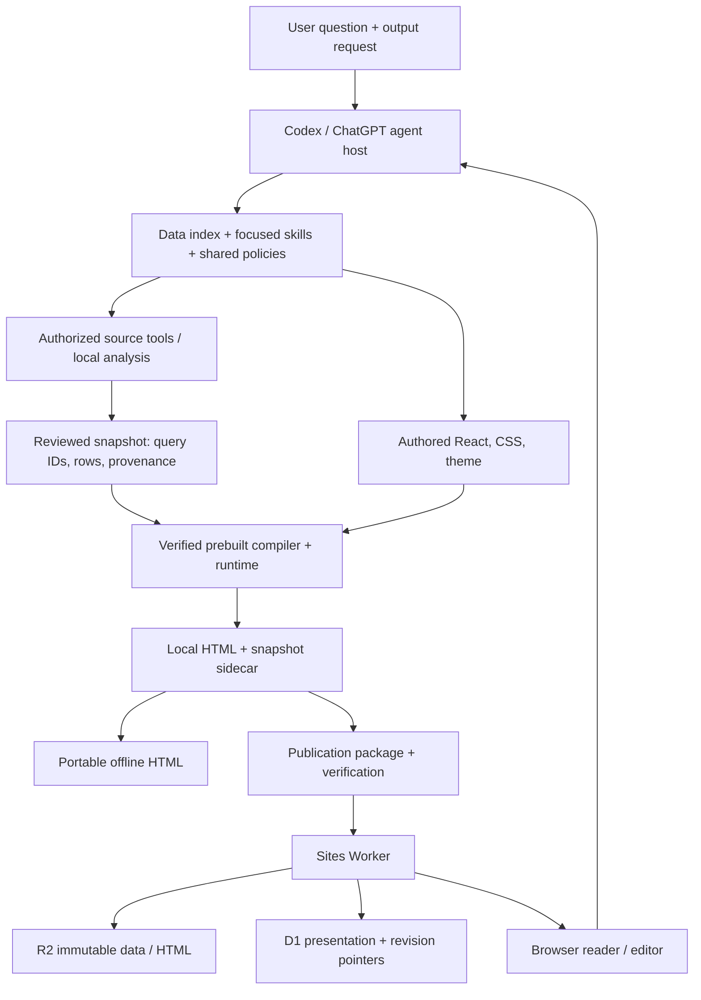
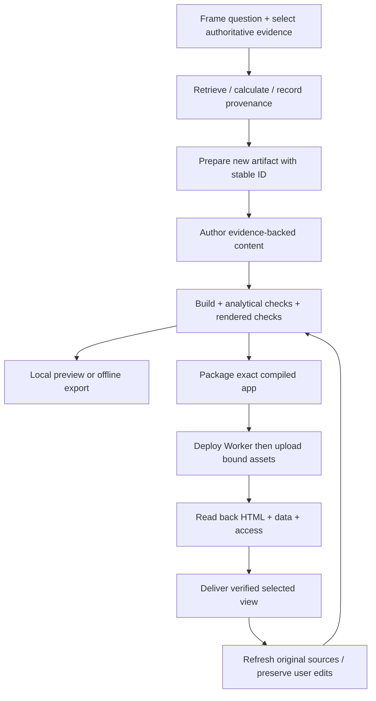
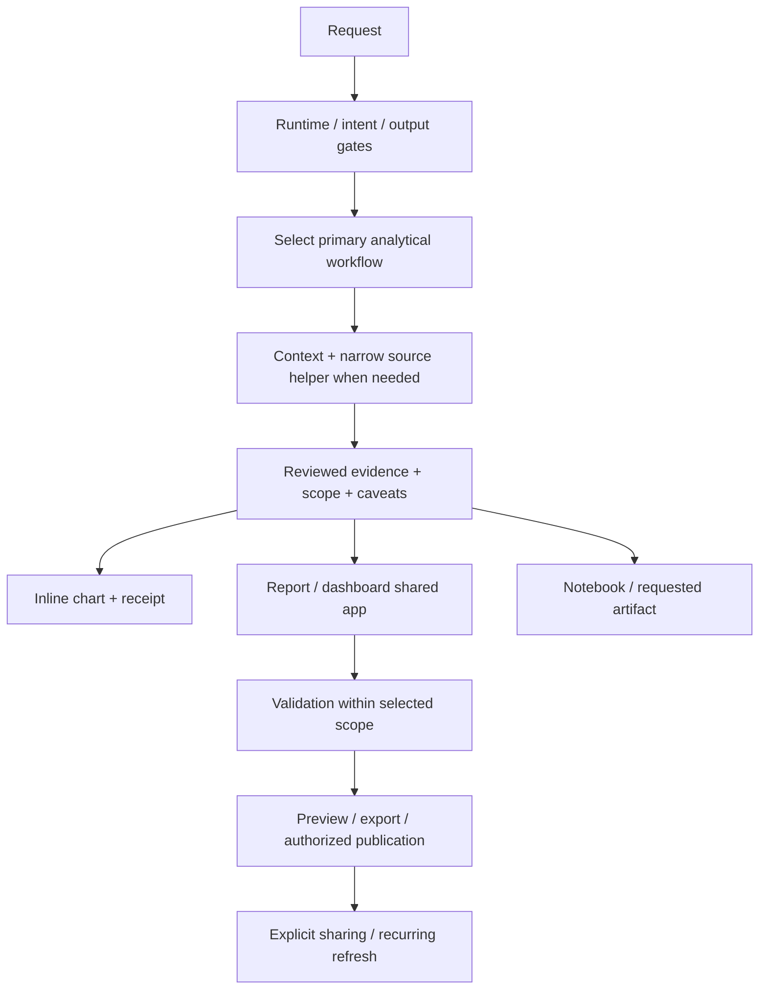

# Codex Data 1.0.8: technical and product review

Standalone review • 14 September 2026 • Audience: AI engineers

## 1. Executive assessment

**Inference — Assessment.** Data is an evidence-oriented analytics workflow and artifact platform. Its strongest architectural idea is to let an agent investigate and author a question-specific experience while a shared runtime preserves source inspection, presentation editing, navigation, and delivery behavior. It is a substantial product implementation, not merely a collection of prompts. Its trustworthiness nevertheless depends on three different mechanisms: the agent selecting and interpreting evidence correctly, the runtime preserving that evidence, and the host supplying identity, tools, approvals, and deployment. These mechanisms should be assessed separately. [S01] [S03] [S05] [S09]

**Observed — Product scope.** The manifest identifies `data-analytics` version `1.0.8`, displays the product as **Data**, declares a proprietary license, and describes product/business analysis. Its 20 skill entry points span discovery, metric design, diagnostics, quality, reports, dashboards, notebooks, context, validation, conversion, publication, sharing, and refresh. Optional connector declarations are discovery hints, not implementations or proof of access. The installed manifest has an empty repository field. [S01] [S02] [S03]

**Inference — Best fit.** The architecture is well suited to bounded, reviewed analytical work that must remain understandable and revisable after the conversation: a metric investigation with inspectable SQL, a report with supporting calculations, or a dashboard whose filters operate over a saved population. It is less self-sufficient when a task requires source access, a scheduler, authenticated collaboration, or new runtime packages. Those capabilities cross explicit host or maintainer boundaries. [S03] [S05] [S07] [S19]

**Observed — Strong foundations.** The inspected implementation includes a verified, data-free prebuilt runtime; a closed local module build path; stable artifact/query/component identities; separate presentation state; revision-checked hosted presentation writes; immutable snapshot storage; bounded query updates; source-link sanitization; and publication credential scanning. The local split build and offline export succeeded without installing customer-app dependencies. [S08] [S09] [S10] [S11] [S12] [S17] [T02]

**Observed — Material gaps.** Complete-view URL serialization includes filters marked `shareInUrl: false`; a direct probe reproduced this. A malformed owner query-update body throws an uncaught `SyntaxError` from the Worker function. The HTML assembler accepts a structurally valid query snapshot with no provenance. These are different classes of finding: an explicit but privacy-sensitive view contract, a request-error containment defect, and a limit of structural validation. None establishes a live data breach. [S12] [S14] [S17] [T05]

**Observed — Validation result.** The full installed test command, executed against a temporary copy with Node 24.19.0, reported **1,407 passed / 32 failed / 0 skipped**. Thirty failures were dependency/toolchain-related; two were instruction-text assertions. A separate print browser test passed. The mobile responsive suite failed on a 320-pixel icon-spacing assertion and stopped early. Separate offline fixture checks rendered at 1440, 390, and 320 pixels without page overflow or uncaught page errors. These are scoped results, not a product-wide pass. [T01] [T03] [T04] [T06]

**Recommendation — Improvement order.** Prioritize privacy-safe view links, evidence-bound verification, request containment, and activation of fully staged publications. Then unify evidence validation and make release tests reproducible. Resolve instruction drift and mobile regressions before expanding the runtime surface. No confirmed P0 exploit or production outage was established in this review; section 12 defines a conditional P0 release gate and concrete P1–P3 work. [S05] [S12] [S14] [S18] [T01] [T04] [T05]

## 2. Review method and limits

**Observed — Sole subject.** The reviewed installation is `/Users/charlie/.codex/plugins/cache/openai-curated-remote/data-analytics/1.0.8`. No other agent or application repository was used as a comparison. The working repository is only the destination for this review. The installed plugin was copied to a temporary directory for execution. A before/after SHA-256 inventory checks that the installed files remain unchanged. [T07]

**Observed — Inspection method.** Inspection covered actual contents of the manifest, README, root/template/release package configuration, lock/manifest metadata, all skill frontmatter and routing inventory, relevant skill bodies, shared policies, component documentation, builder and publication code, Worker routes, storage, source normalization, URL state, runtime bootstrap, public components, presentation validation, tests, and live-evaluation instructions. Large source files and the full skill corpus were inspected selectively; this is not a line-by-line audit of all 705 installed files. Minified bundles were checked through manifest verification and exercised by builds/rendering; their entire minified text was not manually audited. [S01]–[S43] [T07]

**Observed — Execution method.** The installed root test selection was run unchanged in the temporary copy. It includes top-level tests, release tests, and template tests. Subsequently, only the temporary copy received a symlink to the already bundled `playwright-core`; no npm installation occurred. Browser retries used an existing Chromium headless shell after the sandbox initially prevented loopback listening/browser startup. Test receipts preserve those scopes. The release publisher's fresh `npm ci` and byte-for-byte rebuild were not run: the frozen maintainer dependency workspace was not present. [S08] [S20] [S21] [T01]–[T06]

**Observed — Not exercised.** No live warehouse query, real connector workflow, Sites deployment, owner-session authorization, cloud refresh job, external message, document conversion, or real-user usability study was executed. No security exploitation against an external system, performance benchmark, exhaustive screen-reader audit, or full browser matrix was performed. Host behavior outside the installed source cannot be verified by local Worker mocks or generated HTML. [T01]–[T06]

**Observed — Deliverable design.** Data's report, analysis-quality, and validation guidance informed the evidence discipline and review structure. `ui-ux-pro-max` supplied documentation-oriented minimalism, accessible hierarchy, responsive layout, and control guidance. This requested standalone technical document uses self-contained HTML rather than presenting itself as a functioning Data analytics app. It has no warehouse-backed claims, fabricated query snapshot, external resources, or publication workflow. The complete Markdown review is preserved in the HTML. [S04] [S06] [S23] [S44]

**Observed — Review-artifact validation.** The HTML was opened offline in Chromium at 1440×1000, 768×1024, 390×844, 375×812, 320×740, and 844×390. Checks found no page overflow, clipped inspected text blocks, uncaught browser errors, or external network requests. Automated checks confirmed Markdown prose/table/list preservation, internal source navigation, source-copy payloads with a mocked clipboard, disclosure controls, print expansion/restoration, and principal text-color contrast. Chromium PDF output was rendered and inspected; the architecture diagram's initial page split was corrected. These checks validate this review document, separately from the plugin results below. They do not establish screen-reader or cross-browser conformance. [T08]

**Observed — Evidence labels.** **Observed** means directly inspected source/instruction behavior or an executed result, with the distinction stated. **Inference** means a reasoned implication, not an observed production outcome. **Recommendation** means proposed work. A paragraph's label applies to its full claim; tables label each row. Source IDs resolve to exact installed paths and line intervals in section 14. Test IDs identify retained local evidence.

## 3. System architecture and boundaries

### 3.1 Layers and responsibility

| Layer | Responsibility and boundary | Evidence |
|---|---|---|
| Observed: plugin registration | Manifest exposes skills, interface metadata, and optional provider categories. It does not declare a plugin-owned analytics MCP server. | [S01] |
| Observed: agent instruction layer | Index chooses output and source authority; focused skills guide the analytical job; shared policies govern dependencies and artifacts. Execution uses callable host capabilities. | [S03] [S04] |
| Observed: reviewed artifact inputs | `src/data.json` stores query rows and provenance; `src/content/` holds authored React/CSS/assets; `src/theme.css` supplies theme tokens. | [S05] [S07] |
| Observed: build layer | Preparers create new identities and content. Ordinary builds verify installed bundles, validate authored boundaries, link supported local modules, and assemble HTML/data. | [S08]–[S11] |
| Observed: browser runtime | React shell, shared charts, source inspector, controls, editor, layout, URL state, and handoff tools operate over reviewed evidence. | [S13]–[S16] [S24] |
| Observed: hosted service | Worker exposes snapshot/presentation/query routes. D1 stores presentation and revision metadata; indexed publications place immutable snapshot/query payloads in R2. | [S12] [S18] |
| Observed: host/integrations | Codex/ChatGPT tools provide source reads, browser context, task handoff, Sites lifecycle, and scheduling. External artifact skills handle document/slide conversions. | [S03] [S19] [S27] [S28] |

**Inference — Architectural thesis.** Data externalizes the analytical execution environment while owning the artifact contract. The agent is responsible for meaning; the runtime is responsible for preserving and exposing the result. This enables many source types without embedding database clients into dashboards, but also means a running dashboard is not a self-contained analytical agent or a live warehouse client. [S03] [S05] [S12] [S19]



**Observed — Diagram meaning.** Arrows summarize the source-established control and artifact flow. The final arrow is a host handoff for further work, not browser-side warehouse execution. Sites authentication surrounds hosted access and is external to the Worker source reviewed here. [S05] [S08] [S12] [S19] [S25]

### 3.2 Build/runtime separation

**Observed.** The default customer build uses a shipped IIFE browser runtime and a standalone JavaScript compiler. The release compiler exposes Rollup, Sucrase transformation, JavaScript parsing, and CSS parsing/walking/generation. The runtime manifest lists eight supported module specifiers, including React, React DOM, React Markdown, Recharts, and `@openai/data-app`. Vite belongs to release building or explicit `--source` compilation, which requires a compatible installed local toolchain. [S08] [S09] [S10]

**Observed.** The loader verifies regular-file containment, sizes, hashes, API version, and source-manifest relationships. Compiler loading evaluates the exact verified bytes and supplies a rejecting `require`, avoiding reopening a replaced module path through Node's module cache. The generated project's copied verifier is not trusted for the ordinary prebuilt path; the installed, verified authoring checker is used. [S09]

**Inference.** These checks materially reduce accidental runtime drift and ambient dependency interference. They do not constitute publisher authenticity by themselves: hashes stored alongside code rely on the integrity of the plugin delivery channel. Nor is `runInThisContext()` an isolation boundary against a malicious trusted compiler. The security claim is integrity relative to installed release metadata, not independent signature verification or arbitrary-code sandboxing. [S09]

**Observed.** The authored linker accepts static local module graphs, local JSON/assets, ordinary CSS, and documented inline calculation workers. It rejects unsupported package/URL imports, top-level await, lazy dynamic-import semantics, and unsupported `import.meta`. Protected-code checks reject direct internal imports and selected patterns of chrome manipulation. These are authoring constraints; they do not establish that arbitrary authored JavaScript has no browser capabilities. [S07] [S10] [S22]

**Inference.** A narrow public surface makes routine authoring predictable and keeps product behavior consistent. Its cost is an additional compiler/linker contract and a source-build escape hatch that maintainers must support. Increasing language or package support without contract tests would enlarge the surface for semantic differences between ordinary builds and source builds. [S08] [S10] [S20]

### 3.3 Artifact lifecycle



**Observed.** Preparation rejects an existing output directory and creates a new app ID. Revisions preserve app/query/component IDs, layout, selected view, and user presentation. `buildStatus` distinguishes creating, updating, complete, and paused authoring. `complete` means requested work is finished; instructions explicitly distinguish it from successful execution of unavailable verification. [S07] [S11]

**Observed.** Split builds bind compiled HTML and a content-addressed complete JSON sidecar in `dist/data-app-build.json`. Local HTTP loads the full sidecar before creating content. `export-offline` converts the verified split bundle into portable HTML without recompilation and limits output to `.data-app-offline/exports/` inside the app. Publication retains an offline recovery bundle and removes split data from deployment/source locations as specified. [S07] [S17] [S19]

**Inference.** The lifecycle deliberately preserves a reviewable artifact across delivery modes. Publication is still a multi-step transaction: its prescribed order deploys code before uploading its content-addressed assets. If asset upload fails while a new deployment is active, the Worker can return 503 for missing assets. This is a source-derived availability risk, not an observed production outage. [S12] [S19]

## 4. Skill system: routing and instruction design

### 4.1 Routing contract

**Observed.** The index first resolves host/runtime gates, task intent, and response mode. It locks the requested output before source-helper selection. A spreadsheet can be a source for an HTML dashboard; its file format does not choose the deliverable. Source helpers must be narrow, have callable prerequisites, preserve the controlling source's semantics, and return evidence rather than overriding Data's final response. [S03]

**Observed.** A positive ChatGPT web + Chat mode signal activates a Work Mode recommendation gate; explicit continuation clears it. Inline output has its own shared-chart and Sources-receipt rules. Local desktop report/dashboard delivery defaults to localhost; cloud/web defaults to private Sites publication, subject to explicit file-only/no-publish instructions. These are instruction rules, not guarantees that every host exposes every required tool. [S03] [S05]



**Inference.** The routing model is a procedural policy graph carried in text, not a compiled state machine. Gates express useful ownership and stopping rules, but successful execution requires the host agent to remember earlier decisions, interpret conditional instructions, and resolve tool availability. Source-code tests can validate wording or a handoff payload without proving that an agent chooses the correct route in a real conversation. [S03] [S20] [S21]

### 4.2 Taxonomy and dependencies

| Skill family | Installed entry points | Purpose and handoff |
|---|---|---|
| Observed: entry and context | `index`, `gather-business-context`, `create-data-context` | Route current work; retrieve decision-shaping context; persist reusable guidance only when requested. [S03] [S26] [S29] |
| Observed: metrics and decisions | `design-kpis`, `kpi-reporting`, `metric-diagnostics`, `product-business-analysis`, `market-sizing` | Define measurement; report actuals; decompose movements; recommend decisions; estimate scenarios and sensitivity. [S30]–[S34] |
| Observed: evidence fitness | `analyze-data-quality`, `validate-data` | Assess underlying data versus audit an existing analytical conclusion/artifact. Scoped companion calls avoid restarting the whole workflow. [S06] [S35] |
| Observed: authoring | `build-report`, `build-dashboard`, `visualize-data`, `jupyter-notebooks` | Create the selected surface, choose visual encodings, preserve calculation records, and verify rendered outputs. [S04] [S23] [S36] [S37] |
| Observed: delivery and upkeep | `publish-artifact-to-sites`, `report-to-pdf`, `convert-to-doc`, `convert-to-slides`, `share-artifact-summary`, `schedule-refresh-jobs` | Preserve the existing artifact/view while crossing destination, authorization, and host boundaries. [S19] [S27] [S28] [S38] [S39] [S40] |

**Observed.** Shared instruction ownership is documented in the README. Common source/dependency rules belong to the shared skill instructions; analytical criteria and dashboard-quality criteria are reusable references; the Data App Contract owns snapshot/runtime/lifecycle rules; copied `AGENTS.md` owns authoring boundaries. Focused skills link to these owners rather than treating every reference as a new workflow. [S02] [S05] [S07]

**Inference — Strength.** The most useful distinctions are semantic: defining KPIs is different from diagnosing an existing one; dataset quality differs from validating a conclusion; a report is an argument while a dashboard is an exploration/monitoring surface. These boundaries encourage the agent to do the right kind of work instead of merely choosing a tool. [S04] [S06] [S30] [S32] [S35] [S36]

**Observed — Overlap and tension.** `gather-business-context` asks for every enabled/provided source family that could help and fresh structured-source discovery. The index and shared policy ask for authoritative-first bounded discovery, reusing task evidence and expanding only for a material gap. `product-business-analysis` mandates a context pass while the context skill says fully self-contained requests can skip it; the product skill permits a brief pass in that case. These can be reconciled, but the reconciliation is left to the agent. [S03] [S26] [S33]

**Observed — Disclosure tension.** Dashboard copy guidance says sample classification should live in metadata and visible disclosure is added only when requested. The demo and live-evaluation instructions require synthetic labeling; report guidance also calls for a synthetic label. A hypothetical sample dashboard exported as an image can lose metadata-only disclosure. The conflict is textual; this review does not claim an agent actually misrepresented sample data. [S03] [S04] [S21] [S36]

**Inference — Maintenance risk.** Long procedural gates mix durable policy with tool names, browser variants, timed chooser behavior, and legacy cases. The index alone is 488 lines. That makes it powerful but creates instruction drift: one wording change can break a regex test while leaving the intended behavior intact, and a correct general policy can be weakened by a focused skill's broader imperative. [S03] [S20] [T01]

**Recommendation.** Retain the taxonomy, but centralize source-discovery scope and synthetic-data disclosure. Test routes with realistic input/tool-availability scenarios and expected actions, alongside minimal wording checks. Keep durable permission boundaries distinct from host-specific instructions and optional preferences. See R6 and R8. [S03] [S20] [S26]

## 5. Data, evidence, and analytical trust

### 5.1 Authority is a workflow decision

**Observed.** Source authority is claim-specific. Shared policy traces secondary mentions to original evidence and resolves conflicts using ownership, directness, definition, grain, coverage, and freshness. A connector badge does not establish query access; metadata access does not establish data access. User-scoped CSVs or pasted results are valid within their supplied scope and date and must not be described as fresh warehouse reads. [S03] [S41]

**Inference.** This is a strong epistemic policy but not a centralized semantic execution engine. A `source.sql` string is a record of what the agent says ran, not a cryptographically authenticated execution receipt. A `metricDefinitions` object can explain the numerator and denominator without proving their values. Evidence quality remains dependent on source tools, preserved execution outputs, and review of actual transformations. [S05] [S06] [S15]

### 5.2 Snapshot and identity model

| Object | Established contract | Consequence |
|---|---|---|
| Observed: artifact | Stable top-level ID and surface, with snapshot timestamps/build state. | Identity survives refresh and presentation edits. [S07] [S11] |
| Observed: query | Stable key in `queries`; reviewed rows plus source metadata and optional methods/payload columns. | Query IDs identify saved artifact datasets, not warehouse table names. [S05] |
| Observed: component | Stable `id`, reviewed `queryId`, kind, title, optional additional query bindings and source/display rows. | Source inspection and exports can follow a visible unit back to evidence. [S16] |
| Observed: definition | Label/definition, optional formula/variable/dependencies, component scope and source lineage. | Inspector can expose relevant definitions and their dependencies. [S05] [S15] |
| Observed: presentation | Theme, title, text edits, hidden blocks, chart overrides, filters, assumptions, layout, tabs, verification. | It is separately persisted and validated; row/provenance keys are not presentation edits. [S14] |
| Observed: immutable publication | HTML/snapshot hashes, asset descriptors, snapshot indexes, source references. | Supports integrity verification and recovery of exact reviewed input. [S18] [S19] |

**Observed.** Recorded evidence can include SQL, provider/tool and exact non-secret arguments in `evidenceFlow`, transformation steps in `query.methods`, pagination/coverage limits, units, timezone, fixed or rolling window rules, query links, and metric definitions. Source normalization accepts several historical aliases. Provider-specific query links preserve only recognized locators; general source URLs reject query strings, fragments, credentials, and suspicious credential paths. [S05] [S15]

**Inference.** The evidence representation is rich but heterogeneous. Supporting aliases helps existing artifacts, while loosely structured metadata makes complete validation harder. A typed schema should express required evidence per source class without requiring fabricated SQL for non-SQL sources. An externally computed score may correctly have unavailable methodology; the schema must allow that state explicitly rather than creating false certainty. [S05] [S15] [T05]

### 5.3 Filters, grain, and freshness

**Observed.** Filter resolution applies exact dimensions before date endpoints, scopes filters to queries, and distinguishes aggregate rows from breakdown rows. Report history retains periods inside visible ranges; latest/previous use an unambiguous temporal field, and previous-period comparison clears only the period restriction while preserving other scope. This is substantive analytical behavior in shared code, not solely chart formatting. [S42]

**Inference.** Shared filtering reduces inconsistent populations between views, but correct behavior still depends on schema and grain. For example, summing subgroup conversion rates is not repaired by selecting the right date. An authored chart can still use an incorrect aggregation, omit a denominator, or read undeclared data outside its wrapper. The source contract and independent calculations must validate those choices. [S05] [S23] [S42]

**Observed.** The contract distinguishes `source.executedAt`, snapshot `generatedAt`, actual observed periods, report cutoffs, and table-usage timestamps. Usage/popularity is explicitly not proof of verification or freshness. Refresh instructions update requests, periods, narrative, and per-query execution times and preserve fixed versus rolling-window semantics. [S05] [S43]

**Observed.** The local assembler probe accepted `{"queries":{"q":{"rows":[{"value":1}]}}}` without source metadata. It verified structure at that boundary, not source authority, freshness, metric meaning, or result correctness. This intentionally small probe does not exercise every subsequent runtime path. [S17] [T05]

**Recommendation.** Introduce a shared evidence validator at preparation, build, refresh, and publication. Validate structural references, source classification, coverage, freshness semantics, formula dependencies, and component/query bindings; report missing evidence explicitly. Keep analytical assertions such as causal support and correct business eligibility as separate reviewed obligations. See R5. [S05] [S06] [T05]

## 6. Report and dashboard architecture

### 6.1 Composition and common behavior

**Observed.** Reports and dashboards select different authored content inside the same `DataAppRuntime` and `DataAppShell`. The public module exports evidence wrappers, charts, metric cards, tables, filter controls, narrative editing, sections, sortable regions, source inspection, and query-loading boundaries. The shell owns the single main landmark and product controls. Content can be custom React/CSS while preserving stable evidence bindings. [S07] [S13] [S16] [S24]

**Observed.** Report instructions favor answer-first narrative, material caveats beside claims, and progressive disclosure for methods. Dashboard instructions favor task-specific sections, useful comparisons, scoped controls, and adapting approved example compositions without inheriting fictional measurements. Golden example status requires recorded approval for the current example revision; preparation with `--from-reference` requires the user's reviewed snapshot and does not load the example fixture. [S04] [S11] [S36]

**Inference.** A common shell makes provenance and editing learnable across artifacts. Free composition preserves analytical expressiveness, but it also creates a trust obligation for every custom block: visible geometry, bound data, source preview, copied values, and exported images must agree. Shared wrappers make this possible; they cannot establish it merely by being present. [S05] [S16] [S23]

### 6.2 Inspection, editing, and persistence

**Observed.** Source inspection provides Overview, Data preview, SQL query, and Evidence flow. It displays recorded definitions, filters, sources, and freshness rather than rerunning queries. Component menus expose source inspection, copying, chart editing, and permitted presentation operations. Mobile components can use a native select command surface. Pending/failed components suppress stale data actions. [S05] [S16] [S24]

**Observed.** Hosted presentation writes require owner authorization, validated fields, and a matching revision. Database updates include the revision in the write predicate, returning 409 on conflict. Presentation verification is generated through an explicit server-side action and removes an untrusted initial seed badge. Local presentation uses per-artifact storage. Inline chart edits have a different lifetime: the live frame retains them, but reloading returns to embedded originals. [S12] [S14] [S21]

**Inference.** Separating presentation from evidence protects data from accidental inline text editing. It does not ensure narrative remains true after refresh or an authorized text edit. A changed conversion value can invalidate a sentence even when the chart, source rows, and presentation record each remain structurally valid. The refresh skill's requirement to recheck conclusions is therefore essential. [S04] [S05] [S14]

### 6.3 Selected-view URLs

**Observed.** URL state encodes tabs, page/section/chart filters, chart visibility/zoom, assumptions, per-tab state, and focus. Complete `view=1` serialization retains supported non-default selections and discards unrelated parameters. Limits apply to values/maps and unsafe keys. Component permalinks resolve stable aliases but confer whole-Site reader access, not component-level authorization. [S05] [S14]

**Observed.** `serializeDashboardUrlState()` deliberately calls filter selection with `complete=true`; this includes filters with `shareInUrl: false`. A fake account value appeared in the serialized result in a direct probe. The general dashboard instructions simultaneously say identity-bearing filters should stay out of URLs. [S14] [S36] [T05]

**Inference.** Faithful reproduction and link confidentiality are currently in tension. A shared link can carry a sensitive account label into browser history, copied messages, or infrastructure logs even though it includes no query rows. This is a plausible leak path, not evidence that any real label was exposed in this review. Size bounds and valid-value checks do not solve sensitivity classification. [S14] [T05]

### 6.4 Exports and publication

**Observed.** PDF conversion is a host workflow over the existing artifact; native browser printing is distinct. Word and slide conversion prefer native card PNG capture, preserving the selected view and making surrounding structure editable. Capture has explicit size/batch limits and can fail when content is hidden, changing, unsupported, or oversized. Notebooks retain editable calculations instead of substituting chart screenshots for code. [S05] [S27] [S28] [S37] [S38]

**Observed.** Native print CSS removes action controls and chrome while retaining column titles, selected values, filter/search context, and chart geometry. The shipped print smoke test checks the visible paginated table state, not every underlying row. The test passed for both fixture surfaces; this does not prove complete PDF handoff behavior through a real host. [S39] [T03]

**Observed.** Publication packages the exact compiled UI with a Worker, logical DB/BUCKET bindings, immutable assets, and an initial presentation seed. Temporary upload authorization is content-bound and expires; upload/readback verifies byte counts and SHA-256. Separate publication source records immutable data references for hydration and keeps complete offline exports outside publication Git. All reviewed data remains in the uploaded snapshot. [S18] [S19]

**Inference.** Export and publish controls are not equivalent to offline capabilities. An exported single file can render without a host, but a refresh, message, or agent-assisted conversion needs its host handoff and authorized source access. A real offline claim should name the supported operations, not merely the file format. [S05] [S19] [S25] [T02]

## 7. Safety and governance

### 7.1 Trust boundaries

| Boundary | What the plugin establishes | What remains outside that guarantee |
|---|---|---|
| Observed: source reads | Instructions require authorized governing tools and prohibit weaker substitutes/no-fallback bypasses. | Inference: actual connector permissions and agent compliance depend on host execution. [S03] [S41] |
| Observed: authored/runtime files | Hash, containment, module, CSS, and protected-code checks constrain ordinary authoring. | Inference: these are not complete malicious-code isolation or supply-chain authenticity. [S09] [S10] [S22] |
| Observed: Site reads | Snapshot and query-read routes assume the Site viewer boundary. | Inference: direct deployment without equivalent ingress controls could expose data. [S12] |
| Observed: Site writes | Owner hash from environment must match the normalized authenticated email header; absent configuration denies writes. | Inference: the hosting ingress must strip/replace spoofed identity headers and authenticate visitors. [S12] [S19] |
| Observed: publication | Scanner, contained files, content hashes, expiry and no-redirect upload/readback constrain the transfer. | Inference: general sensitive information or unsupported encodings can escape bounded credential patterns. [S18] [S19] |
| Observed: presentation visibility | Hidden blocks and filters alter the view; uploaded snapshots remain complete. | Inference: hiding fields cannot satisfy redaction or audience-specific row access. [S05] [S19] |

**Observed.** The Worker compares a SHA-256 of the normalized `oai-authenticated-user-email` header with `DATA_APP_OWNER_EMAIL_SHA256` on each write request. The source explicitly says Sites replaces this header. The owner setting is initialized from the verified Site owner, is not embedded in generated source, and must not be silently changed on republish. A local probe confirmed 403 with no configured owner. [S12] [S19] [T05]

**Inference.** The owner-email hash is an identity comparison, not a password or encryption scheme. It avoids placing raw owner identity into configuration artifacts, but does not make an email unguessable. The essential security property is trustworthy ingress identity plus controlled environment configuration. Whether those host guarantees hold in production remains unresolved here. [S12] [S19]

### 7.2 Data leakage and secrets

**Observed.** Publication instructions state that all reviewed rows, metadata, and SQL remain accessible within the published snapshot. The scanner describes itself as bounded detection of common accidental disclosures, not general DLP. It checks credential-like keys, tokens, connection strings, URL parameters/paths, and encoded textual containers, failing closed on supported scan limits. Its own documented limitations include other archived output and unsupported encodings. [S18] [S19]

**Inference.** Confidential business facts need not look like secrets. A sensitive forecast, employee cohort, customer name, or private SQL literal can pass credential-pattern checks. Safe publication therefore requires minimizing the reviewed population and matching Site access to that complete population. The scanner helps catch credentials; it does not determine whether recipients should see the underlying facts. [S18] [S19]

**Observed.** Source-link sanitization deliberately rejects ordinary query strings and fragments while recognizing a small provider-specific query-link contract. This is conservative and can suppress a legitimate source link that depends on unrecognized locator parameters. The URL may remain recorded metadata even when the safe clickable representation is unavailable. [S15]

### 7.3 Untrusted content and authorization

**Observed.** Linked-app workflows require reading the actual current view and explicitly say titles, SQL, rows, selected text, and page content are evidence rather than authorization. Sharing resolves recipients from user instructions and selected destinations, not from page content. Creating, exporting, refreshing, publishing, sending, and scheduling have distinct scopes; source setup alone authorizes none of the consequential actions. [S05] [S40] [S41]

**Inference.** Prompt injection remains an agent/host risk whenever source content becomes context for another action. The plugin articulates the boundary, but no adversarial end-to-end agent evaluation was run here. Handing off a complete structured view improves fidelity while increasing the amount of untrusted content that must remain inert. [S03] [S05] [S21]

### 7.4 Failure containment and concurrency

**Observed.** Hosted data bootstrap aborts related requests on failure and shows an error instead of mounting an incomplete snapshot. On-demand query loading checks the expected row count, deduplicates requests, limits concurrent fetches to two, aborts obsolete work, and reports changed snapshots. Indexed storage stages immutable replacements and atomically activates pointers after checking the current generation and previous revisions. [S13] [S18] [S42]

**Observed.** Query mutation accepts at most 100 updates and 10,000 rows per update, requires existing query IDs, and validates execution timestamps. However, it calls `request.json()` outside a local parse-error catch. The direct malformed-body probe threw a `SyntaxError`; the presentation route has a local catch for its parse/validation errors. [S12] [T05]

**Inference.** Row-count bounds do not bound bytes: one row can contain a very large string or nested object, and the body is parsed before row limits are checked. No live memory exhaustion was attempted. Storage's internal concurrent-write checks also do not substitute for a client-supplied expected revision: a stale client writing after another update completes can still submit an old full replacement. These are concrete hardening opportunities rather than demonstrated data loss. [S12] [S18]

**Observed.** The verification record contains only `verifiedBy` and `verifiedAt`; the Worker preserves it unless an explicit removal occurs. Query writes update snapshot data without referencing presentation verification. The badge describes checking sources, calculations, conclusions, and limitations. [S12] [S14] [S43]

**Inference.** That badge is an attestation with a time, not proof tied to the current evidence revision. It can outlive changes to data or conclusions unless the surrounding workflow removes/rechecks it. Binding verification to a snapshot and authored-content identity would make the trust statement inspectable. [S12] [S43]

## 8. Validation, tests, and reproducibility

### 8.1 Observed execution ledger

| Check | Result | Interpretation |
|---|---|---|
| Observed: root test selection | 1,439 tests reported; 1,407 pass; 32 fail; none skipped. | Node test counts include test-file failures, not uniformly individual assertions. No overall quality percentage is inferred. [T01] |
| Observed: dependency failures | 22 failed file entries associated with missing imports/asynchronous missing React; 8 source-build assertions fail because Vite is unavailable. | The copied installation lacks the full maintainer dependency tree. These are not 30 established product defects. [T01] |
| Observed: instruction assertions | Dashboard discovery frontmatter lacks expected wording; refresh prompt differs from an exact expected phrase. | Actual test failures. Their effect on agent routing was not established. [S20] [T01] |
| Observed: split build | Shared base fixture builds using the shipped compiler/runtime, with no app `node_modules`. | Confirms this customer build path works in the inspected environment. [T02] |
| Observed: deterministic repeat | Two unchanged split builds produce the same HTML hash. | Local repeatability only; not a publisher rebuild, cross-platform proof, or performance benchmark. [T02] |
| Observed: portable export | Export from verified split bundle succeeds without recompilation. | The offline fixture can be opened as a file. [T02] [T06] |
| Observed: print browser suite | Dashboard/report print smoke test passes. | Fixture controls, chart geometry, scope receipts, PDF header, and screen restoration are covered by its assertions. [T03] |
| Observed: mobile responsive suite | Fails on first Chromium dashboard 320px icon-gap assertion: observed 10px; accepted 5–7px. | Later suite cases did not finish; this is not a complete mobile pass/fail diagnosis. [T04] |
| Observed: independent offline rendering | Chromium 148.0.7778.96; 1440/390/320px; 16 mounted components; no uncaught page errors or page overflow. | Screenshots inspect opening views. Does not replace all interaction, accessibility, or browser tests. [T06] |
| Observed: direct contract probes | Missing owner → 403; malformed owner JSON → throw; complete view includes private fixture filter; assembler accepts no-provenance query. | Small deterministic boundary tests, not a live Site security assessment. [T05] |

### 8.2 What the tests establish

**Observed.** Shipped tests cover publication paths/assets/secrets, runtime and compiler integrity, authored imports, serialization, streaming JSON, query loading, examples, presentation, source inspection, URL state, chart geometry, mobile touch, print, exports, and host handoff behavior. Browser helpers intentionally build fixture apps without installing or borrowing app dependencies and can mock host follow-up, clipboard, and print APIs. A passing mock does not establish real host delivery. [S20] [S21]

**Observed.** The two non-environment root-suite failures are narrow. `dashboard-delivery-contract.test.mjs` demands wording such as “uploaded spreadsheets” in frontmatter, while the body still explicitly routes uploaded spreadsheets as sources. `report-refresh.test.mjs` requires an exact prompt phrase about reading saved requests/calculations. The emitted prompt differed. These should be triaged as contract drift; neither failure proves wrong queries ran. [S03] [S20] [T01]

**Observed — Executed selection.** The following is the root test script's exact selection, run from the temporary plugin copy with Node 24.19.0. The separate browser invocations were `node tests/data-app-print-browser.smoke.mjs` and `node tests/mobile-responsive-browser.smoke.mjs`; the latter is only the first command in the larger mobile npm script. [S20] [T01] [T03] [T04]

```sh
node --test tests/*.test.mjs scripts/prebuilt/*.test.mjs templates/data-app/base/tests/*.test.mjs
```

**Inference.** The test inventory is a strength, but coupling assertions to prose makes harmless edits noisy and can encourage “test-shaped” instructions. Behavioral agent evaluation is needed for source choice, route completion, permission handling, synthetic disclosure, and preserved user scope. The live-evaluation README provides scenarios and an evidence ledger, but no live evaluation results were produced by this review. [S20] [S21]

### 8.3 Reproducibility and environment assumptions

**Observed.** The runtime guard accepts Node 20.19+, 22.12+, or later majors above 22, rejecting unsupported versions. Root development dependencies include React and Playwright; the template separately defines React DOM, Recharts, Lexical, Radix, image export, Vite, and single-file build dependencies. The release workspace has its own frozen lock and additional compiler/minifier inputs. The customer build and maintainer-test environment are distinct. [S08] [S09] [S20]

**Observed.** The release manifest records exact asset bytes/hashes and source hashes. In this installation, `app.js` is 1,968,387 bytes, `compiler.cjs` 817,698 bytes, and the general inline runtime 976,869 bytes. Family-specific inline runtimes reduce payload relative to the general bundle, but the fragment limit includes data/theme/wrapper too. These are raw stored bytes, not compressed transfer sizes or measured startup times. [S08] [S10] [T07]

**Inference.** The near-1MB general inline bundle leaves relatively little headroom for a complete fragment; family selection is therefore important. Full-app bundles and complete browser snapshots can still impose startup and heap cost on phones. Streaming lowers particular server/parser pressures; it is not an end-to-end memory guarantee. No latency, throughput, or heap claim is made here. [S08] [S13] [S19]

## 9. Design and UX analysis

**Observed — Opening hierarchy.** The inspected offline base fixture presents a concise title, filter bar, four summary metrics, then supporting visualizations. At 390px, cards become a vertical reading sequence; the opening screenshot shows strong numerical hierarchy, whitespace, and compact trend context. The filter bar extends internally beyond the viewport while the page itself stays within the screen. These screenshots are synthetic examples, not business findings. [T06]

**Inference — Product advantage.** Repeated source and chart actions create a consistent inspection pattern. A reader can move from a summary to the precise population and calculation without leaving the artifact. Separating source detail from the opening story supports both decision-makers and technical auditors, provided material caveats remain visible next to claims. [S04] [S05] [S16] [S24]

**Observed — Responsive and interaction intent.** The app includes native phone action selectors, contextual menus, filter controls, contained dialogs, touch-specific tests, chart-loading states, keyboard-oriented shared components, and print rules. The authoring guide calls for 32px desktop and 16px mobile gutters in the normal dashboard layout, contained marks, and internally scrolling wide tables. [S07] [S16] [S20] [S39]

**Inference — Usability trade-offs.** A menu-heavy inspection workflow can hide important evidence from casual readers; small source icons require discoverable labels and clear focus behavior. A long phone metric stack delays contextual charts. Internal horizontal filter/table scrolling is practical but can conceal choices without a strong overflow cue. None of these is a measured usability finding; they are design risks to test with representative analytical tasks. [S16] [T06]

**Observed — Accessibility limits of this review.** The print test and opening viewport inspections succeeded within their scope; the mobile suite's spacing failure is recorded. No screen-reader session, full keyboard journey, all-theme contrast audit, or iOS/Safari verification was completed. Semantic elements and accessible-name code demonstrate intent, not compliance of every generated artifact. [S16] [S20] [T03] [T04] [T06]

**Recommendation — Trust-centered UX.** Make the meaning of “verified,” “fresh,” “sample,” “filtered,” and “published snapshot” visibly distinct. Do not rely on color or hidden metadata for consequential status. Add task-based tests: identify the denominator, distinguish zero from missing, copy the exact filtered population, recognize stale evidence, and determine who can see the underlying snapshot. See R1, R2, R6, and R9. [S05] [S23] [S43]

## 10. Extensibility and maintenance risks

| Extension | Established seam | Implementation direction and coupling |
|---|---|---|
| Observed + Recommendation: new data source | Host connector + narrow source workflow + optional manifest category. | Normalize source identity, successful non-secret arguments, coverage, freshness, and methods into reviewed queries. Provider discovery and execution are external; adding a dependency name alone is insufficient. [S01] [S03] [S05] |
| Observed + Recommendation: new analytical skill | Skill frontmatter/body, index routing, shared policy references. | Define a distinct analytical purpose and input/output contract; reuse evidence rather than restarting discovery. Test route selection and completion. [S03] [S26] |
| Observed + Recommendation: new report/dashboard type | Authored content or catalog example with brief, data contract, fixture, test, revision and approval. | Add composition within the public runtime API; use reviewed inputs via `--from-reference`. Avoid embedding a second shell or editor. [S07] [S11] [S24] |
| Observed + Recommendation: new chart family | Shared renderer/spec/editor, public exports and prebuilt bundles. | Add schema, transformations, legends, tooltip/keyboard/touch behavior, source/export parity, and family bundle validation together. This crosses a maintainer boundary. [S08] [S10] [S24] |
| Observed + Recommendation: new publication target | Delivery skill plus hosting/storage/identity implementation. | Preserve compiled output and evidence identity; implement equivalent reader/writer authorization, snapshot and presentation routes, staging and readback. Worker D1/R2 APIs and Sites identity headers are concrete coupling. [S12] [S18] [S19] |
| Observed + Recommendation: reusable domain context | User-owned context skill/plugin, sources and working preferences. | Preserve audience scope, canonical definitions and source authority; review discovered material before inclusion. Installation/sharing is distinct from creating a draft. [S29] |

**Inference.** The public module is a useful seam, but large central files increase change radius: `DataAppShell`, `ChartRenderer`, `SourceInspector`, and common styles coordinate many behaviors. Editing a chart family can affect inline size budgets, source definitions, selected-view state, images, print, and existing presentation overrides. This is a coupling map, not a claim that file length alone is a defect. [S08] [S13] [S14] [S16] [S24]

**Inference.** Dual ordinary/source build paths and legacy/indexed storage paths are the largest long-term maintenance multipliers. The on-demand path is intentionally narrower: only explicitly packaged, dependency-aware, unedited indexed snapshots use it; local and owner-edited snapshots load eagerly. Guidance saying “the browser still loads the complete snapshot” describes the default but omits this documented opt-in path. Maintain a single capability matrix so these conditions remain clear. [S08] [S13] [S19] [S42]

## 11. Concrete failure modes and trade-offs

| Scenario | Established fact | Reasoned implication |
|---|---|---|
| Chart is hidden before publication | Observed: complete rows and SQL remain in the snapshot. [S19] | Inference: a recipient with Site access can inspect evidence outside the visible chart; UI hiding is unsuitable for redaction. |
| Sensitive account selected before Copy link | Observed: complete-view serializer includes `shareInUrl: false` filters. [T05] | Inference: link reproduction can disclose labels in a different channel from the protected snapshot. |
| Old owner tab saves after fresh data arrived | Observed: query PUT lacks a client expected-revision field; storage checks revisions during staging. [S12] [S18] | Inference: in-flight conflicts are constrained, but stale-after-completion writes need stronger client concurrency semantics. |
| Query body contains malformed JSON | Observed: direct owner probe throws before structured query validation. [T05] | Inference: host error handling determines the final HTTP failure; do not promise a consistent 400 response. |
| Page is verified and then evidence changes | Observed: attestation stores person/time, not evidence/content hashes. [S12] [S43] | Inference: the badge can describe a past review of different content unless invalidated or scoped. |
| Worker deployed but assets not uploaded | Observed: asset routes return 503 when descriptors cannot resolve verified objects. [S12] [S19] | Inference: the deployment sequence can expose a temporary unavailable version; stage before activation. |
| New source package imported by authored code | Observed: ordinary linker rejects packages outside supported modules. [S10] | Inference: fail-fast protects portability but requires a deliberate maintainer/source-build decision. |
| Dashboard contains a large saved query | Observed: on-demand loads complete queries and retains them; default/local snapshots are eager. [S13] [S42] | Inference: lazy transport delays cost but does not bound eventual browser heap. |
| Supplied score has no calculation details | Observed: contract permits truthful unavailable methodology and forbids invented formulas. [S05] | Inference: evidence can remain useful while unfit for independent recomputation; disclose the limit rather than manufacturing provenance. |
| Host action button exists in offline HTML | Observed: handoff code targets Codex/ChatGPT surfaces. [S25] | Inference: rendering portability does not make refresh, messaging, or conversion independent of the host. |

## 12. Prioritized recommendations

**Recommendation — Priority definitions.** P0 is an immediate containment/release blocker for confirmed exposure or destructive behavior. P1 protects trust, confidentiality, correctness, or critical delivery. P2 improves reliability and maintainability. P3 improves product clarity and optimization. Priorities below express review judgment, not measured customer incidence.

### R0 · P0 conditional gate: verify the hosting identity boundary

**Observed.** Worker reader routes rely on Site access, and owner writes trust the hosting identity header plus environment configuration. No live ingress test was run. No P0 incident is asserted. [S12] [S19]

**Recommendation.** Before broadening hosting targets or access, require a deployment contract test for anonymous reads, non-owner writes, spoofed headers, missing/mismatched owner configuration, and access changes. **Rationale/benefit:** prevent the host assumption from silently becoming a security gap. **Direction:** exercise the deployed ingress with separate test identities and verify that client-supplied identity headers never grant authority. **Risk:** tests must use synthetic data and cannot manufacture accounts or weaken production access. **Acceptance:** anonymous access matches configured policy; non-owner and spoofed writes return 403; missing owner denies writes; owner flow succeeds. Escalate to P0 containment only if those checks demonstrate unauthorized access; otherwise keep this as a required release contract.

### R1 · P1: make privacy constraints survive complete-view serialization

**Observed.** The serializer includes `shareInUrl: false` selections; the probe reproduced a private fixture label in `f.account`. [S14] [T05]

**Recommendation.** Add an explicit non-shareable/sensitivity rule honored by page, section, chart, focus, and tab state. **Rationale/benefit:** prevent view fidelity from exporting identity-bearing labels. **Direction:** either omit protected selections with a clear fidelity warning or use an authenticated server-stored opaque view ID. Do not silently claim that a link reproduces omitted private state. **Risks:** missing state changes the recipient's view; saved-view storage introduces lifecycle and access requirements. **Acceptance:** privacy fixtures never appear in URL text under any supported link path, including `view=1`; round-trip tests preserve allowed state; protected-state omissions are visible and screen-reader accessible.

### R2 · P1: bind verification to evidence and authored conclusions

**Observed.** Verification stores only person and timestamp; query writes do not invalidate it. [S12] [S14] [S43]

**Recommendation.** Record snapshot identity, authored-content identity, and verification scope, then invalidate or visibly mark the attestation stale when those inputs change. **Rationale/benefit:** make the badge describe what was actually reviewed. **Direction:** server-side attestation object with revision/hash bindings; distinguish data freshness from analytical verification. **Risks:** frequent legitimate refreshes may invalidate badges; scope rules must avoid treating a cosmetic color edit as a new analytical review. **Acceptance:** changing rows, metric definitions, or reviewed conclusions cannot retain a current badge for the old state; cosmetic-only behavior is specified; tests cover refresh, republish, and manual text edits.

### R3 · P1: bound and contain query mutations

**Observed.** Owner query JSON parsing can throw; row-count limits occur after parsing; the route does not accept a client expected revision. [S12] [S18] [T05]

**Recommendation.** Add a bounded body reader, structured parse errors, cell/depth limits appropriate to the snapshot schema, and client expected snapshot/query revisions. **Rationale/benefit:** consistent failures, bounded resource use, and protection against stale full replacements. **Direction:** validate before storage, return 400/413/409 with stable error codes, and preserve the previously active snapshot on all rejected updates. **Risks:** large legitimate payloads may need the immutable publication path rather than inline mutation; define that distinction clearly. **Acceptance:** malformed JSON returns structured 400; oversized bytes reject before unbounded buffering; stale sequential and concurrent writes return 409; rejected batches leave all query values and timestamps unchanged.

### R4 · P1: activate only fully staged publications

**Observed.** The workflow deploys a Worker, then uploads and reads back the assets it references. Missing assets produce 503. [S12] [S19]

**Recommendation.** Stage immutable HTML/data, verify them, then atomically activate the new version or retain a verified previous active version until readiness is complete. **Rationale/benefit:** avoid replacing a functioning page with an unavailable intermediate deployment. **Direction:** separate upload capability from active descriptors and promote a readiness-verified version. **Risks:** stale staging objects need cleanup; activation must preserve owner/presentation and avoid widening token scope. **Acceptance:** fault injection at each upload/deploy/readback step leaves the prior version readable; successful activation exposes matching HTML/data hashes; retries do not duplicate or erase presentation records.

### R5 · P1: enforce an evidence schema without pretending to prove analysis

**Observed.** The assembler accepts a query without provenance; the richer provenance requirements currently live primarily in instructions and normalization logic. [S05] [S15] [S17] [T05]

**Recommendation.** Share one versioned evidence validator across prepare/build/refresh/publication. **Rationale/benefit:** catch missing query references, missing source class, invalid periods, impossible definition references, and incomplete extraction metadata before delivery. **Direction:** discriminated source types, explicit unavailable fields, complete/truncated coverage, consistent lineage references, and consumer-query checks. Leave business/causal correctness to reviewed analytical checks. **Risks:** overstrict requirements can force fictional SQL or block valid manually supplied data; support truthful unknowns. **Acceptance:** malformed references fail with paths and remedies; non-SQL sources validate without SQL; truncated evidence remains visibly qualified; representative valid legacy inputs have an explicit supported policy rather than silent normalization surprises.

### R6 · P1: unify synthetic and modeled-data disclosure

**Observed.** Sample disclosure differs among dashboard, report, demo, and evaluation instructions. [S03] [S04] [S21] [S36]

**Recommendation.** Give source classification one policy owner and propagate consequential labels to cards, images, print, and converted artifacts. **Rationale/benefit:** keep sample/projection status visible when artifacts leave their source inspector. **Direction:** runtime-derived classification badges or concise captions, with narrowly scoped labels for mixed observed/modeled views. **Risks:** redundant warning clutter can obscure the actual analysis; display once at the appropriate scope. **Acceptance:** synthetic fixtures and projections stay identifiable in screenshot/PDF/slide exports; observed data never inherits a synthetic label from unrelated queries; host agent scenarios choose consistent disclosure.

### R7 · P2: separate customer-runtime checks from frozen maintainer checks

**Observed.** The root suite mixes dependency-free tests with React/Vite/browser-dependent tests; the copy's missing toolchain produced 30 failures. [S20] [T01]

**Recommendation.** Provide documented, reproducible test tiers with frozen dependencies and an explicit environment preflight. **Rationale/benefit:** make a failed suite actionable and prevent dependency absence from obscuring real regressions. **Direction:** distinct customer/offline, unit, browser, publisher-rebuild, and live-host commands; record Node/browser/lock identities. **Risks:** splitting suites can reduce coverage if the release pipeline runs only the fastest tier. **Acceptance:** clean supported environments can run the full declared matrix; missing prerequisites report a clear setup failure; release CI proves every required tier ran; unchanged publisher `--check` yields byte-identical assets.

### R8 · P2: reduce instruction drift and test decisions

**Observed.** Context discovery and bounded-source guidance differ in breadth; two shipped tests fail on exact prose expectations. [S03] [S20] [S26] [T01]

**Recommendation.** Centralize authority/discovery/disclosure decisions and add scenario-based agent evaluations. **Rationale/benefit:** reduce redundant source work and behavior that depends on which skill was read last. **Direction:** compact decision tables, linked owners, explicit nested-call return contracts, and eval cases for missing tools, conflicting sources, supplied-only evidence, and report-versus-inline packaging. **Risks:** excessive formalization can make prompts harder to adapt; avoid replacing useful analytical judgment with quotas. **Acceptance:** all identified policy contradictions are resolved; prose changes do not break irrelevant tests; behavioral cases retain requested source/output/permissions and do not start unnecessary workflows.

### R9 · P2: finish mobile/accessibility regression triage

**Observed.** The mobile suite stopped on 10px icon gaps; the independent opening views fit the viewport. [T04] [T06]

**Recommendation.** Determine whether intended design or implementation is wrong, then rerun the entire mobile suite and representative keyboard/screen-reader journeys. **Rationale/benefit:** distinguish brittle pixel checks from actual usability regressions and recover the blocked downstream coverage. **Direction:** retain geometry assertions for overlap/clipping, add semantic interaction checks, and validate real phone browsers as well as Chromium. **Risks:** weakening tolerances indiscriminately can conceal layout drift; screenshot approval must specify the intended design. **Acceptance:** 320/390/430px, tablet and landscape tests complete; source inspector/editor have usable focus order and dismissal; 200% zoom retains controls; status and data distinctions do not rely only on color.

### R10 · P2: document storage, loading, and recovery as a capability matrix

**Observed.** Local/default loading is eager; on-demand is opt-in and limited to unedited indexed publications. Publication source uses immutable data references and requires verified hydration. [S13] [S18] [S19] [S42]

**Recommendation.** Publish one maintained matrix for local, standalone, split, hosted eager, hosted on-demand, owner-edited, and source-build behavior. **Rationale/benefit:** prevent mistaken assumptions about data availability, offline operation, and recovery. **Direction:** generate key fields from tested configuration/constants and document preservation/rollback steps per mode. **Risks:** a matrix can itself become stale; treat changes as release-review items. **Acceptance:** every mode has an executable fixture; supported refresh/export paths are explicit; old deployed source can recover its exact snapshot without substituting mutable data; no documentation implies all hosted modes are lazy or all are eager.

### R11 · P3: measure cost and simplify only demonstrated hotspots

**Observed.** Raw full-app and inline assets are substantial, and the source already partitions inline chart families and offers optional query loading. No performance benchmark was run. [S08] [T07]

**Recommendation.** Add repeatable startup, heap, interaction, and export measurements on representative low-end phones and dataset shapes before further splitting or worker use. **Rationale/benefit:** direct optimization toward actual constraints. **Direction:** fixed synthetic fixtures, cold/warm runs, browser/version/device metadata, and budgets for complete fragments rather than library bytes alone. **Risks:** artificial fixtures can misrepresent expensive categorical or nested data; retain varied shapes. **Acceptance:** checked-in benchmark methodology and results identify any budget breach; improvements preserve row counts, nulls, source scope, exports, and interactive behavior.

### R12 · P3: expose a compact capability and trust glossary

**Observed.** Rendering, local presentation editing, owner editing, host handoff, and cloud refresh have different dependencies and permission rules. [S05] [S12] [S19] [S25]

**Recommendation.** Explain those differences at relevant controls with concise capability states and a glossary for snapshot, freshness, verification, source scope, and selected view. **Rationale/benefit:** help readers predict what an artifact can do and what its trust signals mean. **Direction:** clear unavailable states and task-oriented help, preserving source details for auditors. **Risks:** excessive explanatory chrome competes with the analysis. **Acceptance:** usability participants can identify whether data is live, whether filters restrict access, what a badge verifies, and which actions need a host; record task completion and misunderstandings without inventing benchmark targets.

## 13. Unresolved questions and assessment limits

**Inference — Questions for maintainers.** The following require evidence beyond this installation, not further speculation:

- **Inference:** Does Sites consistently replace identity headers and enforce reader access on every snapshot, query-row, raw-asset, and component route, including custom domains?
- **Inference:** Is verification intended to attest a historical review or the currently displayed evidence and narrative? What edits should invalidate it?
- **Inference:** Is `shareInUrl: false` deliberately retired as a privacy mechanism, and what supported mechanism should protect identity-bearing view state?
- **Inference:** Which release command provisions the complete root/template/publisher dependency matrix and enforces browser suites? Were the two prose-test failures accepted or overlooked?
- **Inference:** What retention/cleanup policy applies to immutable query replacements and abandoned staged objects? The inspected update path stages objects but does not establish a complete operational retention policy.
- **Inference:** What dataset/browser limits have been measured for eager and on-demand rendering, images, and mutation bodies?
- **Inference:** Which host versions support each WebMCP/export/handoff capability, and what is the supported testing matrix?
- **Inference:** Which live agent evaluations demonstrate correct source choice, prompt-injection resistance, scope preservation, and authorization across the instruction graph?

**Inference — Overall conclusion.** Data has a coherent product thesis and substantial engineering around preserving inspectable analytical artifacts. Its boundaries are strongest where they are executable: module containment, snapshot identity, source actions, and revisioned presentation storage. The next improvements should connect those technical guarantees to semantic trust and operational safety: privacy-aware views, revision-bound verification, validated evidence contracts, contained mutations, and publication readiness. This assessment remains scoped to the installed 1.0.8 implementation and the recorded local checks.

## 14. Source references and validation receipts

**Observed.** References S01–S43 point to the inspected installation; S44 records the requested presentation-design skill. Line intervals identify the supporting passage; the clickable file link opens at the first cited line. `T` references point to retained review evidence. These are navigation references, not external runtime dependencies of the HTML report.

### S01

**Observed — Source.** `/Users/charlie/.codex/plugins/cache/openai-curated-remote/data-analytics/1.0.8/.codex-plugin/plugin.json` · lines 1–388.

### S02

**Observed — Source.** `/Users/charlie/.codex/plugins/cache/openai-curated-remote/data-analytics/1.0.8/README.md` · lines 1–93.

### S03

**Observed — Source.** `/Users/charlie/.codex/plugins/cache/openai-curated-remote/data-analytics/1.0.8/skills/index/SKILL.md` · lines 10–99.

**Observed — Source.** `/Users/charlie/.codex/plugins/cache/openai-curated-remote/data-analytics/1.0.8/skills/index/SKILL.md` · lines 227–305.

**Observed — Source.** `/Users/charlie/.codex/plugins/cache/openai-curated-remote/data-analytics/1.0.8/skills/index/SKILL.md` · lines 354–410.

### S04

**Observed — Source.** `/Users/charlie/.codex/plugins/cache/openai-curated-remote/data-analytics/1.0.8/skills/build-report/SKILL.md` · lines 30–114.

### S05

**Observed — Source.** `/Users/charlie/.codex/plugins/cache/openai-curated-remote/data-analytics/1.0.8/shared/data-app.md` · lines 21–98.

**Observed — Source.** `/Users/charlie/.codex/plugins/cache/openai-curated-remote/data-analytics/1.0.8/shared/data-app.md` · lines 100–189.

### S06

**Observed — Source.** `/Users/charlie/.codex/plugins/cache/openai-curated-remote/data-analytics/1.0.8/skills/validate-data/SKILL.md` · lines 25–59.

### S07

**Observed — Source.** `/Users/charlie/.codex/plugins/cache/openai-curated-remote/data-analytics/1.0.8/templates/data-app/base/AGENTS.md` · lines 5–83.

### S08

**Observed — Source.** `/Users/charlie/.codex/plugins/cache/openai-curated-remote/data-analytics/1.0.8/scripts/prebuilt/README.md` · lines 1–42.

**Observed — Source.** `/Users/charlie/.codex/plugins/cache/openai-curated-remote/data-analytics/1.0.8/scripts/prebuilt/package.json` · lines 1–36.

### S09

**Observed — Source.** `/Users/charlie/.codex/plugins/cache/openai-curated-remote/data-analytics/1.0.8/scripts/data-app-runtime.mjs` · lines 58–145.

**Observed — Source.** `/Users/charlie/.codex/plugins/cache/openai-curated-remote/data-analytics/1.0.8/scripts/data-app-runtime.mjs` · lines 149–251.

### S10

**Observed — Source.** `/Users/charlie/.codex/plugins/cache/openai-curated-remote/data-analytics/1.0.8/scripts/prebuilt/manifest.mjs` · lines 10–63.

**Observed — Source.** `/Users/charlie/.codex/plugins/cache/openai-curated-remote/data-analytics/1.0.8/scripts/authored-module-graph.mjs` · lines 164–299.

**Observed — Source.** `/Users/charlie/.codex/plugins/cache/openai-curated-remote/data-analytics/1.0.8/scripts/authored-module-graph.mjs` · lines 643–749.

### S11

**Observed — Source.** `/Users/charlie/.codex/plugins/cache/openai-curated-remote/data-analytics/1.0.8/scripts/prepare-data-app.mjs` · lines 28–144.

### S12

**Observed — Source.** `/Users/charlie/.codex/plugins/cache/openai-curated-remote/data-analytics/1.0.8/templates/data-app/base/src/data-app-worker.js` · lines 141–181.

**Observed — Source.** `/Users/charlie/.codex/plugins/cache/openai-curated-remote/data-analytics/1.0.8/templates/data-app/base/src/data-app-worker.js` · lines 263–438.

### S13

**Observed — Source.** `/Users/charlie/.codex/plugins/cache/openai-curated-remote/data-analytics/1.0.8/templates/data-app/base/src/DataAppRuntime.jsx` · lines 21–109.

**Observed — Source.** `/Users/charlie/.codex/plugins/cache/openai-curated-remote/data-analytics/1.0.8/templates/data-app/base/src/query-data-store.js` · lines 1–145.

### S14

**Observed — Source.** `/Users/charlie/.codex/plugins/cache/openai-curated-remote/data-analytics/1.0.8/templates/data-app/base/src/presentation-state.js` · lines 7–115.

**Observed — Source.** `/Users/charlie/.codex/plugins/cache/openai-curated-remote/data-analytics/1.0.8/templates/data-app/base/src/dashboard-url-state.js` · lines 3–99.

**Observed — Source.** `/Users/charlie/.codex/plugins/cache/openai-curated-remote/data-analytics/1.0.8/templates/data-app/base/src/dashboard-url-state.js` · lines 217–260.

### S15

**Observed — Source.** `/Users/charlie/.codex/plugins/cache/openai-curated-remote/data-analytics/1.0.8/templates/data-app/base/src/source-provenance.js` · lines 130–220.

**Observed — Source.** `/Users/charlie/.codex/plugins/cache/openai-curated-remote/data-analytics/1.0.8/templates/data-app/base/src/source-provenance.js` · lines 428–565.

### S16

**Observed — Source.** `/Users/charlie/.codex/plugins/cache/openai-curated-remote/data-analytics/1.0.8/templates/data-app/base/src/components/DataComponent.jsx` · lines 16–181.

### S17

**Observed — Source.** `/Users/charlie/.codex/plugins/cache/openai-curated-remote/data-analytics/1.0.8/scripts/data-app-build.mjs` · lines 112–225.

**Observed — Source.** `/Users/charlie/.codex/plugins/cache/openai-curated-remote/data-analytics/1.0.8/scripts/data-app-separate.mjs` · lines 1–100.

### S18

**Observed — Source.** `/Users/charlie/.codex/plugins/cache/openai-curated-remote/data-analytics/1.0.8/templates/data-app/base/src/object-snapshot-storage.js` · lines 261–342.

**Observed — Source.** `/Users/charlie/.codex/plugins/cache/openai-curated-remote/data-analytics/1.0.8/skills/publish-artifact-to-sites/scripts/publication-source.mjs` · lines 9–92.

**Observed — Source.** `/Users/charlie/.codex/plugins/cache/openai-curated-remote/data-analytics/1.0.8/skills/publish-artifact-to-sites/scripts/publication-secrets.mjs` · lines 1–43.

**Observed — Source.** `/Users/charlie/.codex/plugins/cache/openai-curated-remote/data-analytics/1.0.8/skills/publish-artifact-to-sites/scripts/publication-secrets.mjs` · lines 81–112.

### S19

**Observed — Source.** `/Users/charlie/.codex/plugins/cache/openai-curated-remote/data-analytics/1.0.8/skills/publish-artifact-to-sites/SKILL.md` · lines 30–93.

### S20

**Observed — Source.** `/Users/charlie/.codex/plugins/cache/openai-curated-remote/data-analytics/1.0.8/package.json` · lines 1–31.

**Observed — Source.** `/Users/charlie/.codex/plugins/cache/openai-curated-remote/data-analytics/1.0.8/templates/data-app/base/package.json` · lines 1–35.

**Observed — Source.** `/Users/charlie/.codex/plugins/cache/openai-curated-remote/data-analytics/1.0.8/tests/browser-helpers.mjs` · lines 13–75.

**Observed — Source.** `/Users/charlie/.codex/plugins/cache/openai-curated-remote/data-analytics/1.0.8/tests/dashboard-delivery-contract.test.mjs` · lines 1–55.

**Observed — Source.** `/Users/charlie/.codex/plugins/cache/openai-curated-remote/data-analytics/1.0.8/templates/data-app/base/tests/report-refresh.test.mjs` · lines 8–34.

### S21

**Observed — Source.** `/Users/charlie/.codex/plugins/cache/openai-curated-remote/data-analytics/1.0.8/tests/live-evals/README.md` · lines 1–45.

**Observed — Source.** `/Users/charlie/.codex/plugins/cache/openai-curated-remote/data-analytics/1.0.8/tests/browser-helpers.mjs` · lines 137–199.

### S22

**Observed — Source.** `/Users/charlie/.codex/plugins/cache/openai-curated-remote/data-analytics/1.0.8/templates/data-app/base/scripts/verify-protected-runtime.mjs` · lines 182–212.

### S23

**Observed — Source.** `/Users/charlie/.codex/plugins/cache/openai-curated-remote/data-analytics/1.0.8/shared/analysis-quality.md` · lines 1–57.

### S24

**Observed — Source.** `/Users/charlie/.codex/plugins/cache/openai-curated-remote/data-analytics/1.0.8/templates/data-app/base/src/data-app-public.jsx` · lines 1–40.

**Observed — Source.** `/Users/charlie/.codex/plugins/cache/openai-curated-remote/data-analytics/1.0.8/templates/data-app/base/src/components/SourceInspector.jsx` · lines 25–108.

**Observed — Source.** `/Users/charlie/.codex/plugins/cache/openai-curated-remote/data-analytics/1.0.8/templates/data-app/base/src/components/Chart.jsx` · lines 1–12.

### S25

**Observed — Source.** `/Users/charlie/.codex/plugins/cache/openai-curated-remote/data-analytics/1.0.8/templates/data-app/base/src/runtime-environment.js` · lines 5–39.

**Observed — Source.** `/Users/charlie/.codex/plugins/cache/openai-curated-remote/data-analytics/1.0.8/skills/index/SKILL.md` · lines 384–390.

### S26

**Observed — Source.** `/Users/charlie/.codex/plugins/cache/openai-curated-remote/data-analytics/1.0.8/skills/gather-business-context/SKILL.md` · lines 6–81.

### S27

**Observed — Source.** `/Users/charlie/.codex/plugins/cache/openai-curated-remote/data-analytics/1.0.8/skills/convert-to-doc/SKILL.md` · lines 21–52.

### S28

**Observed — Source.** `/Users/charlie/.codex/plugins/cache/openai-curated-remote/data-analytics/1.0.8/skills/convert-to-slides/SKILL.md` · lines 21–54.

### S29

**Observed — Source.** `/Users/charlie/.codex/plugins/cache/openai-curated-remote/data-analytics/1.0.8/skills/create-data-context/SKILL.md` · lines 127–172.

**Observed — Source.** `/Users/charlie/.codex/plugins/cache/openai-curated-remote/data-analytics/1.0.8/skills/create-data-context/SKILL.md` · lines 202–268.

### S30

**Observed — Source.** `/Users/charlie/.codex/plugins/cache/openai-curated-remote/data-analytics/1.0.8/skills/design-kpis/SKILL.md` · lines 25–114.

### S31

**Observed — Source.** `/Users/charlie/.codex/plugins/cache/openai-curated-remote/data-analytics/1.0.8/skills/kpi-reporting/SKILL.md` · lines 75–127.

### S32

**Observed — Source.** `/Users/charlie/.codex/plugins/cache/openai-curated-remote/data-analytics/1.0.8/skills/metric-diagnostics/SKILL.md` · lines 65–158.

### S33

**Observed — Source.** `/Users/charlie/.codex/plugins/cache/openai-curated-remote/data-analytics/1.0.8/skills/product-business-analysis/SKILL.md` · lines 60–130.

### S34

**Observed — Source.** `/Users/charlie/.codex/plugins/cache/openai-curated-remote/data-analytics/1.0.8/skills/market-sizing/SKILL.md` · lines 35–123.

### S35

**Observed — Source.** `/Users/charlie/.codex/plugins/cache/openai-curated-remote/data-analytics/1.0.8/skills/analyze-data-quality/SKILL.md` · lines 24–122.

### S36

**Observed — Source.** `/Users/charlie/.codex/plugins/cache/openai-curated-remote/data-analytics/1.0.8/skills/build-dashboard/SKILL.md` · lines 35–103.

### S37

**Observed — Source.** `/Users/charlie/.codex/plugins/cache/openai-curated-remote/data-analytics/1.0.8/skills/jupyter-notebooks/SKILL.md` · lines 35–112.

### S38

**Observed — Source.** `/Users/charlie/.codex/plugins/cache/openai-curated-remote/data-analytics/1.0.8/skills/report-to-pdf/SKILL.md` · lines 1–47.

### S39

**Observed — Source.** `/Users/charlie/.codex/plugins/cache/openai-curated-remote/data-analytics/1.0.8/templates/data-app/base/src/print.css` · lines 1–160.

**Observed — Source.** `/Users/charlie/.codex/plugins/cache/openai-curated-remote/data-analytics/1.0.8/tests/data-app-print-browser.smoke.mjs` · lines 1–100.

### S40

**Observed — Source.** `/Users/charlie/.codex/plugins/cache/openai-curated-remote/data-analytics/1.0.8/skills/share-artifact-summary/SKILL.md` · lines 23–39.

**Observed — Source.** `/Users/charlie/.codex/plugins/cache/openai-curated-remote/data-analytics/1.0.8/skills/schedule-refresh-jobs/SKILL.md` · lines 25–47.

### S41

**Observed — Source.** `/Users/charlie/.codex/plugins/cache/openai-curated-remote/data-analytics/1.0.8/shared/shared-skill-instructions.md` · lines 3–34.

**Observed — Source.** `/Users/charlie/.codex/plugins/cache/openai-curated-remote/data-analytics/1.0.8/shared/shared-skill-instructions.md` · lines 78–104.

### S42

**Observed — Source.** `/Users/charlie/.codex/plugins/cache/openai-curated-remote/data-analytics/1.0.8/templates/data-app/base/src/use-data-app.js` · lines 29–179.

**Observed — Source.** `/Users/charlie/.codex/plugins/cache/openai-curated-remote/data-analytics/1.0.8/templates/data-app/base/src/hosted-query-bootstrap.js` · lines 1–29.

**Observed — Source.** `/Users/charlie/.codex/plugins/cache/openai-curated-remote/data-analytics/1.0.8/templates/data-app/base/docs/components/async-data.md` · lines 15–65.

### S43

**Observed — Source.** `/Users/charlie/.codex/plugins/cache/openai-curated-remote/data-analytics/1.0.8/templates/data-app/base/src/components/DataAppChrome.jsx` · lines 97–173.

**Observed — Source.** `/Users/charlie/.codex/plugins/cache/openai-curated-remote/data-analytics/1.0.8/templates/data-app/base/src/report-date.js` · lines 1–12.

**Observed — Source.** `/Users/charlie/.codex/plugins/cache/openai-curated-remote/data-analytics/1.0.8/shared/data-app.md` · lines 84–96.

### S44

**Observed — Source.** `/Users/charlie/.codex/skills/ui-ux-pro-max/SKILL.md` · lines 57–107.

### T01

**Observed — Review receipt.** [unit-tests.log](data-plugin-review-evidence/unit-tests.log).

### T02

**Observed — Review receipt.** [split-build.log](data-plugin-review-evidence/split-build.log).

**Observed — Review receipt.** [rebuild.log](data-plugin-review-evidence/rebuild.log).

**Observed — Review receipt.** [offline-export.log](data-plugin-review-evidence/offline-export.log).

### T03

**Observed — Review receipt.** [print-browser-retry.log](data-plugin-review-evidence/print-browser-retry.log).

### T04

**Observed — Review receipt.** [mobile-browser-retry.log](data-plugin-review-evidence/mobile-browser-retry.log).

### T05

**Observed — Review receipt.** [probes.log](data-plugin-review-evidence/probes.log).

**Observed — Review receipt.** [probes.mjs](data-plugin-review-evidence/probes.mjs).

### T06

**Observed — Review receipt.** [demo-browser.json](data-plugin-review-evidence/demo-browser.json).

**Observed — Review receipt.** [demo-1440.png](data-plugin-review-evidence/demo-1440.png).

**Observed — Review receipt.** [demo-390.png](data-plugin-review-evidence/demo-390.png).

**Observed — Review receipt.** [demo-320.png](data-plugin-review-evidence/demo-320.png).

### T07

**Observed — Review receipt.** [installed-integrity.json](data-plugin-review-evidence/installed-integrity.json).

**Observed — Review receipt.** [installed-hashes-before.json](data-plugin-review-evidence/installed-hashes-before.json).

### T08

**Observed — Review receipt.** [report-validation.json](data-plugin-review-evidence/report-validation.json).

**Observed — Review receipt.** [print-validation.json](data-plugin-review-evidence/print-validation.json).

[S01]: </Users/charlie/.codex/plugins/cache/openai-curated-remote/data-analytics/1.0.8/.codex-plugin/plugin.json:1>
[S02]: </Users/charlie/.codex/plugins/cache/openai-curated-remote/data-analytics/1.0.8/README.md:1>
[S03]: </Users/charlie/.codex/plugins/cache/openai-curated-remote/data-analytics/1.0.8/skills/index/SKILL.md:10>
[S04]: </Users/charlie/.codex/plugins/cache/openai-curated-remote/data-analytics/1.0.8/skills/build-report/SKILL.md:30>
[S05]: </Users/charlie/.codex/plugins/cache/openai-curated-remote/data-analytics/1.0.8/shared/data-app.md:21>
[S06]: </Users/charlie/.codex/plugins/cache/openai-curated-remote/data-analytics/1.0.8/skills/validate-data/SKILL.md:25>
[S07]: </Users/charlie/.codex/plugins/cache/openai-curated-remote/data-analytics/1.0.8/templates/data-app/base/AGENTS.md:5>
[S08]: </Users/charlie/.codex/plugins/cache/openai-curated-remote/data-analytics/1.0.8/scripts/prebuilt/README.md:1>
[S09]: </Users/charlie/.codex/plugins/cache/openai-curated-remote/data-analytics/1.0.8/scripts/data-app-runtime.mjs:58>
[S10]: </Users/charlie/.codex/plugins/cache/openai-curated-remote/data-analytics/1.0.8/scripts/prebuilt/manifest.mjs:10>
[S11]: </Users/charlie/.codex/plugins/cache/openai-curated-remote/data-analytics/1.0.8/scripts/prepare-data-app.mjs:28>
[S12]: </Users/charlie/.codex/plugins/cache/openai-curated-remote/data-analytics/1.0.8/templates/data-app/base/src/data-app-worker.js:141>
[S13]: </Users/charlie/.codex/plugins/cache/openai-curated-remote/data-analytics/1.0.8/templates/data-app/base/src/DataAppRuntime.jsx:21>
[S14]: </Users/charlie/.codex/plugins/cache/openai-curated-remote/data-analytics/1.0.8/templates/data-app/base/src/presentation-state.js:7>
[S15]: </Users/charlie/.codex/plugins/cache/openai-curated-remote/data-analytics/1.0.8/templates/data-app/base/src/source-provenance.js:130>
[S16]: </Users/charlie/.codex/plugins/cache/openai-curated-remote/data-analytics/1.0.8/templates/data-app/base/src/components/DataComponent.jsx:16>
[S17]: </Users/charlie/.codex/plugins/cache/openai-curated-remote/data-analytics/1.0.8/scripts/data-app-build.mjs:112>
[S18]: </Users/charlie/.codex/plugins/cache/openai-curated-remote/data-analytics/1.0.8/templates/data-app/base/src/object-snapshot-storage.js:261>
[S19]: </Users/charlie/.codex/plugins/cache/openai-curated-remote/data-analytics/1.0.8/skills/publish-artifact-to-sites/SKILL.md:30>
[S20]: </Users/charlie/.codex/plugins/cache/openai-curated-remote/data-analytics/1.0.8/package.json:1>
[S21]: </Users/charlie/.codex/plugins/cache/openai-curated-remote/data-analytics/1.0.8/tests/live-evals/README.md:1>
[S22]: </Users/charlie/.codex/plugins/cache/openai-curated-remote/data-analytics/1.0.8/templates/data-app/base/scripts/verify-protected-runtime.mjs:182>
[S23]: </Users/charlie/.codex/plugins/cache/openai-curated-remote/data-analytics/1.0.8/shared/analysis-quality.md:1>
[S24]: </Users/charlie/.codex/plugins/cache/openai-curated-remote/data-analytics/1.0.8/templates/data-app/base/src/data-app-public.jsx:1>
[S25]: </Users/charlie/.codex/plugins/cache/openai-curated-remote/data-analytics/1.0.8/templates/data-app/base/src/runtime-environment.js:5>
[S26]: </Users/charlie/.codex/plugins/cache/openai-curated-remote/data-analytics/1.0.8/skills/gather-business-context/SKILL.md:6>
[S27]: </Users/charlie/.codex/plugins/cache/openai-curated-remote/data-analytics/1.0.8/skills/convert-to-doc/SKILL.md:21>
[S28]: </Users/charlie/.codex/plugins/cache/openai-curated-remote/data-analytics/1.0.8/skills/convert-to-slides/SKILL.md:21>
[S29]: </Users/charlie/.codex/plugins/cache/openai-curated-remote/data-analytics/1.0.8/skills/create-data-context/SKILL.md:127>
[S30]: </Users/charlie/.codex/plugins/cache/openai-curated-remote/data-analytics/1.0.8/skills/design-kpis/SKILL.md:25>
[S31]: </Users/charlie/.codex/plugins/cache/openai-curated-remote/data-analytics/1.0.8/skills/kpi-reporting/SKILL.md:75>
[S32]: </Users/charlie/.codex/plugins/cache/openai-curated-remote/data-analytics/1.0.8/skills/metric-diagnostics/SKILL.md:65>
[S33]: </Users/charlie/.codex/plugins/cache/openai-curated-remote/data-analytics/1.0.8/skills/product-business-analysis/SKILL.md:60>
[S34]: </Users/charlie/.codex/plugins/cache/openai-curated-remote/data-analytics/1.0.8/skills/market-sizing/SKILL.md:35>
[S35]: </Users/charlie/.codex/plugins/cache/openai-curated-remote/data-analytics/1.0.8/skills/analyze-data-quality/SKILL.md:24>
[S36]: </Users/charlie/.codex/plugins/cache/openai-curated-remote/data-analytics/1.0.8/skills/build-dashboard/SKILL.md:35>
[S37]: </Users/charlie/.codex/plugins/cache/openai-curated-remote/data-analytics/1.0.8/skills/jupyter-notebooks/SKILL.md:35>
[S38]: </Users/charlie/.codex/plugins/cache/openai-curated-remote/data-analytics/1.0.8/skills/report-to-pdf/SKILL.md:1>
[S39]: </Users/charlie/.codex/plugins/cache/openai-curated-remote/data-analytics/1.0.8/templates/data-app/base/src/print.css:1>
[S40]: </Users/charlie/.codex/plugins/cache/openai-curated-remote/data-analytics/1.0.8/skills/share-artifact-summary/SKILL.md:23>
[S41]: </Users/charlie/.codex/plugins/cache/openai-curated-remote/data-analytics/1.0.8/shared/shared-skill-instructions.md:3>
[S42]: </Users/charlie/.codex/plugins/cache/openai-curated-remote/data-analytics/1.0.8/templates/data-app/base/src/use-data-app.js:29>
[S43]: </Users/charlie/.codex/plugins/cache/openai-curated-remote/data-analytics/1.0.8/templates/data-app/base/src/components/DataAppChrome.jsx:97>
[S44]: </Users/charlie/.codex/skills/ui-ux-pro-max/SKILL.md:57>
[T01]: </Users/charlie/Repos/deepagents-agents/data-analytics-agent/doc/data-plugin-review-evidence/unit-tests.log>
[T02]: </Users/charlie/Repos/deepagents-agents/data-analytics-agent/doc/data-plugin-review-evidence/split-build.log>
[T03]: </Users/charlie/Repos/deepagents-agents/data-analytics-agent/doc/data-plugin-review-evidence/print-browser-retry.log>
[T04]: </Users/charlie/Repos/deepagents-agents/data-analytics-agent/doc/data-plugin-review-evidence/mobile-browser-retry.log>
[T05]: </Users/charlie/Repos/deepagents-agents/data-analytics-agent/doc/data-plugin-review-evidence/probes.log>
[T06]: </Users/charlie/Repos/deepagents-agents/data-analytics-agent/doc/data-plugin-review-evidence/demo-browser.json>
[T07]: </Users/charlie/Repos/deepagents-agents/data-analytics-agent/doc/data-plugin-review-evidence/installed-integrity.json>
[T08]: </Users/charlie/Repos/deepagents-agents/data-analytics-agent/doc/data-plugin-review-evidence/report-validation.json>
