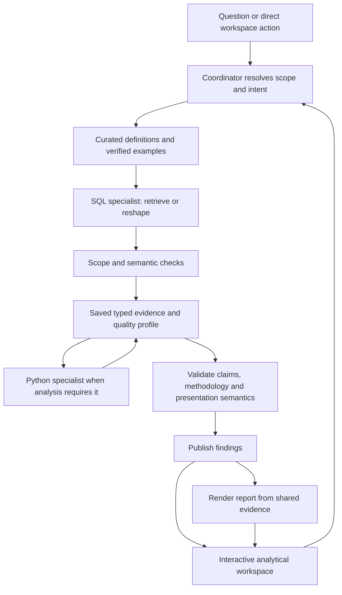

# Data analytics agent: architecture and product review

Reviewed September 10, 2026. This is an assessment and proposed roadmap; application behavior has not been changed.

The application has a strong foundation for a local analyst: durable evidence, explicit specialist responsibilities, iterative analysis, recoverable execution, and shared chart/report artifacts. Its largest remaining gaps are analytical verification and the experience of using the results. More autonomous execution will be valuable after those gaps are addressed.

“Top notch” should mean that users can consistently get the right business answer, understand its scope and limitations, inspect its evidence, and use it to make their next decision. The current implementation has not yet demonstrated that level of reliability across realistic workloads. There is no head-to-head benchmark here that establishes a ranking against commercial products.

## Review basis

- Inspected coordinator and specialist construction, prompts and skills, semantic discovery, SQL validation, Python execution, persistence, lifecycle, publication, chart/report contracts, UI components, and tests.
- Ran the deterministic suite: **188 passed, 6 skipped, 4 warnings**. The warnings concern experimental streaming and dependency deprecations. Ruff's configured F checks passed.
- Read the previous live evaluation findings. Those trials establish useful repair behavior on synthetic data, not general analytical reliability.
- Inspected the current Streamlit UI using a temporary copy of an existing synthetic forecast. The older fixture needed its saved turn ID aligned with the current contract in that temporary copy. No compatibility changes were made to the application.
- Inspected desktop onboarding, the saved answer, chart/report presentation, and evidence navigation. This was not a comprehensive mobile, keyboard, or screen-reader audit.
- Checked current primary documentation from Snowflake, Databricks, Hex, LangChain, and Anthropic. Product documentation establishes available patterns, not independently verified superiority.
- No new live model trials or business warehouse queries were run. Local fixture inspection supplied the numerical examples below.

Installed stack: Deep Agents 0.7.0, LangChain 1.3.14, LangGraph 1.2.6, Streamlit 1.59.2, Plotly 6.9.0.

## What is already strong

| Area | Assessment |
|---|---|
| Responsibility boundaries | Coordinator owns the answer; SQL owns source retrieval; Python operates on named saved inputs. This makes scope and provenance easier to reason about. |
| Evidence | Typed Parquet, explicit parent relationships, bounded previews, complete downloads, and separate chart presentation datasets are solid choices. |
| Statistical workflow | The specialist can inspect, execute, revise, request more source data, and continue. The skill covers leakage, baselines, temporal validation, and uncertainty. |
| Recovery | Checkpoints, committed tool outputs, Stop/Resume, durable reviews, correction delivery, and independent report retry address important real-world failures. |
| Presentation | Chat and reports reuse chart specifications; reports bind metric values to stored cells, escape text, check theme contrast, and preserve artifacts. |
| UI engineering | Stable widget identities, an independent composer, incremental event cursors, and lazy activity/evidence panels are thoughtful foundations. |

Keep the current coordinator/SQL/Python topology. Additional permanent specialist agents would need evidence of better outcomes to justify their coordination overhead. Deep Agents remains an appropriate harness for this workload; its current documented capabilities include durable orchestration, context management, skills, and steering. [Deep Agents overview](https://docs.langchain.com/oss/python/deepagents/overview).

## Highest-priority findings

### 1. Verify the meaning of claims, not just their artifact references

**High priority; observed defect in a saved report and a current contract gap.**

The inspected forecast report displays **340.00** under “Average 2025 forecast.” Its narrative states an average of **351.000**, and the saved forecast column's mean is **351.0**. The report specification binds the card to row zero of the forecast column: January's value is 340.

The renderer faithfully displays that cell. The problem is that a valid cell reference does not establish that the label describes it correctly. Free-text answers, interpretations, labels, and percentage changes have similar exposure to unsupported claims. This is a historical generated example, not a claim that a new model run today would reproduce the same mistake. The current contract still permits it.

Evidence: [metric renderer](/Users/charlie/Repos/deepagents-agents/data-analytics-agent/data_analytics_agent/reporting/renderer.py:185), [metric schema](/Users/charlie/Repos/deepagents-agents/data-analytics-agent/data_analytics_agent/reporting/schemas.py:103), [answer contract](/Users/charlie/Repos/deepagents-agents/data-analytics-agent/data_analytics_agent/schemas.py:110).

Introduce a small typed claim record: metric identity, business label, value reference, unit, population/time scope, aggregation, and validation status. Bind report cards and material numerical statements to these claims. Have SQL or Python save the actual aggregate as evidence; the report renderer should not silently calculate business metrics. Generate standard labels from the metric definition, and validate narrative/claim agreement before publication. An LLM review can check interpretation, but arithmetic and reference checks should be deterministic.

Acceptance example: an “average” card cannot bind to an arbitrary monthly row; changing that binding causes validation to fail or explicitly changes the label. Report rendering retries must continue to reuse evidence.

### 2. Move core business semantics into execution checks

**High priority; confirmed by code inspection and a local validator probe.**

The source SQL validator enforces a single read-only query and rejects dangerous statement structures. It does not receive the semantic catalog. A query referencing an undeclared object, a potentially inflating orders-to-items SUM, and `SELECT *` all passed this structural validator. These probes were parsed locally, not executed against a source. Database privileges remain a separate boundary.

The semantic catalog contains useful definitions and relationships, but the application relies heavily on prompt adherence for source-object selection, join choice, business grain, and aggregation. This is the central correctness risk for ordinary analytics, including queries that execute successfully.

Evidence: [validator](/Users/charlie/Repos/deepagents-agents/data-analytics-agent/data_analytics_agent/backends/validation.py:44), [source execution tool](/Users/charlie/Repos/deepagents-agents/data-analytics-agent/data_analytics_agent/agents/text_to_sql/tools.py:56), [semantic types](/Users/charlie/Repos/deepagents-agents/data-analytics-agent/data_analytics_agent/semantic.py:47).

Start with catalog-aware object/field checks and a small library of verified, parameterized business queries. For governed metrics, represent metric, dimensions, filters, and time grain explicitly. Validate supported join paths, uniqueness assumptions, aggregate grain, denominator definitions, and time boundaries. Use warehouse semantic execution where supported; do not attempt to build a universal semantic compiler before a focused version works end to end. Custom exploratory SQL still needs explicit scope and checks.

Snowflake's semantic routing prioritizes governed metric/join definitions; that capability is marked **Preview**, and its documentation explicitly describes limitations. Databricks provides trusted parameterized queries and functions. These are useful design references, not guarantees that generated answers are correct. [Snowflake semantic routing](https://docs.snowflake.com/en/en/user-guide/snowflake-cortex/cortex-analyst/cortex-analyst-routing-mode), [Databricks trusted assets](https://docs.databricks.com/aws/en/genie-agents/tune-quality).

Acceptance examples: revenue remains unchanged when adding a one-to-many dimension; weighted rates use the correct denominator; ambiguous fiscal periods trigger clarification; undeclared physical objects are rejected at execution.

### 3. Treat analytical quality evaluations as a release requirement

**High priority; current coverage does not establish broad reliability.**

The deterministic tests are valuable. The live suite is much narrower: five case categories over one small, regular synthetic fixture. Statistical cases largely check for terminology in saved outputs/code and the presence of executions. The descriptive case checks whether the expected number appears somewhere in the evidence, rather than fully verifying the final answer. These checks can pass despite misleading wording or invalid methodology.

Evidence: [live evaluations](/Users/charlie/Repos/deepagents-agents/data-analytics-agent/tests/test_live_evaluations.py:140), [prior evaluation review](/Users/charlie/Repos/deepagents-agents/data-analytics-agent/doc/live-evaluation-review.md).

Build a versioned set of real business question patterns, using authorized or synthetic datasets. Start with roughly 30–50 representative cases and several phrasings, then expand from failures. Separate development examples from held-out evaluation cases. Include:

- Joins, distinct counts, weighted metrics, nulls, missing categories, currencies, time zones, partial periods, and “top”/tie semantics.
- Follow-up scope, freshness requests, corrections, clarification, chart-only revision, and restart/recovery.
- Noisy forecasts, structural breaks, intermittent demand, short histories, leakage, multiple comparisons, and insufficient evidence.
- Agreement among the answer, report metrics, chart labels, and actual saved results.

Use result equivalence and invariants for SQL; persisted split definitions, predictions, and recomputed errors for models; calibrated human/model rubrics for explanation quality. Measure first-attempt and repeated-trial success, unnecessary clarification, repair rate, time to usable findings, total time, and cost per successful task. Keep adversarial cases outside tuning examples.

Databricks documents result-comparison benchmarks; Hex documents version-controlled evaluation suites and tracking consistency, runtime, and credit usage. Anthropic recommends assessing outcomes and using complementary graders across repeated trials. [Genie benchmarks](https://docs.databricks.com/aws/en/genie-agents/monitor), [Hex evals](https://learn.hex.tech/docs/agent-management/evals), [Agent evaluation guidance](https://www.anthropic.com/engineering/demystifying-evals-for-ai-agents).

### 4. Make uncertainty a first-class chart concept

**High priority for forecasting; confirmed current implementation limitation.**

The renderer hard-codes the legend text **“Uncertainty interval”** for all bounds. The inspected artifact uses those bounds for a planning sensitivity range, explicitly described elsewhere as not a calibrated prediction interval. The chart vocabulary undermines that distinction.

The schema also restricts bands to a single-series line chart. The saved forecast reports that historical actuals were omitted to fit this restriction. Its historical dates remain on the x-axis, leaving a large span without plotted actual values.

Evidence: [band renderer](/Users/charlie/Repos/deepagents-agents/data-analytics-agent/data_analytics_agent/visualization/renderer.py:590), [band restriction](/Users/charlie/Repos/deepagents-agents/data-analytics-agent/data_analytics_agent/visualization/schemas.py:259).

Add explicit band kind, label, method, and optional coverage level. Support actuals, forecast, baseline, and bounds as a small set of typed chart layers, with a forecast boundary marker. Keep one authoritative chart specification for chat and report. Plotly already supplies the trace primitives; this needs a better application contract, not another charting library.

Also let the analysis specialist inspect a bounded diagnostic image when needed. Currently `AnalysisOutput.model_facing()` replaces its image path with `rendered: true`; the agent receives no image in that response. Numerical diagnostics remain essential, but the workflow should permit visual examination of residual and distribution plots. [Model-facing image output](/Users/charlie/Repos/deepagents-agents/data-analytics-agent/data_analytics_agent/agents/data_analysis/schemas.py:38).

### 5. Turn the UI into an analytical workspace

**High product priority; observed in the current UI.**

The theme and native components are coherent. The main issue is hierarchy and interaction. Onboarding foregrounds framework details and execution modes; saved conversations sit below substantial technical information. A completed forecast contains a long answer, separate assumptions/interpretation, repeated analysis panels, a chart, an expanded report, and eight evidence sections. Dataset names look like internal variable names. The report preview occupies 900 pixels by default, and some report analysis sections include raw diagnostic output.

Evidence: [header/sidebar](/Users/charlie/Repos/deepagents-agents/data-analytics-agent/data_analytics_agent/ui/components.py:697), [report preview](/Users/charlie/Repos/deepagents-agents/data-analytics-agent/data_analytics_agent/ui/components.py:1243), [answer assembly](/Users/charlie/Repos/deepagents-agents/data-analytics-agent/data_analytics_agent/ui/components.py:1278).

Use this hierarchy:

1. A concise answer and the most useful metric/chart.
2. A compact scope row: source, data as-of time, business period, filters, units, and validation state.
3. Relevant actions: change period, compare, break down, inspect data, refresh, export.
4. An adjacent or switchable workspace for **Findings / Data / Method / Report**.

Retain all evidence, but group intermediate artifacts under lineage instead of displaying every ancestor as a peer finding. Keep the HTML report mandatory under current requirements; make its default chat presence compact, with preview on demand. Use business labels and display formatting for dates, currency, precision, and percentages while keeping downloaded values exact.

Provide direct chart type/title/axis controls and selection-to-follow-up. A title-only edit should update the saved chart version and report without an LLM or warehouse round trip. Scope-changing actions should clearly state whether they filter a snapshot or fetch new data. Show clarification choices as actual choices, with free text still available.

Move saved conversations above diagnostics, add search and rename, and use a small status indicator with one technical disclosure. Preserve the stable composer, Activity disclosure, Stop/Resume, and report retry. For common tasks, prototype these changes in Streamlit before considering a frontend rewrite.

Hex documents manual chart exploration and side-by-side conversation/notebook/app views. The transferable pattern is direct manipulation combined with conversational analysis. [Hex Threads](https://learn.hex.tech/docs/explore-data/threads).

## Architecture improvements to support those priorities

### Persist analytical scope explicitly

Saved datasets already retain source, creation time, lineage, and executed code; runs also bind a catalog hash. Extend this into a compact analytical scope record: population, filters, observation grain, business date window, source freshness, units, metric identities, semantic version, and completeness.

Distinguish extraction time from data freshness. A dataset downloaded today may contain observations ending last year. Reuse decisions should be checked against this record, not inferred only from narrative and SQL.

Follow-up context currently replays prior answer text and artifact IDs but omits separate assumptions, interpretation, `partial`, and unresolved questions. Preserve these fields in the compact context so later answers do not accidentally drop caveats. For long conversations, select relevant prior evidence and maintain a bounded summary instead of rebuilding an ever-growing transcript. [Follow-up context](/Users/charlie/Repos/deepagents-agents/data-analytics-agent/data_analytics_agent/run_manager.py:78).

### Keep orchestration adaptive; make publication predictable

Preserve flexible SQL/Python investigation loops. Use deterministic validation at the execution and publication boundaries. A single mandatory critic agent would add cost and may share the original model's mistakes; invoke targeted review when the task, ambiguity, or validation results justify it.

Simple totals should take a short route through grounded SQL, typed findings, and a standard compact report. Preserve early findings and separate report retry. Remove repeated prompt sections and avoid asking the model to design a layout for every scalar answer.

All roles currently share one model object, and OpenAI reasoning effort is set to medium. After establishing the benchmark, compare a fast model for straightforward retrieval/presentation with a stronger configuration for difficult analysis. Adopt routing only if the measured accuracy/latency/cost tradeoff improves. No specific model is declared best by this review. [Model configuration](/Users/charlie/Repos/deepagents-agents/data-analytics-agent/data_analytics_agent/coordinator.py:69).

### Isolate Python before expanding unattended use

The fresh worker process, cleaned environment, time limit, cancellation, and output limits are valuable. They do not restrict the process's operating-system file access or network access. Generated code is executed with ordinary Python `exec`; memory and CPU consumption are not contained by the output-size checks.

This limitation is acknowledged in the project's local single-user scope. Before accepting untrusted uploads, broad connector content, or unattended jobs, put execution in an established isolation boundary with read-only input mounts, a bounded output directory, resource limits, controlled egress, and no service credentials. Preserve the current named-dataset contract. Keep warehouse credentials and access control outside generated Python. [Worker execution](/Users/charlie/Repos/deepagents-agents/data-analytics-agent/data_analytics_agent/agents/data_analysis/worker.py:217), [runner](/Users/charlie/Repos/deepagents-agents/data-analytics-agent/data_analytics_agent/agents/data_analysis/runner.py:209), [Deep Agents sandboxes](https://docs.langchain.com/oss/python/deepagents/sandboxes).

For team deployment, add identity-scoped authorization for queries and artifact downloads, warehouse roles/masking, and durable job ownership before lifting the documented single-process constraint. Local SQLite is a reasonable fit for today's deployment; a distributed infrastructure rewrite is not the first improvement.

### Build a reviewed knowledge improvement loop

Today, corrections influence the conversation but do not become a reusable, reviewed body of business knowledge. Add a workflow to turn accepted corrections into candidate metric definitions, synonyms, join guidance, and verified query examples. Give each entry scope, version, owner, and evaluation coverage. Validate it before it influences other conversations.

The existing lexical metadata search is a sensible baseline for the small catalogs. Add hybrid retrieval/reranking only when retrieval tests show that vocabulary or catalog size requires it. Keep verified examples distinct from held-out evaluation answers. Snowflake's verified query repository is an established reference for curating useful SQL examples. [Snowflake verified queries](https://docs.snowflake.com/en/user-guide/snowflake-cortex/cortex-analyst/verified-query-repository).

## Proposed target workflow

These boxes describe responsibilities. They do not require a new agent, service, or graph node for every box. Add small modules around existing execution, publication, and presentation contracts.

## Sequence the work in complete increments

| Stage | Deliverable | Exit criteria |
|---|---|---|
| 1. Trust and baseline | Claim bindings, corrected uncertainty semantics, representative eval suite, preserved follow-up caveats | Catch the saved report's wrong-average binding; reject mislabeled bands; reproduce an evaluated baseline. |
| 2. Business correctness | Catalog-aware source validation, a focused set of governed metrics and verified queries, explicit data scope | Join/denominator/time cases pass; unsupported semantics produce clear clarification or limitations. |
| 3. Daily usability | Compact findings, organized evidence workspace, direct chart edits, freshness/refresh controls, better navigation | Users can verify and refine a result without traversing the full execution history; cosmetic edits need no source execution. |
| 4. Safe expansion | Isolated Python; CSV/Excel as typed artifacts; then explicit approved cross-source bindings | Isolation and lineage checks pass; full populations stay distinct from previews and presentation samples. |
| 5. Repeated value | Saved parameterized analyses, reviewed knowledge updates, scheduled monitoring | Reruns retain scope/version lineage; alerts identify material changes and avoid unchanged-status noise. |

File uploads, document research, multi-source analysis, and scheduling are already in the deferred roadmap. They become more useful after verification and interaction improve. For uploads, start with a file as a first-class source before blending it with a warehouse; require explicit join keys and cardinality checks for mixed-source work. External documents should contribute cited context rather than silently redefine governed metrics.

For monitoring, rerun an established analysis specification with fresh evidence and compare against its prior result. Distinguish scheduled deterministic analyses from open-ended recurring investigation. Hex exposes this distinction in its Tasks documentation. [Hex Tasks](https://learn.hex.tech/docs/explore-data/tasks).

The strongest product direction is **an evidence-backed analytical workspace with dependable business semantics and measured analytical quality**. The current implementation already contains much of the execution foundation needed to build it incrementally.
