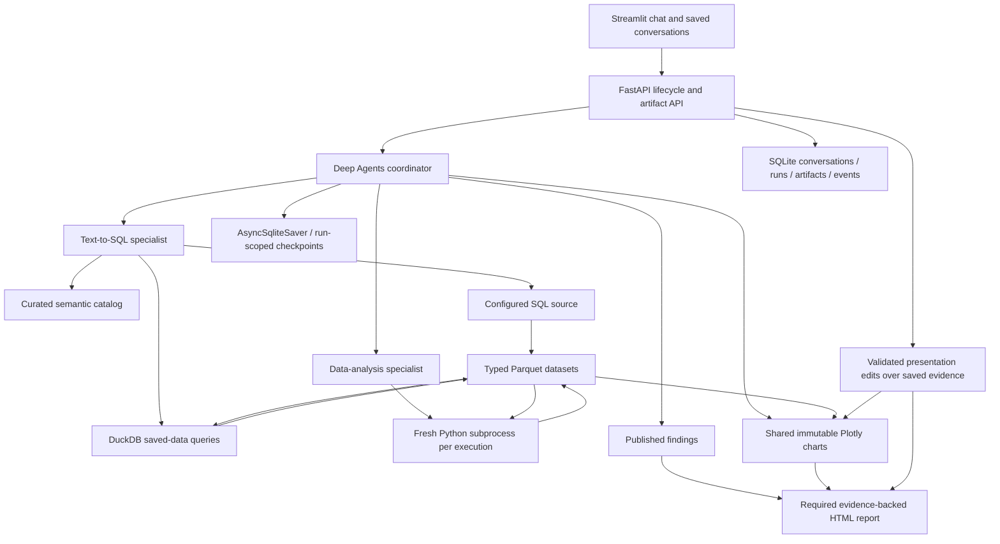

# Architecture

The coordinator routes by required work, not surface keywords. It handles
metadata-only discussion directly. SQL owns warehouse access and descriptive
transformations; Python owns analysis over explicit saved artifacts. Python can
request more data through the coordinator, which makes a sequential SQL
assignment and resumes the analysis. There are no fixed one-delegation rules.

`datasets.py` handles bounded extraction, typed Parquet and full-artifact
summaries. `stores.py` handles conversation/run/analysis/report state using
`persistence.py`. Durable metadata uses typed JSON, with large content in files.
`execution.py` and the Python runner manage local cancellation. `run_manager.py`
owns execution/resume/stop/report retry; `approvals.py` translates exact edits;
`diagnostics.py` aggregates provider usage and bounded tool events.

The graph is constructed per configured source and uses one run ID as its
checkpoint identity. FastAPI opens/closes the maintained SQLite checkpoint saver.
On startup, unfinished computations become paused and pending reviews remain
reviewable. Each tool registers artifacts directly and journals its committed
output under run/tool-call identity. Final assembly resolves explicit references;
it does not scan backward through messages or guess embedded JSON schemas.

`presentation.py` resolves all material evidence and transitive dataset lineage.
Chart versions are immutable. Chat and report consume the same chart spec and
presentation dataset. Report metric values reference exact stored rows/columns.
A published answer remains visible if rendering fails; successful completion
requires its report. Final structured answers use LangChain ToolStrategy so schema
validation errors return to the model for correction. Retry report reuses a valid
attached artifact, renders the saved specification, or requests presentation-only
repair using published findings. Computation tools reject execution after publication.
Resume selects this same recovery path after publication; active workers prevent
overlapping attempts.

`presentation_edits.py` handles `POST /api/runs/{run_id}/presentation` without
constructing agents or opening sources. Its typed allowlist admits title, labels,
palette, and compatible chart-type edits; scope and dataset bindings cannot be
edited. The caller supplies the displayed report/chart IDs. Stale IDs and active
conversations are rejected. Shape/data validation precedes candidate creation.
Sampled display datasets cannot change chart type.

The existing renderer renders a revision of the agent-authored report specification.
Original analytical turns, charts and reports remain immutable. Candidate records
in `presentation_edits` retain preparing/failed/ready status. A single atomic
`presentation_views` metadata write commits the new chart/report pair only after
both artifacts exist. Conversation and run reads resolve that view, including
history supplied to later analytical turns. Rendering failure leaves the previous
view intact; resubmitting the explicit edit retries it. History deletion includes
these records and their report files. No new graph run or provider call is needed.

Chart bounds require `interval` metadata: kind, method, optional label, and
optional nominal coverage. Scenario/sensitivity ranges cannot declare coverage.
The shared renderer displays the same label/method in chat and HTML; declaring
nominal coverage does not certify empirical calibration. This strict contract
does not migrate old bound specifications that omitted interval meaning.

Streamlit refreshes active content using a timed fragment, preserving stable
widget keys. Immutable previews/reports are cached by ID with bounded caches.
Full downloads stream separately from preview pages. Conversation changes cause
an app rerun; ordinary active-run refresh does not rebuild the conversation.

Constraints: one process, one local user, one source per conversation, sequential
source queries. No persistent arbitrary Python object state, cross-conversation
learning, or obsolete in-memory-state migration.

`semantic_context.py` builds one coherent metadata package for prompts and the
context tool. SQL owns physical definitions; the coordinator sees the business
projection. Whole oversized packages request refinement. Caches contain metadata,
never source observations. SQL/chart operational guidance lives in owner prompts;
analysis and report methodology remain on-demand skills.

`steering.py` uses supported before-model and after-model middleware plus tool
wrappers. Agent-private checkpoint state tracks correction IDs independently in
each assignment. Ordered HumanMessages have stable IDs, making checkpoint replay
idempotent. Later specialists receive the same durable corrections in their own
context. Tool wrappers reject stale proposed steps; running steps may finish.
Publication and completion share the run-store lock with acceptance and refuse
pending coordinator corrections. No concurrent invoke or graph-internal mutation
is used. Clarifications use interrupt/resume and remain distinct from code review.

The UI has one Activity disclosure per run, retained across publication and
completion. Incremental event cursors avoid retransmitting history each second;
hidden activity/diagnostics are rendered lazily. Findings remain visible while
reporting runs, fails or is retried. The composer remains outside the polling
fragment so typing and focus persist.

## Isolated uploaded files

`uploads.py` stages one bounded CSV/Parquet file in its own conversation and
requires explicit schema confirmation before any run. CSV first enters Arrow as
text; Parquet retains supported scalar types. Type suggestions and review checks
use the full bounded population. Confirmation creates an immutable reviewed
Parquet child, retains original bytes and snapshot, and saves SHA-256, selected
types, declared grain and verified row keys. Unsupported nested types, invalid
casts, duplicate declared keys and oversized files fail without truncation.

Uploads are source-scoped evidence, not entries in the shared warehouse registry
or generated OSI catalogs. Coordinator and SQL specialist use the same harness
with reviewed file context, omitting warehouse/semantic tools. SQL binds saved
artifacts into the existing external-access-disabled DuckDB query path; Python
uses the same saved-input execution tools. Charts and reports retain the existing
parent lineage. Reports include upload provenance. Warehouse agents keep their
curated semantic catalog requirements.

`POST /api/uploads?filename=...` accepts raw file bytes and creates the staged
conversation. `GET /api/conversations/{id}/upload` returns at most ten preview rows
and review metadata; `POST /api/conversations/{id}/upload/confirm` commits explicit
types/grain/keys. `GET /api/conversations/{id}/source` resolves that isolated
source. Upload sources never appear in the reusable source listing. Imports and
confirmation run off the event loop; history deletion refuses active imports or
reviews. Restart reopens staged or confirmed files. Source-configuration errors
are separate from model readiness so files work without a warehouse registry.
