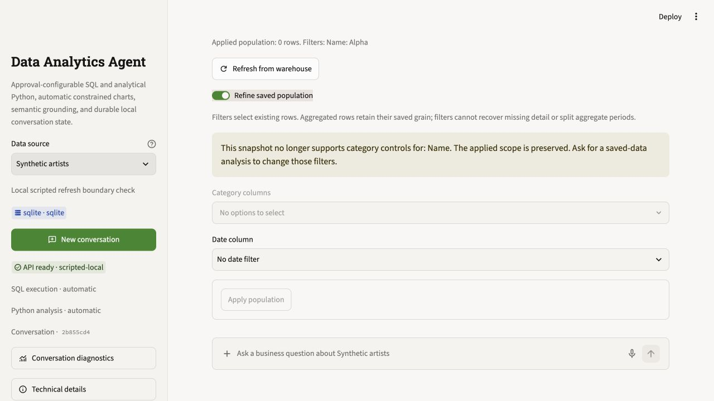

# Priority analytics releases: extended local testing

Completed: 2 October 2026 (America/New_York); verification began on 1 October.
This continues the
[initial priority release verification](priority-releases-2026-10-01.md).
Changes remain in the local working tree; no commit or deployment was made.
API/storage contract is now **19**. Portable analysis bundles retain format **2**.

The user requested thorough testing and careful fixes, and retained the instruction
**Keep verification local for now.** All new data is synthetic. No provider
evaluation or live warehouse trial was performed. Browser tracing was disabled.

## Verification result

The final full run passed **490 tests**, with **six provider tests skipped** and
three warnings, in **125.53 seconds**. The final focused
scope/forecast/semantic/workflow checks passed **108 tests** in **16.52 seconds**.
Ruff's F checks, formatting checks for this increment's code and `git diff --check`
also passed.
There are **67 additional regression cases** compared with the initial 423-test
release, plus stronger assertions in existing cases.

Tests exercise quoted SQL-looking categories and identifiers, Unicode, boolean and
missing categories, the entire inclusive end day, timezone feedback, cardinality
limits, whole month/quarter/year filters, nested CTEs, repeated scoping, joined date
lineage, typed empty refreshes, removed categories, restart and source failure.
Forecast tests cover all five supported frequencies and 15 seeded combinations
(three seeds per frequency), reordered rows, calendar phase, interval bindings,
missing periods, structural breaks and numerical overflow.

Score checks compare stored MAE/RMSE and measured interval coverage with known
synthetic errors and independent NumPy calculations. Existing full-suite checks
also move exported bundles, replay scripts, and execute notebooks in fresh kernels.
Semantic checks preserve composite keys, canonical measures, fan-out protection,
clarification boundaries, independently graded snapshots and structured repair
receipts. These are implementation checks, not live-model accuracy grades.

## Defects found and fixed

| Observed failure | Repair and regression evidence |
|---|---|
| An empty Arrow reader kept its Parquet schema but lost the saved column list and profile. | Retain schema field names even with no batches; empty scoped inputs can be counted again and retain their typed fields. Duplicate aliases are rejected even for empty readers. |
| Date filtering could split monthly aggregates inside a CTE or a previously scoped dataset. | SQLGlot lineage follows the selected date projection through saved dependencies and enforces whole supported periods. Unused aggregate CTEs do not change raw date grain. Unsupported weekly buckets explain the calendar gap. |
| A joined raw date could inherit another input's monthly restriction because the inputs shared a column name. | Persist exact SQL alias-to-parent bindings and follow only the selected date's inputs. Bindings appear in saved metadata, inspection responses and exported SQL provenance; contract 19 requires the new field. |
| Refresh compared broad value-profile kinds, rejecting typed empty inputs while accepting a date-to-timestamp change. | Compare stored Arrow field types. A same-schema empty refresh is valid; incompatible fields/types are rejected before rebinding. |
| After refresh removed a selected category, a follow-up rejected the preserved scope and native controls could contain unavailable defaults. | Reuse the exact current input for an unchanged selection/scope. The empty population remains authoritative; controls explain absent values and use valid defaults. |
| Refresh failed when an existing category filter's fresh column exceeded the 100-choice limit; the form could then drop the uneditable filter. | Reapply the stored filter to the fresh typed column, keep bounded controls for new choices, and disable scope submission when an applied filter cannot be represented. Changing it requires a saved-data analytical request. |
| A weekly forecast origin between observations shifted the future calendar; a holdout could also change weekdays. | Anchor weekly validation and future dates to the training weekday. Reject a changed holdout phase with preparation feedback. |
| Interval columns could alias prediction roles, and finite predictions could produce infinite squared-error scores. | Require distinct actual/candidate/baseline/bound columns; refuse nonfinite score datasets before saving and request explicit rescaling with declared units. |
| DuckDB input aliases differing only by case could silently overwrite one another. | Reject case-colliding saved SQL bindings before registration; retain exact aliases with their parents. |
| A handled structured SQL error lost its stable code in callback diagnostics. | Preserve the permitted error/repair fields from structured ToolException receipts and count the failed attempt once. |
| A shared derivation graph triggered exponentially repeated population checks. | Memoize each result within one validation while retaining every-parent population checks. The 25-node probe fell from **12,286 to 25 lookups**. |
| Reopening history after an invalid registry or removed source exposed an exception and hid saved answers. | Return a useful unavailable-source response, keep saved answers/reports readable, and stop new analytical submission until the source is restored. Both cases have API/native-widget regressions. |

The two project calls to DuckDB's deprecated `fetch_record_batch` were replaced by
the installed library's `to_arrow_reader` API. The full run's warnings dropped
from 65 to three: an existing FastAPI test-client deprecation and two LangGraph
streaming beta warnings. No dependency changes or compatibility paths were added.

## Semantic discovery observations

[Local discovery receipts](priority-discovery-local-2026-10-01.json) retain frozen
fixture hashes, code hashes, every timing sample and manual SQL values. The probe
uses three fresh small/large catalog instances, with ten warmed samples per variant
and instance. It invokes metadata tools directly; no model or server participates.

| Catalog | Expected role candidates | Calls per four-role lookup | Serialized response characters, separate → batch | Median warmed tool time, separate → batch |
|---|---|---|---|---|
| 2 datasets | All four roles in every repetition/variant | 4 → 1 | 4,000 → 1,912 | 0.030 → 0.012 ms |
| 102 datasets | All four roles in every repetition/variant | 4 → 1 | 4,007 → 1,913 | 0.035 → 0.013 ms |

The role probe supplies known `facts`/`regions` dataset hints. A separate broad
five-item date browse in the large catalog returned archive event dates first and
omitted `facts.month`; narrowing to `facts` returned the intended month field in
all three repetitions. This exposes a broad-browsing boundary, not a demonstrated
natural-language question or SQL-generation failure. Exact selection and specialist
coverage assessment remain necessary.

A hand-authored canonical regional revenue query passed semantic validation and
returned North **8,680**, South **8,760**, West **8,840**. An independent formula
over the frozen fixture recomputed those values. This verifies the fixture and
validator path; the query was not generated by a model.

Batching removed about 52% of serialized metadata in this controlled lookup.
Warmed tool times are tiny and exclude model work, source execution, cold discovery,
approval waits and cumulative turn context. They do **not** establish the 15%
end-to-end speed gate or a preference for a new retrieval architecture.

[Lineage lookup receipts](priority-lineage-local-2026-10-01.json) record the
mechanical population-check improvement separately from discovery timing.

## Browser and recovery observations

Browser verification uses a temporary local SQLite source and scripted agent,
with tracing disabled and a dummy provider key. It exercises source-backed refresh
and native scope controls without invoking a provider. The original Alpha filter
selected two rows. Refreshing after Alpha disappeared retained zero rows; reopening
after restarting both services and refreshing against 101 distinct new categories
still retained zero rows. All three immutable report revisions remained readable.
The form displayed the unsupported-filter explanation with **Apply population**
disabled, preserving the existing filter.

The browser control tool's checkbox, label and coordinate mouse attempts did not
toggle the scope switch. Keyboard Space opened it successfully. This run does not
establish mouse interaction usability or prove a product mouse defect; include
that interaction in the business-user observation. The native-widget regressions
and keyboard browser flow verify the state and submission guard.

[Compact browser receipts](priority-followup-browser-2026-10-01.json) retain exact
inputs, report IDs, HTML hashes and limitations.
The saved-source recovery regression separately uses native widgets and API checks;
it is not a business-user usability study.



## Next improvement opportunities

1. **Ground time roles before broad browsing.** Add held-out questions with
   competing event/accounting dates and metric meanings, including loss of dataset
   hints. Review needed clarification and exact selections. Curate evidenced gaps
   in catalog meanings/synonyms; this probe does not justify hybrid retrieval.
2. **Make more grain and calendar meaning inspectable.** Current SQL lineage checks
   protect supported calendar buckets. Arbitrary Python/business aggregates,
   timezone transformations and fiscal/weekly calendars still need explicit
   preparation and specialist review. Add examples when real workflows require them.
3. **Review forecasting methodology independently.** Stored chronology and numerical
   recomputation do not prove that model fitting/preprocessing avoided holdout
   leakage, or that a claimed interval meaning is defensible. Preserve code and
   include these checks in the authorized live evaluation and analyst replay study.
4. **Observe users handling changed and empty populations.** Test whether business
   users understand preserved zero-row scopes, absent-category feedback and the
   difference between snapshot time and a declared source cutoff. Scripted controls
   passing does not establish human task success.

The three paired provider studies and business-user observation remain pending.
Maintain three fresh baseline/candidate repetitions and independently graded
complete outcomes when authorization changes. Do not infer those gates from local
metadata timing, report completion or skipped provider tests.

## Reproduction and evidence limits

```sh
LANGSMITH_TRACING=false LANGCHAIN_TRACING_V2=false .venv/bin/python -m pytest -o addopts='' -q
LANGSMITH_TRACING=false LANGCHAIN_TRACING_V2=false .venv/bin/python -m pytest -o addopts='' -q tests/test_saved_scope.py tests/test_forecast_evaluation.py tests/test_semantic_priority.py tests/test_priority_workflow.py
.venv/bin/ruff check data_analytics_agent streamlit_app.py scripts tests --select F
.venv/bin/python -m scripts.probe_discovery_local > /tmp/discovery-local.json
```

Fresh-kernel replay requires local loopback ports. One non-escalated replay check
failed with a sandbox permission error; it passed in the authorized full runs.
Two first draft test assertions were corrected: an Arrow slice used all rows
instead of zero rows, and a semantic receipt assertion used an incorrect field
name. The probe's initial import and browser fixture's catalog directory were also
corrected. These harness mistakes are distinct from the product failures above.

Compact before/after test evidence is retained in
[regression receipts](priority-followup-regressions-2026-10-01.json); bulky raw XML
and temporary datasets remain outside the repository. Historical 423-test and
contract-18 receipts are preserved without rewriting their counts.

Restart both normal services together with a fresh contract-19 storage directory
for incompatible history, preserving needed older artifacts separately. There
are no migrations. All temporary verification services and the browser tab were
closed after the checks. Normal services were not started.
