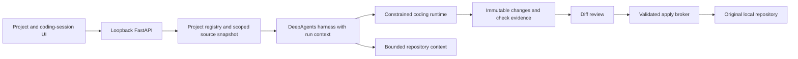

# General Agent: coding-agent review and implementation plan

**Date:** October 3, 2026

**Status:** Approved by the user for implementation of all stages, step by step.
The review below records the original baseline. Current implementation, tests,
scope decisions and remaining release gates are tracked in
[CODING_AGENT_IMPLEMENTATION.md](CODING_AGENT_IMPLEMENTATION.md).

**Execution decision superseded October 4, 2026:** The user requested execution
without Docker. The implementation now defaults to trusted-local host commands
in a separate review copy, with Docker available only by explicit selection.
The copy and reviewed apply are not a sandbox; local commands have host
filesystem/network permissions and no container CPU/memory/PID limits. The
container proposal below is retained as the original reviewed design, not the
current default. See the implementation ledger and README for current setup.

**First-release priority confirmed by the user:** Local repositories, code editing, tests, and diff review.

## 1. Recommendation and intended outcome

Keep the existing DeepAgents harness, FastAPI service, SQLite persistence, skill system, and general-assistant capabilities. Build a repository-centered coding workflow around them. The first useful release should complete this entire sequence:

1. Select an explicitly registered local repository.
2. Inspect its instructions, structure, existing changes, and validation commands.
3. Produce a plan, or implement an already authorized task.
4. Edit a separate working copy and run checks in the explicitly selected coding environment.
5. Present a trustworthy diff, check results, and unresolved problems.
6. Apply the reviewed changes to the original repository without overwriting intervening user work.

First fix the verified path-policy defects and delegated-budget gap. Then deliver the local workflow as one working vertical slice. Add live process management, richer navigation, browser verification, background jobs, GitHub delivery, and IDE integration in subsequent releases. Inline completion and Snowflake data access are separate capabilities with different runtime and interaction requirements.

This is a plan for a capable coding product. It does not claim equivalent model quality, latency, or breadth to a commercial Copilot product without task evaluations.

## 2. Review scope and evidence

Reviewed the application modules, Streamlit UI, source skill catalog, README, development guidance, deterministic tests, dependency declarations/lockfile, and installed framework implementation. Parallel reviews covered execution/workspace/harness behavior, API/persistence/UI behavior, and official product documentation.

Installed and locked versions inspected: DeepAgents 0.7.1, LangChain 1.3.14, langchain-core 1.5.3, LangGraph 1.2.10, Streamlit 1.59.2, and SQLite checkpointer 3.1.1. Recommendations must be implemented against those tested interfaces; current documentation can describe newer behavior.

Validation performed during review:

- `PYTHONDONTWRITEBYTECODE=1 .venv/bin/python -m pytest -m 'not live' -p no:cacheprovider`: **38 passed, 2 deselected**, in 6.85 seconds. One existing Starlette/httpx deprecation warning.
- Temporary synthetic fixtures reproduced cross-corporation symlink access and a write through a symlink alias into an application-managed skills directory.
- A temporary hidden-file fixture confirmed that direct `.env` reads were rejected while directory listing and glob exposed its name. Default grep did not expose its contents in this fixture; the Python search fallback needs separate coverage.
- A temporary command fixture launched a child that held the output pipes for three seconds. A configured one-second command timeout returned after **3.06 seconds**, demonstrating that the deadline does not bound the complete command lifecycle.
- Inspected framework source and constructed the actual graph with an in-memory backend and a tool-capable fake model. With limits of two model calls, one tool call, and one task call, a root → subagent → root task completed with **five model calls and three tool calls**, reproducing the delegated-budget gap without provider calls or filesystem changes. A permanent regression test is still required.

No application code, dependency files, source skills, real application databases, or installed skill state were changed. No provider calls, package installation, commits, pushes, PRs, or deployments were performed. This document is the only intended repository addition from the review.

## 3. What the project already does well

The existing product is a trusted-local general assistant with a real agent harness, rather than merely a chat wrapper.

| Existing foundation | Evidence and value |
| --- | --- |
| Configurable model with additive harness tuning | [agent.py:159](/Users/charlie/Repos/deepagents-agents/general-agent/general_agent/agent.py:159). Preserve built-in provider/model tuning and the intentional general-purpose subagent. |
| Filesystem tools, progressive skills, planning, delegation | [agent.py:179](/Users/charlie/Repos/deepagents-agents/general-agent/general_agent/agent.py:179). DeepAgents supplies these capabilities; `tools=[]` means no additional tools, not no tools. |
| Clear authority and verification guidance | [agent.py:63](/Users/charlie/Repos/deepagents-agents/general-agent/general_agent/agent.py:63). Existing prompts already require repository inspection, preservation of user edits, checks, and explicit authorization for publishing. |
| Restricted command environment and cancellation tracking | [execution.py:60](/Users/charlie/Repos/deepagents-agents/general-agent/general_agent/execution.py:60). `inherit_env=False`, output limits, and process groups are valuable controls, although they do not sandbox the host. |
| Corporation-scoped application persistence | [store.py:342](/Users/charlie/Repos/deepagents-agents/general-agent/general_agent/store.py:342). Keep this scope on every new coding object and operation. |
| Recoverable history and immutable file versions | [workspace.py:563](/Users/charlie/Repos/deepagents-agents/general-agent/general_agent/workspace.py:563). Extend the artifact concept into before/after change sets instead of replacing it with agent-authored descriptions. |
| Structured activity and provider-reported usage | [run_manager.py:308](/Users/charlie/Repos/deepagents-agents/general-agent/general_agent/run_manager.py:308). Reuse v3 tool/delegation/plan events and retain honest reporting of missing usage. |
| Deliberate restart behavior | [store.py:220](/Users/charlie/Repos/deepagents-agents/general-agent/general_agent/store.py:220). Abandoned running/stopping attempts become failed, preventing silent replay of side effects. |
| Modular document workflows | Source `skills/` and [file_inspector.py](/Users/charlie/Repos/deepagents-agents/general-agent/general_agent/file_inspector.py). Preserve the inspect/create/edit/render/verify workflows while adding coding. |

DeepAgents also already supplies summarization and tool-result offloading. Do not propose rebuilding context compaction, a task planner, or a generic multi-agent framework. Its public interfaces support memory, permissions, tool allowlists, and interrupts, but application lifecycle and shell containment still need explicit implementation. [DeepAgents overview](https://docs.langchain.com/oss/python/deepagents/overview)

## 4. Findings that should determine priorities

### F1 — Confirmed file-tool isolation and read-only-policy defects: P0

`CancellableLocalShellBackend._resolve_path()` translates virtual paths, then delegates containment to a backend rooted at the **entire** application workspace. Upstream resolution follows symlinks and checks only that global root. A link inside corporation A's chat can therefore resolve inside corporation B's directory and still pass containment. The reverse path converter also returns paths outside the active corporation rather than rejecting them.

An independent temporary fixture successfully read a synthetic B-owned file while running in A. A second fixture wrote through `/skill-link/new.txt` into the synthetic installed skills tree because read-only enforcement checks the requested `/skills` prefix, not the resolved destination.

Evidence: [execution.py:111](/Users/charlie/Repos/deepagents-agents/general-agent/general_agent/execution.py:111), [execution.py:182](/Users/charlie/Repos/deepagents-agents/general-agent/general_agent/execution.py:182), [workspace.py:145](/Users/charlie/Repos/deepagents-agents/general-agent/general_agent/workspace.py:145). Installed framework evidence: `deepagents/backends/filesystem.py`, lines 203–215.

These are defects in the promised built-in file-tool boundaries. They are distinct from the documented, intentionally unsandboxed host shell.

### F2 — Root call limits do not cover delegated calls: P0

The model/tool/task limit middleware is attached to the main agent. Installed DeepAgents only inherits main middleware that replaces an existing default general-purpose middleware slot. These call-limit middleware classes have no such default slot, so the general-purpose subagent does not receive them.

The parent still limits `task` calls, and provider-reported tokens aggregate across agents. However, `MAX_MODEL_CALLS` and `MAX_TOOL_CALLS` should not currently be understood as whole-run ceilings covering delegated activity. An actual constructed fake-model graph reproduced five model calls and three tool calls despite configured limits of two and one respectively.

Evidence: [agent.py:186](/Users/charlie/Repos/deepagents-agents/general-agent/general_agent/agent.py:186), [run_manager.py:30](/Users/charlie/Repos/deepagents-agents/general-agent/general_agent/run_manager.py:30); installed `deepagents/graph.py`, lines 752–778. Existing construction tests mock graph creation and do not execute this behavior.

### F3 — Command deadline misses part of process cleanup: P0

The timeout surrounds `process.wait()`, but subsequent pipe draining is unbounded. `_terminate()` immediately returns when the shell parent has an exit code, even if descendants still hold the pipes. The temporary three-second child fixture exceeded the configured one-second deadline.

Evidence: [execution.py:249](/Users/charlie/Repos/deepagents-agents/general-agent/general_agent/execution.py:249), [execution.py:337](/Users/charlie/Repos/deepagents-agents/general-agent/general_agent/execution.py:337). This also warrants cancellation tests after parent exit and before pipe closure; the review did not establish every possible orphan-process outcome.

### F4 — Workspace paths are unsuitable for normal repositories: P1

The blanket dotfile restriction prevents built-in tools from working with `.gitignore`, `.github`, `.editorconfig`, and similar source configuration. Yet listing and glob can reveal names rejected by direct reads. Relaxing the general workspace policy would expose application storage and secrets; a distinct, explicit repository policy is needed.

Evidence: [workspace.py:105](/Users/charlie/Repos/deepagents-agents/general-agent/general_agent/workspace.py:105), [workspace.py:796](/Users/charlie/Repos/deepagents-agents/general-agent/general_agent/workspace.py:796).

### F5 — File artifacts are not complete coding change sets: P1

Every run hashes and copies all visible files in the corporation's chats/shared area. Hidden source files are excluded. Modified artifacts retain the after-image, then the baseline is removed. This cannot reliably show or undo the first modification of an existing source file, and work in unrelated chats increases snapshot cost.

Evidence: [workspace.py:533](/Users/charlie/Repos/deepagents-agents/general-agent/general_agent/workspace.py:533), [workspace.py:583](/Users/charlie/Repos/deepagents-agents/general-agent/general_agent/workspace.py:583). The corporation-wide writer lock currently helps avoid cross-run artifact attribution errors. Keep it until coding ownership and snapshot scopes are established.

### F6 — Completion is not proof of a successful coding task: P1

A returned graph result is marked completed without structured test/build/review evidence. Tool failures are activity records rather than task outcomes. The prompt asks for verification, but the UI cannot establish whether a reported passing check applies to the final source bytes.

Evidence: [run_manager.py:238](/Users/charlie/Repos/deepagents-agents/general-agent/general_agent/run_manager.py:238), [run_manager.py:387](/Users/charlie/Repos/deepagents-agents/general-agent/general_agent/run_manager.py:387).

### F7 — Checkpoint storage is not task continuation: P1/P2

Each run uses `thread_id=corp_id:run_id`; a subsequent run rebuilds input from completed user/assistant text. Tool context, task state, and pending decisions are not a durable coding session. Current run states cannot represent a pending approval or clarification. Simply enabling `interrupt_on` would require changes to completion/finalization handling.

Evidence: [run_manager.py:197](/Users/charlie/Repos/deepagents-agents/general-agent/general_agent/run_manager.py:197), [run_manager.py:315](/Users/charlie/Repos/deepagents-agents/general-agent/general_agent/run_manager.py:315), [schemas.py:16](/Users/charlie/Repos/deepagents-agents/general-agent/general_agent/schemas.py:16), [store.py:589](/Users/charlie/Repos/deepagents-agents/general-agent/general_agent/store.py:589).

### F8 — The UI and log APIs lack coding review surfaces: P1/P2

There is one current chat, no project/session navigation, no source diff/review/apply controls, and no interactive process session. The composer is blocked while running. Command output arrives as a completed tool result. History/events are not paginated, so large build logs and long sessions would become expensive to retrieve repeatedly.

Evidence: [streamlit_app.py:139](/Users/charlie/Repos/deepagents-agents/general-agent/streamlit_app.py:139), [streamlit_app.py:494](/Users/charlie/Repos/deepagents-agents/general-agent/streamlit_app.py:494), [components.py:87](/Users/charlie/Repos/deepagents-agents/general-agent/general_agent/ui/components.py:87), [store.py:638](/Users/charlie/Repos/deepagents-agents/general-agent/general_agent/store.py:638), [store.py:759](/Users/charlie/Repos/deepagents-agents/general-agent/general_agent/store.py:759).

### F9 — Project environments and current external knowledge are missing: P1/P2

Commands use the application interpreter and corporation-wide package injection. This is useful for document/data work, but a repository needs its own locked dependencies and runtime version. The application has no dedicated web search, webpage reader, browser verification, repository symbol tools, or connector registry. Shell technical access does not make these reliable product capabilities.

Evidence: [execution.py:70](/Users/charlie/Repos/deepagents-agents/general-agent/general_agent/execution.py:70), [agent.py:79](/Users/charlie/Repos/deepagents-agents/general-agent/general_agent/agent.py:79), [README.md](/Users/charlie/Repos/deepagents-agents/general-agent/README.md).

## 5. Research: which product patterns to adopt

Snowflake's documentation states that legacy Snowflake Copilot is being replaced by Cortex Code. Legacy Copilot is primarily a governed SQL/schema/documentation assistant. For general coding, Cortex Code/CoCo CLI/Desktop is the more relevant comparison. [Using Snowflake Copilot](https://docs.snowflake.com/en/user-guide/snowflake-copilot)

| Reference workflow | Documented pattern | Application decision |
| --- | --- | --- |
| Cortex Code CLI | File/search/edit tools, persistent shell, incremental/background output, termination, review, web tools | Build a full edit/check/review loop and owned process sessions. [Agent tools](https://docs.snowflake.com/en/user-guide/cortex-code/tools) |
| Cortex Code Desktop | Projects/sessions, changed-file tree, unified diffs, accept/reject | Make project and change review first-class surfaces. [Desktop navigation](https://docs.snowflake.com/en/user-guide/cortex-code/cortex-code-desktop/navigation) |
| GitHub Copilot IDE agent | Iterative workspace edits and terminal/tool use | First release targets local pairing with inspectable results. [IDE agent mode](https://docs.github.com/en/copilot/how-tos/copilot-in-your-ide/use-copilot-agents/use-agent-mode?tool=vscode) |
| GitHub Copilot Plan mode | A read-only planning experience before implementation | Enforce Plan mode through tool/backend restrictions. [Plan mode](https://docs.github.com/en/copilot/how-tos/copilot-in-your-ide/use-copilot-agents/use-plan-mode) |
| GitHub Copilot cloud agent | Independent repository tasks in an ephemeral Actions environment, branch work and optional PR delivery | Treat unattended issue/PR work as a later job/delivery capability. [Cloud agent](https://docs.github.com/en/copilot/concepts/agents/cloud-agent/about-cloud-agent) |
| Copilot workspace context | File/text search, language intelligence and semantic indexing | Start with accurate bounded lexical search; add semantic infrastructure after measured discovery failures. [Workspace context](https://code.visualstudio.com/docs/agents/reference/workspace-context) |
| Repository instructions | Repository/path-specific build, test and convention guidance | Start with native `AGENTS.md` plus project manifests; avoid supporting every vendor format prematurely. [Repository instructions](https://docs.github.com/en/copilot/how-tos/copilot-on-github/customize-copilot/add-custom-instructions/add-repository-instructions) |
| Tool integrations | MCP tool allowlists and scoped credentials | Add connectors through an application-owned registry; credentials stay outside model commands. [GitHub MCP configuration](https://docs.github.com/en/copilot/how-tos/copilot-on-github/customize-copilot/configure-mcp-servers) |

These are documented workflow comparisons, not assertions that every feature is available in every editor or subscription. Preview/experimental capabilities are not first-release dependencies.

## 6. Target architecture and boundaries

The application and original repository stay outside the model-controlled coding runtime. The model edits a session-owned working copy. A trusted application service validates and applies a specific reviewed change set. The same change/evidence contracts later serve the browser UI, IDE client, and background worker.

### 6.1 Repository and execution model

- Register an exact local root through the UI/API; models address `project_id`, never arbitrary host paths.
- Validate the canonical root and every file operation, including symlink components and replacement races. Refuse paths containing symlinks; do not silently follow them. Exclude real application runtime roots by canonical physical identity, including visible `workspace/` trees, as well as `.data/`, installed skills, packages and temp storage. Registering this application repository must not copy another corporation's runtime files.
- Define physical ownership: reject duplicate or overlapping canonical project roots across corporations. Within one corporation, reuse an existing registered root and serialize apply operations across overlapping targets. Corporation-scoped database rows alone cannot isolate two registrations pointing at the same checkout.
- Bind source files under a new virtual `/repo` route. Keep `/uploads`, `/shared`, `/chats`, `/skills`, and `/tmp` semantics intact for existing general-assistant work. Coding sessions receive only the selected attachments/shared inputs needed for that task.
- Create a persistent session-owned source copy from approved files. Include current user changes as the starting baseline; include eligible untracked source files. Exclude credentials, application state, dependency/build caches, symlinks, and Git metadata. Show exclusions during onboarding.
- Use Git's bounded read operations for revision, status and history through an application-owned service. Disable execution-bearing features such as filesystem-monitor hooks, external diff/text-conversion commands and pagers; test discovery against hostile repository configuration. Immutable source manifests, rather than mutable model-controlled Git metadata, establish the review/apply baseline.
- Treat session copies and immutable manifests as the long-term local editing model. Git worktrees can serve authorized branch workflows later, but are not a sandbox or a prerequisite for the first local release.

**Recommended coding executor:** One application-configured Docker runtime, with a thin adapter for the existing backend protocol. Keep the current trusted-host executor for existing general-assistant use. A coding session explicitly selects the constrained executor and fails readiness if it is unavailable; it never silently falls back to host execution.

The application controls image, mounts, user, limits, and networking. The agent cannot supply Docker arguments, Dockerfiles, host mounts, or privileged options. Use a non-root user, dropped capabilities, no privilege escalation, bounded CPU/memory/PIDs/time/output/storage, and network disabled for ordinary editing/testing. Mount or transfer only that session's selected inputs and read-only managed skills; never expose the original repository, host home, application environment, Docker socket, credential stores, or other sessions.

For P1, use a read-only container root and explicitly size-limited temporary filesystems for writable source/temp/output areas. Transfer source in, then export approved source results through a size/path/type-validated application service into durable session storage. Do not mount a writable host directory as an allegedly quota-limited scratch area. Bound engine logs and exported storage as well. Refuse tasks that exceed available limits; larger persistent workspaces can later use a quota-backed isolated filesystem without changing the change-set contract. Finalization must capture permitted changes before destroying the runtime, including on Stop/failure. [Docker temporary filesystem limits](https://docs.docker.com/engine/storage/tmpfs/)

This is an explicit addition to the coding trust model and must be reviewed as part of this proposal. Containers require correct configuration and remain subject to runtime/kernel vulnerabilities; loopback-only deployment and the existing trusted-local identity model remain required. Docker specifically warns about daemon access and unrestricted host mounts. [Docker security](https://docs.docker.com/engine/security/), [container runtime options](https://docs.docker.com/reference/cli/docker/container/run/)

### 6.2 Source path policy

Keep the current protected general-workspace policy. Add one repository policy applied consistently to direct reads/writes, search/list results, snapshots, diffs, and apply/revert.

Initially allow known source configuration such as `.gitignore`, `.gitattributes`, `.editorconfig`, `.github/**`, and approved test/linter configuration. Continue to reject `.git/**`, `.env` and secret-bearing variants, key/credential files, application hidden state, symlinks, and unsafe paths. Unknown hidden source configuration is surfaced during onboarding for explicit inclusion; it is not automatically exposed. A safe example file such as `.env.example` needs an explicit source-policy rule rather than the credential rule accidentally permitting all `.env*` files.

Search should respect Git ignore rules and source inclusion policy, with generated/build/dependency directories omitted. A user's explicit request can select an otherwise ignored source file only after the same path/credential checks. Project code can contain embedded secrets; filenames alone cannot guarantee their absence, so external transmission remains an explicit capability decision.

### 6.3 Dependencies and project setup

Start with Python and JavaScript/TypeScript projects. Other languages can use explicitly configured installed commands, but should not be advertised as fully verified environments until evaluated.

- Detect versions, package manager, lockfiles and declared scripts. Display the proposed setup/test/build commands; do not execute arbitrary repository hooks during discovery.
- Keep project packages in the coding environment, separate from the application virtual environment and corporation-wide document packages.
- Reuse `uv`/Python and Node/npm conventions; honor project lockfiles. Do not maintain a custom dependency resolver.
- Use application-controlled base images. Dependency preparation gets explicit authorization for downloads. Keep network-enabled artifact acquisition separate from offline installation/builds, with minimal manifest/lockfile inputs and no source checkout or application secrets.
- For Python, require wheel-only/no-build network acquisition, locked versions and available artifact hashes; do not run source-distribution metadata/build backends online. Omit local/project/workspace package installation from that step, then install/build the project offline with its source in the constrained runtime. Dynamic metadata, unresolved local/workspace dependencies or unavailable wheels become visible setup blockers in P1.
- For Node, use the lockfile and disable lifecycle scripts during network-enabled preparation (`npm ci --ignore-scripts`); perform necessary project/native build steps offline. Supported workspace layouts must retain their relative manifest structure. Private registries and projects requiring networked install scripts are explicit later setup capabilities, not reasons to inherit the ambient host environment.
- A missing setup or failed dependency preparation becomes a visible blocker. It must not trigger automatic global/application installs.

These distinctions matter because uv normally installs local/workspace projects during synchronization, and Python source builds can execute code; npm's script control is a separate package-manager capability. [uv synchronization](https://docs.astral.sh/uv/concepts/projects/sync/), [pip artifact download](https://pip.pypa.io/en/stable/cli/pip_download/), [npm ci](https://docs.npmjs.com/cli/v11/commands/npm-ci/)

## 7. Concrete module, data, and API design

Names below are proposed implementation contracts, not files already added. Introduce each module only with the milestone that uses it.

| Component | Responsibility | Existing integration points |
| --- | --- | --- |
| `general_agent/budgets.py` | Shared run admissions and counters for model/tool/task work | `agent.py`, `RunUsageCallback`, run scope; additive profile middleware factories |
| `general_agent/coding/projects.py` | Registered roots, onboarding, session copies, source manifests | `config.py`, `Workspace`, `Store` |
| `general_agent/coding/context.py` | Scoped instructions, bounded inventory/search and repository summary | File tools and graph input; existing SkillsMiddleware remains owner of generic skill discovery |
| `general_agent/coding/runtime.py` | Controlled container execution, project setup, process ownership | Backend protocol, existing cancellation logic, `RunManager` |
| `general_agent/coding/changes.py` | Before/after versions, diff, conflict checks, apply/revert journal | Existing immutable artifact storage and new scoped records |
| `general_agent/coding/verification.py` | Checks, logs and invalidation when source changes | Runtime execution results, `Store`, UI events |
| `general_agent/coding/tools.py` and `schemas.py` | Narrow model-visible repository/check tools and typed internal contracts | `build_agent()` and coding-session graph construction |
| `general_agent/coding_api.py` | Coding routes with mandatory corporation scope | Included by `api.py`; reuse existing request/error conventions |
| `general_agent/ui/coding.py` | Project/session selector, changes, checks, decisions | Existing Streamlit UI and API client |
| `skills/coding/SKILL.md` | Inspect/plan/edit/check/review procedure and concise triggers | Source skill installation and focused skill tests |

Keep FastAPI, SQLite and Streamlit for the first release. A full custom web IDE would expand scope substantially. Use an IDE client later for rich editing/debugging; change the web frontend only if interaction testing demonstrates that the retained workbench cannot meet approved requirements.

### 7.1 Required records

Every record and lookup is corporation-scoped, including related IDs and blob/log access. Do not trust an ID's presence or opacity as authorization.

| Record | Minimum fields |
| --- | --- |
| `Project` | `corp_id`, `project_id`, display name, canonical source root, source identity, observed Git revision, inclusion policy, approved setup/check commands |
| `CodingSession` | `corp_id`, `session_id`, `project_id`, `conversation_id`, working-copy identity, opening and current accepted baseline manifests, current source revision, runtime identity, active writer |
| `CodingAttempt` | `corp_id`, `run_id`, `session_id`, parent attempt if continued, mode, input plan/version, starting source revision, lifecycle and outcome |
| `ChangeSet` / file changes | Owner IDs, base/result manifest hashes, path, creation/modification/deletion, before/after immutable blob references and hashes, apply/review state |
| `CheckResult` | Owner IDs, exact command/argv and cwd, input/output source manifests, setup/image identity, exit code, duration, bounded summary, immutable log reference, status |
| `Decision` | Owner IDs, decision kind, exact action/plan payload, expected source revision, checkpoint when applicable, status, response and timestamps |
| `ProcessSession` | Added in P2: owner IDs, runtime/process identity, deadline, log cursor, state, exit result and cleanup state |

Separate attempt lifecycle from coding outcome. A run can finish normally while checks fail. Outcomes should distinguish `verified`, `checks_failed`, `not_verified`, and `blocked`; check records distinguish `passed`, `failed`, `not_run`, and `stale`. Do not set `verified` from the assistant's prose.

Use scoped immutable blobs/manifests to retain initial bytes and subsequent changed versions without duplicating every unrelated chat directory on every coding run. Keep originals for deleted files and both sides of modifications. File mode changes and binary assets also belong in the change set. Storage limits and explicit retention operations must preserve active/reviewed records; do not silently delete immutable history.

### 7.2 Initial routes

- `POST /projects`, `GET /projects`, `GET /projects/{project_id}`: register/list/read exact approved roots and onboarding results.
- `POST /projects/{project_id}/sessions`, `GET /sessions`, `GET /sessions/{session_id}`: create/list/read coding sessions.
- `POST /sessions/{session_id}/tasks`: submit `{message, mode: plan|implement|review, plan_id?}`. The server binds project/runtime context.
- `GET /runs/{run_id}/changes`, `GET /changes/{change_id}/diff`: immutable change metadata and bounded diffs.
- `GET /runs/{run_id}/checks`: recorded verification results.
- `POST /changes/{change_id}/apply`: explicit reviewed change set plus expected original-file hashes; reject stale/conflicting targets with HTTP 409.
- `POST /changes/{change_id}/revert`: explicit user request, expected current hashes, and preserved pre-apply versions.
- `POST /decisions/{decision_id}/respond`: approve/reject or answer the exact pending decision. Authorization is bound to its payload/version.

Retain existing stop/download routes and pagination cursors where useful. Add bounded page sizes to history/events and dedicated log references before streaming large process output. SSE can follow when needed; initial cursor polling already fits the UI. Interactive terminal input later requires a separately authorized interface, rather than making every process interactive.

New functionality uses new scoped records; do not add deprecated endpoint aliases, fallback schema readers, or data migration layers. If implementation requires a breaking persisted-schema change, present the exact storage/reset decision separately. No existing data deletion is authorized by this plan.

## 8. Prioritized implementation backlog and release gates

Estimates are planning ranges in engineer working days, not externally validated delivery promises. They assume one experienced engineer, review access, a functioning model configuration, and a locally available container runtime. Model evaluation, unusual repositories and native/GUI development can increase them.

| Priority / milestone | Estimate | Dependency | User-visible result |
| --- | ---: | --- | --- |
| **P0 — Existing invariant hardening** | 4–6 days | None | File boundaries, whole-run budgets, and complete command deadlines are dependable. |
| **P1a — Project/session vertical slice** | 5–7 days | P0 | Open a local project, inspect its scoped source and create a reusable coding session. |
| **P1b — Constrained editing and checks** | 6–9 days | P1a | A task edits an isolated copy and runs project checks without changing the original. |
| **P1c — Diff review and validated apply** | 6–9 days | P1b | Review complete changes/evidence and apply them while preserving user work. |
| **P1d — Coding release evaluation** | 3–5 days | P1c | Evaluated Python/JS local coding release with documented limitations. |
| **P2 — Daily development tools** | 8–12 days | P1 | Live logs, owned dev servers, documentation research, browser checks, better source navigation. |
| **P3 — Durable tasks and parallel sessions** | 8–12 days | P1; process work from P2 | Explicit continuation, queued work and isolated concurrent sessions. |
| **P4 — GitHub delivery and IDE client** | 12–20 days | P1, P3 | Authorized branch/PR workflows and native editor task interaction. |
| **P5 — Separate capability expansions** | Scope individually | Relevant earlier gates | Inline completion, Snowflake development and additional language/runtime support. |

The first local coding release is approximately **24–36 working days (about 5–8 weeks)** under these assumptions. P2–P4 add approximately **28–44 working days**. P5 is intentionally unestimated until its specific workflows are approved.

### P0 — Repair the existing invariants

**Implementation**

1. Make direct file operations and enumeration use the same validated path policy. Reject symlink components before resolving/opening, enforce the selected corporation/chat/shared/skills root, and reject foreign reverse conversions. Check destinations as well as requested strings for read-only operations. Use descriptor-based no-follow/relative operations where needed to prevent check/use races; a string-prefix check is insufficient.
2. Fail closed on unscoped application file access, except the explicitly managed skill-discovery path. Remove obsolete test-only scope shortcuts when updating those tests.
3. Introduce one concurrency-safe `RunBudget` bound to the current run. Reserve before actual model/tool/task execution across main, general-purpose, review, and auxiliary model work. Account summarization as well as ordinary calls. Attach the appropriate middleware through additive profile factories; confirm callback error propagation if callback-based model admission is used. Do not enforce admission only after streamed events arrive.
4. Retain reported token limits and partial-usage reporting. A token ceiling is observed after provider calls and can overshoot by in-flight work; bound concurrency/output and describe that limit accurately.
5. Bound spawn, wait, pipe draining, and cleanup with one lifecycle deadline. Track ownership beyond shell-parent exit; terminate the owned group and close/cancel drains correctly. Test cancellation races and descendants.

**Gate**

Read/write/edit/delete/list/glob/grep cannot cross corporation roots or bypass protected/read-only paths. Test both ripgrep and Python fallback. Real constructed fake-model delegation exhausts the shared limits before an extra call executes. Timeout/Stop leaves no owned test processes, including a descendant whose parent exited. Focused tests plus the full deterministic suite pass.

### P1a — Establish the project/session model

**Implementation**

- Add the project registry, session records, source-policy validator and `/repo` route.
- Register only through a user action identifying the root. Obtain Git status without executing hooks. Capture tracked/untracked/dirty files and exclusions in the onboarding result.
- Snapshot the approved starting bytes and permissions; create the session working copy. Preserve original dirty files exactly.
- Load root `AGENTS.md` and relevant ancestor/nested instructions deterministically, with path scope and size limits. Record their hashes/provenance. Instructions cannot grant new host/network/credential authority.
- Build an ignore-aware inventory and concise repository summary from manifests, README, entry points, tests and CI. Search/read on demand; do not load the whole repository into the prompt.
- Add project/session navigation while keeping the general-assistant chat workflow available.

**Gate**

Open two synthetic projects under different corporations; each sees only its own source/instructions/session. Allowed source dotfiles appear in inspection and snapshots. Credentials/symlinks/app state stay excluded. Onboarding does not alter original bytes, Git state, or execute project code. Refresh reopens the selected session.

### P1b — Implement the coding loop and evidence

**Implementation**

- Add the controlled runtime and Python/Node setup preflight. Keep `inherit_env=False` and explicit physical/virtual paths; introduce `$GENERAL_AGENT_REPO_DIR` inside the coding environment.
- Make Plan and Review modes read-only in both the graph tool surface and backend. The general-purpose subagent must inherit the restriction. It may read/search and write app-owned plan/review state; it has no repository mutation, check execution or shell execution capability. Provide this restriction in P1 so the initial review API and delegated-review evaluation are valid.
- Implementation mode uses existing DeepAgents edit/read/search tools against the isolated copy. Add expected-revision checks to mutation boundaries. Start with existing exact edits; add a patch library/tool only when evaluations show a real need.
- Register a narrow `run_check` tool whose command is an approved project check and whose execution result produces a persisted `CheckResult`. Other shell commands remain bounded and recorded; arbitrary command prose does not become check evidence.
- Run focused checks, repair failures within the existing budgets, and broaden validation when justified. Compare existing baseline failures against final results rather than claiming every pre-existing failure was introduced by the task.
- Tie results to the source manifest/image/setup identity. Capture source manifests before and after every check, because tests/builds/formatters can rewrite source without using file tools. If relevant source changes during a passing check, mark it stale and rerun checks on the final bytes. Reconcile ordinary shell mutations as well; edit-tool counters alone are insufficient. Any later source edit marks earlier applicable results stale. Record missing/skipped checks with reasons.
- Keep the coding workflow in a concise discovered skill and stable prompt rules; do not hard-code the current skill catalog.

**Gate**

A fake-model task can inspect a Python fixture, change behavior, run a test and produce persisted evidence. A JS fixture can build/test. Plan/Review modes cannot mutate through the main agent, subagent, custom tools or shell. Ordinary coding work cannot change the original checkout or app environment. Failed/missing/stale checks remain visible even if the model says it succeeded; a self-modifying check requires revalidation.

### P1c — Complete review and apply

**Implementation**

- Finalize a scoped before/after change set at each turn, including failed/stopped attempts. Capture created, modified, deleted, allowed hidden, executable-mode and binary files.
- Present changed-file navigation, bounded unified diffs, binary metadata/downloads, check summaries, and conflicts in Streamlit. Render source/HTML as escaped code rather than executing uploaded/project content in the UI.
- Show baseline user changes separately from agent changes. The initial review comparison starts from session-opening bytes, including user edits, rather than treating all Git dirtiness as agent output. After apply, advance the accepted baseline for applied files while retaining earlier immutable manifests; unapplied changes remain pending.
- Freeze the proposed change set and source writers during review/apply. Preflight all target hashes/types/permissions, acquire a project write lock, stage writes, and journal the operation for recovery. Revalidate each target/root/type immediately at mutation using no-follow operations; retain both reviewed preimages and the originals actually captured during application.
- Reject detected stale original files and surface conflicts. The application lock does not exclude an external editor or Git process: require a stable source checkout during apply, detect post-apply drift, and disclose the remaining non-cooperative external-writer race. Do not claim a universally race-free filesystem transaction. Compensation and revert must refuse to overwrite a newer external edit and preserve recovery copies after partial failure.
- Applying a selected subset creates a new result revision and invalidates checks that no longer match it. Unrelated user edits in the original can also make the merged result differ from the tested session; preserve those edits and label applied-repository verification stale/not verified until the merged state is checked. First release can use whole-file selection; defer hunk selection unless needed.
- User review/apply does not imply permission to commit, push, create a PR, merge, or deploy.

**Gate**

The end-to-end UI flow succeeds: select project → task → diff/checks → apply. Dirty unrelated user files survive. Injected intervening edits are detected as conflicts; compensation preserves newer edits. Interrupted multi-file apply is recoverable. First modification, deletion, binary asset and mode change have correct immutable before/after records. Rejected changes never reach the original checkout. A follow-up task starts from the accepted baseline without redisplaying applied changes; drift/subset application cannot inherit verification for a different source manifest.

### P1d — Measure the release

Create a small versioned coding-task fixture suite with hidden grader checks outside the agent-visible repository. Begin with 12 tasks spanning Python and JS/TS: bug repair, feature work, multi-file change, test addition, source configuration, existing failure, dirty-file preservation, stale edit/apply, cancellation, budget exhaustion, scoped instructions and delegated review.

Use deterministic model/tool sequences for contracts. Separately run provider-backed tasks only with an approved billable evaluation budget. Record solved-task rate, false success claims, user-edit preservation, patch scope, runtime, tokens, missing usage and setup failures. Compare the current agent and proposed agent under the same model, task inputs and resource limits.

**Proposed acceptance targets, subject to review:** all deterministic safety/isolation/conflict tests pass; no false verified result; at least 80% of the selected coding tasks pass their hidden checks across three independent attempts per task. Report raw per-task results and variability; a small local suite is not proof of general Copilot parity. Set latency/storage targets after measuring representative repository sizes.

### P2 — Improve daily development

- **Process sessions:** managed start/read-output/stop tools, incremental bounded logs, lifecycle deadlines and owner-scoped IDs. Start with non-interactive processes; add PTY input only for an explicit need. Dev-server ownership can extend to the coding session, with clear expiration and shutdown controls.
- **Current docs:** add one approved web-search integration and bounded HTTP fetch using existing HTTP libraries. Enforce schemes, redirects, size/time limits, public-address validation and content provenance. No ambient credentials or access to local/private metadata services. Retrieved content stays untrusted data.
- **Browser checks:** use Playwright for app startup, console errors, interactions and screenshots in the constrained environment. Expose only the owned preview to loopback through a validated broker. Default network-disabled execution needs an explicit isolated preview network; do not casually enable internet/host networking.
- **Visual inputs:** add a separate model-capability-aware image inspection path if needed for screenshots/design references. Preserve binary document rejection and document-skill workflows.
- **Navigation:** add symbol/definition/reference/diagnostic tools through established language tooling, starting with the languages in the evaluation suite. Avoid a new vector database until discovery benchmarks justify it.
- **Review:** improve the P1 read-only general-purpose review workflow with file/line findings and language-appropriate existing scanners. Shared budget applies. Do not install a universal scanner catalog.

**Gate:** long tests show progress, Stop cleans up children, preview processes survive only their intended session lifetime, frontend tasks have browser evidence, documentation sources are recorded, and read-only reviewers cannot modify files.

### P3 — Durable tasks, decisions and parallel work

- Persist waiting-for-input/approval states and recognize graph interrupts before finalization. Resume known pending decisions through LangGraph's existing protocol; approvals bind exact action and source revision. [DeepAgents human-in-the-loop](https://docs.langchain.com/oss/python/deepagents/human-in-the-loop)
- Preserve restart failure of abandoned executing attempts. **Continue** creates a new linked attempt after source/runtime revalidation, using explicit coding state and a recovery summary or validated safe checkpoint. Never automatically replay a possibly completed shell side effect.
- Add a SQLite-backed queue and one local scheduler with leases/heartbeats; do not add Redis/Celery without demonstrated need.
- Allow multiple independently owned session copies, one writer per session and a corporation-level resource cap. Relax the existing corporation-wide top-level lock only once snapshots, packages, temp directories, logs, usage and checkpoints are scoped correctly.
- Parallel readers/reviewers come first. Concurrent writers operate in separate sessions/worktrees and integrate through validated changes, never overlapping writes to one directory.
- Add bounded steering at safe tool boundaries and explicit approval/input notifications, keeping state visible after refresh/reconnect.

**Gate:** queued/waiting/restarted tasks are represented honestly; stale decisions fail; continuation preserves failed-attempt history; parallel sessions cannot contaminate files, events, artifacts, processes or usage.

### P4 — Authorized GitHub delivery and IDE access

**GitHub:** Add a scoped connector with read-only repository/issue/PR tools first. Then implement explicit branch/commit/push/draft-PR operations, binding authorization to the project/revision/delivery action. Include diff/check evidence in delivery. Treat issue text, PR comments and repository files as untrusted inputs. Iterate on review feedback only within the authorized task; merging and deployment require their own intended authorization.

**IDE:** Investigate the existing DeepAgents ACP implementation against the pinned SDK before creating a custom editor protocol. Reuse the same project/session/change/check services for editor-selected context, progress, decisions and review. Add a small VS Code integration only for missing client capabilities. ACP is an established agent/editor integration option. [DeepAgents ACP](https://docs.langchain.com/oss/python/deepagents/acp)

**Gate:** a requested issue task produces a reviewable local result; explicitly authorized delivery produces the intended branch/PR without altering unrelated repositories; credentials never enter generic shell environments or persisted logs. Editor tasks use the same safety/evidence contracts as web tasks.

### P5 — Scope additional capabilities independently

- **Inline completion/next edits:** editor document synchronization, cancellation, prefix/suffix context, low-latency inference and acceptance measurement. This is a separate service path from long-running task execution. Do not market ACP task chat as inline completion.
- **Snowflake development:** a narrow application-side Snowflake connector for schema/docs/read queries first; role/warehouse/query limits and provenance; Snowpark/dbt/Streamlit project checks. Data-changing SQL, deployments and expensive queries require explicit scoped authority. Shell credentials remain absent. The reviewed repository currently has no Snowflake connector implementation.
- **More runtimes:** Go/Rust/Java/native projects, versioned images and project-appropriate checks. Native macOS/GUI builds need a separately reviewed runner; Linux containers cannot validate all host-specific workflows.
- **Deeper retrieval:** semantic code search only after lexical/symbol evaluation demonstrates a benefit, with repository/version-aware indexing and external-transmission policy.

## 9. Validation matrix and release discipline

| Area | Required checks |
| --- | --- |
| Existing behavior | Focused current tests; full deterministic suite; retained document workflows and construction/profile assertions |
| File boundaries | Every file operation and enumeration; cross-corp links; aliases into skills; hidden paths; race replacement; traversal; absent scope |
| Budgets | Real fake-model main/subagent calls, parallel admissions, summarization, exhausted budget before side effect, partial provider usage |
| Runtime | Deadline includes drains; parent-exit descendants; stop/cancel races; resource limits including writable storage/logs/exports; no original/app/home/socket mounts; disabled egress |
| Project isolation | Every new API/table/blob/check/log/decision/process rejects foreign `corp_id`; excluded physical runtime roots; overlapping ownership; dirty root and source identity revalidation |
| Changes | Before/after truth, creations/deletions/modes/binaries/dotfiles, unrelated edits, stale conflicts, external-writer-aware compensation, accepted baseline advancement, subset/drift check invalidation, apply failure recovery |
| Outcomes | Failing/skipped/stale checks never become verified from model prose; baseline failures retained; input/output manifests detect self-modifying checks; exact source/setup identity |
| Persistence | Refresh/reconnect, interrupted decision, abandoned attempt failed, explicit continuation, no side-effect replay, bounded event/log retrieval |
| Product workflow | Browser tests for open project, plan, implement, checks, diff, reject/apply, conflict, stop and session reopening |
| Model quality | Opt-in task evals with hidden checks, current-agent baseline, fixed budgets/model and inspectable results |

Implement in small coherent changes. Each milestone must work end to end before expanding scope. Update canonical prompts/tool descriptions, source skills, focused tests, README and AGENTS.md only where behavior changes. Keep AGENTS.md concise; specialized procedures belong in skills and design documentation.

Before each handoff: inspect the scoped diff, run `git diff --check`, report exact tests performed and limitations. No commits, pushes, PRs, data deletion, dependency installation or live model calls are implicitly authorized by approving a general implementation direction.

## 10. Decisions to review before implementation

The confirmed first-release workflow is local repository editing/testing/review. The remaining proposal is concrete enough to approve or adjust:

1. **Scope:** P0 followed by the complete P1 local release, with Python and JS/TS as the initially evaluated runtimes.
2. **Execution:** use a constrained, application-controlled container for coding sessions; keep the existing trusted-host general-assistant behavior explicit. No silent executor fallback.
3. **Editing:** use isolated session copies and immutable source manifests; apply reviewed changes to the original with conflict checks. No automatic commits or remote publishing.
4. **Interface:** extend the retained Streamlit workbench for project/session/diff/check review; defer rich editor interaction to the IDE workstream.
5. **Later work:** P2 daily tools, P3 durable/parallel tasks, P4 GitHub/IDE, and separately scoped P5 expansions.

After your review, the first implementation should be the P0 invariant repairs and their focused regression tests. Repository feature work follows that gate.
